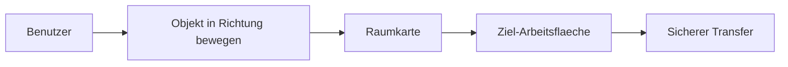

# 00 Product Vision

Dokument-ID: RKWS-DOC-00  
Version: 0.5.0
Status: Accepted  
Datum: 2026-07-02

Diese Produktvision folgt HX-000 in `Spec/HumanExperienceSpecification_HX000.md` und dem Nordstern in `Docs/Nordstern.md`. RK Workspace beginnt in der Wahrnehmung des Menschen: Der Benutzer erlebt einen Arbeitsraum, nicht mehrere Geraete. Aus diesem Arbeitsraum heraus soll er digitale Dinge nehmen, tragen und ablegen, ohne ueber Geraete oder Dateiuebertragung nachdenken zu muessen.

RK Workspace ist eine Arbeitsflaechen-Erweiterung fuer Menschen, die ihren digitalen Alltag nicht mehr auf ein einzelnes Geraet beschraenken. Moderne Arbeit findet auf Laptops, Tablets, Telefonen, externen Monitoren, KVM-Arbeitsplaetzen, Leitstaenden und gekapselten Systemen statt. Klassische Software behandelt diese Punkte als voneinander getrennte Rechner oder Zieladressen. RK Workspace behandelt sie als zusammenhaengenden Arbeitsraum.

## Mission Statement

RK Workspace existiert, um den persoenlichen digitalen Arbeitsplatz von Geraetegrenzen zu befreien. Das Produkt loest das Problem, dass digitale Objekte heute an einzelne Rechner, Betriebssysteme, App-Silos, Freigaben oder Cloud-Dienste gebunden wirken, obwohl der Benutzer in Wahrheit an einem zusammenhaengenden Arbeitsraum arbeitet. Ein Text, ein Bild, eine PDF, ein Link oder ein Kontext soll nicht danach behandelt werden, auf welchem Geraet er gerade liegt, sondern danach, wohin der Benutzer ihn als naechstes in seinem Arbeitsraum bewegen will.

Bestehende Loesungen reichen fuer dieses Ziel nicht aus, weil sie meist innerhalb eines Herstelleroekosystems, eines bestimmten Betriebssystems oder eines bestimmten Objektkanals funktionieren. AirDrop ist stark fuer Apple-nahe Dateiuebergabe, aber kein universelles Arbeitsflaechenmodell fuer Windows, Linux, Android, Dongles, KVM und Industrieumgebungen. Universal Control ist stark fuer Apple-Geraete und Eingabesteuerung, aber kein plattformneutrales Transfer-, Trust-, Hardware- und Workspace-System. Klassische Netzwerkfreigaben und Messenger senden Dateien an Ziele, bilden aber keine raeumliche Arbeitsflaechenhandlung ab.

RK Workspace bietet langfristig den Nutzen, dass der Benutzer seinen Arbeitsplatz als ein zusammenhaengendes digitales Feld erlebt. Arbeitsflaechen koennen gewechselt, ersetzt, erweitert oder durch Hardware repraesentiert werden, ohne dass sich die grundlegende Bedienidee aendert. Die Handlung bleibt: Objekt greifen, Richtung bestimmen, Ziel bestaetigen, Transfer ausfuehren. Plattformen, Transportwege, Hardwareknoten und Sicherheitsdetails werden technisch sauber umgesetzt, aber aus der Alltagsbedienung herausgehalten.

Damit veraendert RK Workspace den digitalen Arbeitsplatz von einer Sammlung separater Geraete zu einer konfigurierbaren, sicheren und erweiterbaren Arbeitsumgebung. Das Produkt soll nicht nur Dateien bewegen, sondern den mentalen Abstand zwischen Arbeitsflaechen verkleinern.

Die Produktthese lautet: Ein digitales Objekt soll sich zwischen Arbeitsflaechen so natuerlich anfuehlen wie ein Blatt Papier, das von einem Schreibtisch auf den naechsten gelegt wird. Ein Benutzer soll spaeter einen Text, ein Bild, eine PDF-Datei, einen Ordner, einen Link, ein Clipboard-Element oder einen ganzen Arbeitskontext greifen und in eine Richtung bewegen koennen. Die Bedeutung der Richtung ergibt sich aus einer Raumkarte. Wenn rechts vom Windows-Arbeitsplatz das MacBook liegt, dann bedeutet die Geste nach rechts nicht "sende an Host macbook.local", sondern "verschiebe dieses Objekt auf die rechte Arbeitsflaeche".

Das Produkt wird deshalb nicht um Geraetenamen, IP-Adressen oder Dateifreigaben herum entworfen. Die primaere Abstraktion ist die Arbeitsflaeche. Eine Arbeitsflaeche kann ein Smart Device mit eigenem RK Workspace Agent sein, zum Beispiel ein Windows-Laptop, ein MacBook, ein Linux-Rechner, ein iPhone oder ein Android-Tablet. Eine Arbeitsflaeche kann aber auch durch einen Dongle repraesentiert werden, wenn der eigentliche Rechner nicht direkt erreichbar ist oder wenn die Arbeitsflaeche eher ein Monitor, ein KVM-Platz, ein Leitstand oder ein gekapseltes Industriesystem darstellt.

Die Benutzeroberflaeche soll langfristig fast unsichtbar sein. Normale Arbeit geschieht ueber Gesten, Raender, Haptik, visuelles Feedback und Richtung. Die sichtbare GUI dient Einrichtung, Pairing, Diagnose, Logs, Firmware- und Hardwareverwaltung sowie Tests. Dieses Prinzip schuetzt das Produkt davor, zu einem weiteren Datei-Manager zu werden. RK Workspace soll im Arbeitsfluss liegen, nicht davor.

Der erste Prototyp konzentriert sich auf das Fundament. Er beweist noch keine globale OS-Integration und keine perfekte Gestensteuerung. Er beweist, dass die Begriffe stabil sind: Arbeitsflaechen lassen sich modellieren, eine manuelle Raumkarte kann Richtungen auf Ziele abbilden, Transferobjekte koennen neutral beschrieben werden, Vertrauen und Faehigkeiten koennen geprueft werden, und ein Texttransfer von Arbeitsflaeche A nach Arbeitsflaeche B kann simuliert und getestet werden.

RK Workspace bleibt als Produkt unabhaengig von RKOS. Diese Trennung ist wichtig, weil RK Workspace eigene Plattformagenten, eigene Hardwareentscheidungen, eigene Sicherheitsregeln, eigene Releases und eigene Integrationsrisiken besitzt. RKOS kann spaeter ein moeglicher Integrationspartner sein, ist aber nicht die Produktbasis.

Der langfristige Anspruch ist plattformuebergreifend. Windows, macOS, Linux, iOS und Android muessen als Arbeitsflaechen koexistieren koennen. Hardware-Dongles erweitern das System fuer Umgebungen, in denen kein normaler Agent laeuft oder in denen die Arbeitsflaeche nicht mit einem einzelnen Betriebssystem identisch ist. UWB kann spaeter helfen, Positionen automatisch zu bestimmen. Bluetooth LE kann fuer Discovery nuetzlich sein. Die eigentlichen Nutzdaten laufen ueber LAN, WLAN oder spaeter optional ueber einen Cloud-Fallback, aber nicht ueber Bluetooth.

## Diagramm

## Querverweise

- `Spec/HumanExperienceSpecification_HX000.md`
- `Docs/Nordstern.md`
- `Spec/ProductVision.md`
- `Spec/ProductPhilosophy.md`
- `Docs/ADR/ADR-0001-workspaces-instead-of-devices.md`
- `Spec/VersionV0.1.md`

## Aenderungsverlauf

| Version | Datum | Aenderung |
| --- | --- | --- |
| 0.5.0 | 2026-07-03 | HX-000 als menschliche Ausgangswahrnehmung der Produktvision ergaenzt. |
| 0.4.0 | 2026-07-03 | Nordstern als hoechste Produktorientierung referenziert. |
| 0.3.0 | 2026-07-02 | Mission Statement fuer RKWS-0340 ergaenzt. |
| 0.2.0 | 2026-07-02 | Dokumentstandard, Diagramm und Querverweise ergaenzt. |
| 0.1.0 | 2026-07-02 | Produktvision angelegt. |
