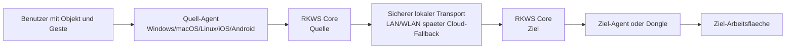
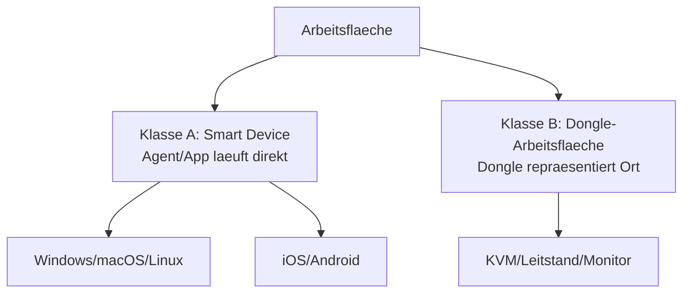
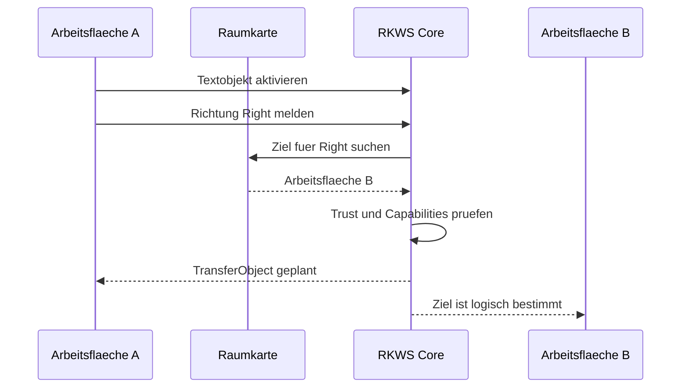
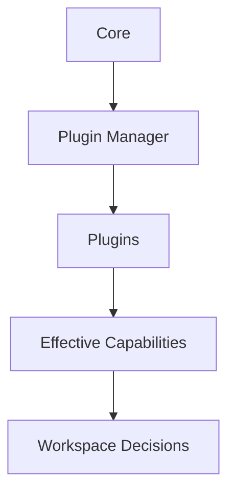

# 01 System Architecture

Dokument-ID: RKWS-DOC-01  
Version: 0.3.0  
Status: Accepted  
Datum: 2026-07-02

## Systemkontext

RK Workspace besteht aus einem plattformneutralen Core, Plattformagenten fuer Smart Devices, optionalen Dongles fuer spezielle Arbeitsflaechen, einer lokalen Discovery- und Pairing-Schicht sowie einem spaeteren sicheren Datentransport. Der Core entscheidet nicht, wie ein Betriebssystem Clipboard, Dateisystem oder Touchpad bedient. Der Core entscheidet, welche Arbeitsflaechen existieren, wie sie in einer Raumkarte liegen, ob sie vertrauenswuerdig sind und ob ein Objekt in eine Richtung geplant werden darf.

## Arbeitsflaechenklassen

Klasse A sind Smart Devices. Sie besitzen eine eigene RK Workspace Software und brauchen keinen Dongle. Beispiele sind Windows-Laptops, MacBooks, Linux-Rechner, iPhones, iPads und Android-Tablets. Diese Agenten integrieren spaeter Clipboard, Dateien, Touchpad- oder Touch-Gesten, Benachrichtigungen und lokale Ablage.

Klasse B sind Arbeitsflaechen mit Dongle. Der Dongle repraesentiert nicht zwingend den Rechner, sondern die Arbeitsflaeche. Diese Trennung ist fuer KVM-Systeme, Industrie-PCs, Monitore ohne Betriebssystem, Headless-Systeme und gekapselte Netzwerke entscheidend. Der Dongle kann Identitaet, Discovery, Pairing und Position liefern, waehrend grosse Nutzdaten ueber Netzwerkpfade laufen.

## Schichten

Der Core enthaelt Modelle und Regeln. Er ist frei von plattformspezifischem Code. Er kennt Arbeitsflaechen, Identitaeten, Transferobjekte, Capabilities, Trust-State, Raumkarten und Richtungen.

Die Plattformagenten sind Adapter. Sie uebersetzen Betriebssystemereignisse in Core-Aufrufe und setzen Core-Entscheidungen wieder in OS-Aktionen um. Diese Schicht darf spaeter Windows-, macOS-, Linux-, iOS- und Android-APIs nutzen.

Die Kommunikationsschicht wird in drei Verantwortungen getrennt: Discovery findet Arbeitsflaechen, Pairing erzeugt Vertrauen, Transport uebertraegt Nutzdaten. BLE darf Discovery unterstuetzen, ist aber kein Payload-Kanal. UWB darf Positionen liefern, ist aber ebenfalls kein Payload-Kanal.

## V1 Ablauf

V1 implementiert diesen Ablauf als lokale Simulation. Echte Discovery, echtes Pairing und echter Netzwerktransport werden erst nach Abnahme von Architektur, Spezifikation und Tests implementiert.

## Architekturregeln

Der Core darf kein Betriebssystem direkt ansprechen. Plattformagenten duerfen den Core nicht mit OS-spezifischen Sonderfaellen verschmutzen. Hardware bleibt optional. Sicherheit wird von Beginn an im Modell sichtbar. Datenuebertragung und Positionsbestimmung bleiben getrennte Subsysteme.

## Plugin- und Capability-Baseline

Ab Architecture Baseline Completion werden Plattformfunktionen, Hardwarefunktionen, Kommunikation, Security, Gesten, Logging, Simulation und Updates ueber Plugins modelliert. Der Core bewertet Arbeitsflaechen anhand effektiver Capabilities, nicht anhand von Geraetetypen. Plattformnamen duerfen Defaults liefern, aber keine Architekturentscheidung ersetzen.

## Querverweise

- `Docs/Architecture/ArchitectureFreeze.md`
- `Docs/Architecture/ArchitectureBaseline.md`
- `Spec/WorkspaceModel.md`
- `Spec/PluginArchitecture.md`
- `Spec/CapabilityModel.md`
- `Spec/Protocol.md`
- `Spec/SecurityModel.md`

## Aenderungsverlauf

| Version | Datum | Aenderung |
| --- | --- | --- |
| 0.3.0 | 2026-07-02 | Plugin- und Capability-Baseline ergaenzt. |
| 0.2.0 | 2026-07-02 | Architektur-Freeze-Verweise ergaenzt. |
| 0.1.0 | 2026-07-02 | Systemarchitektur angelegt. |
