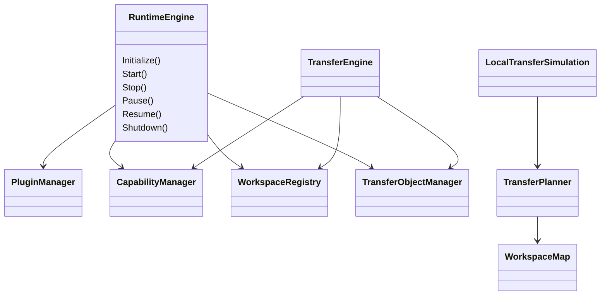

# 02 Software Architecture

Dokument-ID: RKWS-DOC-02  
Version: 0.4.0
Status: Accepted  
Datum: 2026-07-02

## Ziel der Softwarearchitektur

Die Softwarearchitektur schuetzt RK Workspace vor einer fruehen Verengung auf ein bestimmtes Betriebssystem. Der erste Core muss auf Windows, macOS, Linux, iOS, Android und spaeter auf Dongle-nahe Komponenten uebertragbar bleiben. Deshalb ist die Software in einen plattformneutralen Kern, spaetere Plattformadapter, Spezifikationen, Tests und Werkzeuge getrennt.

## Projektlayout

```text
src/Core              Plattformneutrale Modelle, Regeln, Runtime und Simulation
src/Windows           Spaeterer Windows-Agent
src/macOS             Spaeterer macOS-Agent
src/Linux             Spaeterer Linux-Agent
src/iOS               Spaetere iOS-App
src/Android           Spaetere Android-App
src/Shared            Gemeinsame Hilfen ausserhalb des Core
tools/LocalSimulation Lokale Simulation fuer V1
tests                 Unit-, Integrations-, Protokoll- und Hardwaretests
Spec                  Normative Spezifikation
Docs                  Erklaerende Architektur- und Produktdokumente
```

## Core-Grenze

Der Core enthaelt Records, Enums und Services fuer Arbeitsflaechen, Identitaeten, Transferobjekte, Payload-Referenzen, Verschluesselungsmetadaten, Raumkarten, Richtungslogik, Transferplanung und lokale Simulation. Diese Bestandteile sind bewusst neutral. Ein Test oder eine Simulation darf den Core ausfuehren, ohne dass Clipboard, UI, Netzwerk, Treiber oder Betriebssystemdienste vorhanden sind.

Der Core enthaelt keine Clipboard-API-Aufrufe, keine Dateisystem-Watcher bestimmter Betriebssysteme, keinen UI-Code, keine Geraetetreiber, keine BLE- oder UWB-Bibliotheken und keine Netzwerktransport-Implementierung. Diese Dinge gehoeren spaeter in Adapter, Services oder Hardware-/Firmware-Schichten.

## Aktuelle Komponenten



`RuntimeEngine` steuert den Lebenszyklus der zentralen Core-Manager. `TransferEngine` fuehrt den logischen Transferpfad ueber Workspace Registry, Capability Manager und Transfer Object Manager aus. `WorkspaceMap` und `TransferPlanner` bleiben als fruehe neutrale Modell- und Simulationsbausteine erhalten. `LocalTransferSimulation` bildet den ersten nachweisbaren Ablauf ab: zwei simulierte Arbeitsflaechen, Richtung `Right`, Textobjekt, vollstaendiges Log.

## Plugin-Grenze

Der Core definiert Semantik und neutrale Modelle. Plugin-Implementierungen liegen ausserhalb des Core. Spaetere Plattformagenten duerfen OS-Funktionen nur ueber Plugin- und Adaptergrenzen einbringen. Kein Core-Service darf direkt gegen Windows, macOS, Linux, iOS, Android, BLE, UWB, Firmware oder Hardware implementiert werden.

## Teststrategie

Der erste Test-Runner nutzt bewusst keine externen NuGet-Testframeworks. Dadurch bleibt der Foundation-Stand sofort lauffaehig und CI-faehig. Spaeter kann das Projekt auf xUnit, NUnit oder MSTest wechseln, sobald der Nutzen groesser ist als die zusaetzliche Infrastruktur.

## Querverweise

- `Docs/ADR/ADR-0003-platform-neutral-core.md`
- `Spec/PluginArchitecture.md`
- `Spec/PluginDependencyDiagram.md`
- `Spec/LayerModel.md`
- `Spec/RuntimeArchitecture.md`
- `Spec/ObjectModel.md`
- `Spec/StateMachine.md`
- `Spec/TestStrategy.md`

## Aenderungsverlauf

| Version | Datum | Aenderung |
| --- | --- | --- |
| 0.4.0 | 2026-07-02 | Core Runtime Orchestrator und aktualisiertes Core-Diagramm ergaenzt. |
| 0.3.0 | 2026-07-02 | Plugin-Grenze fuer Architecture Baseline Completion ergaenzt. |
| 0.2.0 | 2026-07-02 | Architektur-Freeze-Verweise ergaenzt. |
| 0.1.0 | 2026-07-02 | Softwarearchitektur angelegt. |
