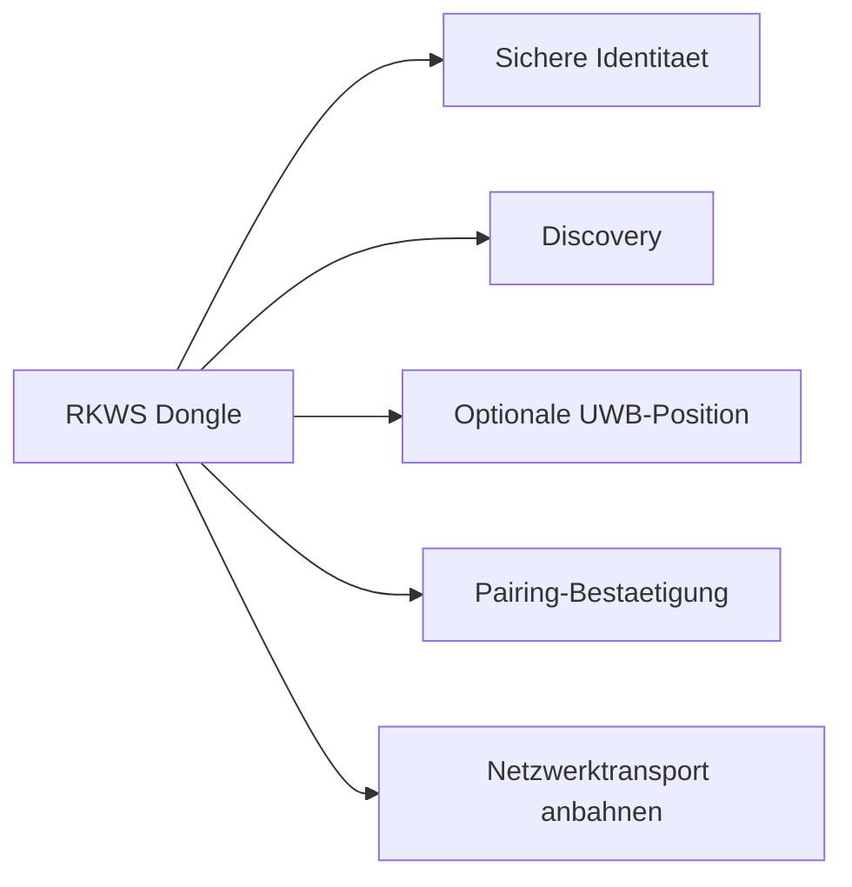

# 03 Hardware Architecture

Dokument-ID: RKWS-DOC-03  
Version: 0.2.0  
Status: Accepted  
Datum: 2026-07-02

## Grundsatz

Hardware erweitert RK Workspace, ist aber keine Voraussetzung fuer die erste Softwareversion. Smart Devices koennen RK Workspace allein ueber Agenten oder Apps nutzen. Der Dongle wird fuer Arbeitsflaechen benoetigt, die keinen normalen Agenten tragen koennen oder bei denen die Arbeitsflaeche nicht identisch mit einem Rechner ist.

## Dongle-Rolle

Der Dongle repraesentiert eine Arbeitsflaeche. Er ist nicht zwingend der Datentraeger und nicht zwingend der Zielrechner. In einem KVM-Setup kann der Dongle den Arbeitsplatz am Monitor repraesentieren, waehrend der aktive Rechner wechselt. In einem Leitstand kann der Dongle eine feste Bedienposition repraesentieren. In einem gekapselten Netzwerk kann er als identifizierbarer Brueckenkopf dienen, ohne grosse Payloads ueber Funk zu transportieren.

## Verantwortungen

Der Dongle soll spaeter eine sichere Identitaet tragen, Discovery unterstuetzen, Pairing ermoeglichen, verschluesselte Kommunikation anbahnen, optional UWB-Positionsdaten liefern, per USB-C versorgt werden und Firmware-Updates erhalten. Grosse Datenuebertragungen sind nicht die Primaeraufgabe des Dongles. Payloads sollen ueber LAN, WLAN oder spaeter definierte Netzwerkpfade laufen.

## Kandidaten

ESP32-S3 ist ein plausibler Startpunkt fuer H2, weil WLAN und BLE integriert sind und die Plattform breit verfuegbar ist. UWB wird separat bewertet, weil Positionierung andere Anforderungen hat als Discovery oder Transport. USB-C ist als Versorgung und spaeter eventuell als Service- oder Konfigurationsschnittstelle vorgesehen.

## Grenzen

V1 entwickelt keine Platine, keine Mechanik und keine Serienhardware. Das Repository enthaelt nur Anforderungen, Testideen und reservierte Verzeichnisse fuer PCB und Mechanical. Hardwareentscheidungen werden erst getroffen, wenn die Softwarebegriffe und Sicherheitsanforderungen stabil genug sind.

## Querverweise

- `Spec/HardwareArchitectureV0.md`
- `Spec/HardwareSourcing.md`
- `Docs/ADR/ADR-0002-optional-hardware-dongles.md`

## Aenderungsverlauf

| Version | Datum | Aenderung |
| --- | --- | --- |
| 0.2.0 | 2026-07-02 | Hardware V0 und Sourcing verlinkt. |
| 0.1.0 | 2026-07-02 | Hardwarearchitektur angelegt. |
