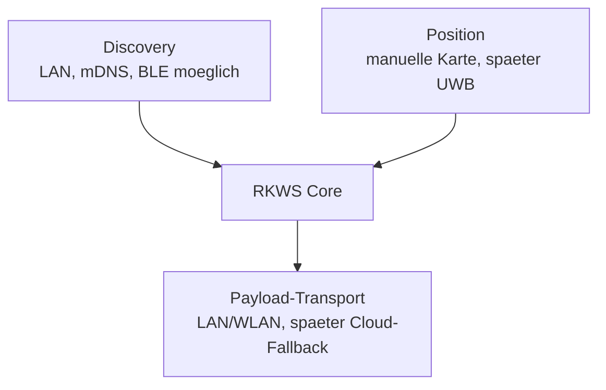

# 04 Communication Protocol

Dokument-ID: RKWS-DOC-04  
Version: 0.3.0
Status: Accepted  
Datum: 2026-07-02

## Status

Dieses Dokument beschreibt das Kommunikationsmodell und grenzt die aktuelle lokale IPC von spaeterem Payload-Transport ab. RKWS-0010 verlangt ausdruecklich Dokumentation vor Implementierung. Die aktuelle Codebasis plant Transfers lokal, besitzt seit MA004.03 lokale Agent-zu-Agent-IPC und entkoppelt diese seit MA004.04 ueber die Transport Abstraction Layer. Sie versendet weiterhin keine Nutzdaten ueber Netzwerk.

## Trennung der Verantwortungen

Discovery, Positionsbestimmung und Datenuebertragung sind getrennte Subsysteme. Discovery kann lokales Netzwerk und Bluetooth LE nutzen. Positionsbestimmung kann spaeter UWB nutzen. Nutzdaten laufen ueber LAN, WLAN oder spaeter optional ueber einen Cloud-Fallback. Bluetooth LE ist kein Payload-Kanal. UWB ist kein Payload-Kanal.



## Phasenmodell

Ein spaeterer Transfer besteht aus Discovery, Pairing, Session-Aufbau, Transfer-Ankuendigung, Payload-Uebertragung, Abschluss und Protokollierung. V1 simuliert bisher nur die Entscheidungsschritte ab Arbeitsflaechenmodell und Raumkarte.

## Aktuelle lokale Transportebene

MA004.04 fuehrt eine lokale Transport Abstraction Layer ein:

- `RKWorkspace.Transport` enthaelt die neutralen Schnittstellen.
- `RKWorkspace.Transport.NamedPipes` enthaelt die aktuelle lokale Implementierung.
- `RKWorkspace.LocalIpc` bleibt als Kompatibilitaetsschicht fuer den Zwei-Prozess-Test erhalten.

Diese Ebene ist keine Discovery, kein Pairing und kein Payload-Transport ueber Rechnergrenzen. Sie dient als technische Grundlage, damit spaetere Transporte wie TCP/LAN, WebSocket, USB, BLE, Cloud Relay oder Loopback/Test ergaenzt werden koennen, ohne den Agent-Ablauf direkt an diese Technik zu koppeln.

## Vorlaeufige Nachrichten

```text
HELLO
WORKSPACE_ADVERTISE
PAIR_REQUEST
PAIR_CONFIRM
PAIR_REJECT
SESSION_START
TRANSFER_OFFER
TRANSFER_ACCEPT
TRANSFER_REJECT
TRANSFER_CHUNK
TRANSFER_COMPLETE
SESSION_CLOSE
```

## Transfer-Metadaten

Ein `TRANSFER_OFFER` soll mindestens die Felder aus `TransferObject` enthalten: ObjectId, ObjectType, SourceWorkspaceId, TargetWorkspaceId, CreatedAt, DisplayName, MimeType, Size, PayloadReference, Checksum und EncryptionInfo. Diese Daten sind ausreichend, um dem Ziel vor der Annahme mitzuteilen, was uebertragen werden soll, von welcher Arbeitsflaeche es kommt, wie gross es ist und wie Integritaet und Verschluesselung behandelt werden.

## Sicherheitsannahmen

Pairing erzeugt Vertrauen zwischen Arbeitsflaechen. Eine Session muss verschluesselt sein. Checksums sichern Integritaet, ersetzen aber keine Authentizitaet. Payloads duerfen nicht allein anhand ihres Dateinamens oder MIME-Types vertraut werden. Ein Ziel muss Transfers ablehnen koennen, wenn Trust-State, Capabilities, Groesse, Richtungszuordnung oder Benutzerbestaetigung nicht passen.

## Offene Entscheidungen

mDNS, BLE-Advertising, UDP-Broadcast oder eine Kombination muessen fuer Discovery bewertet werden. Fuer Session-Sicherheit kommen TLS, Noise oder ein anderes modernes Handshake-Protokoll in Frage. Chunk-Groessen, Resume-Verhalten, Quotas und Konflikte bei mehreren Zielarbeitsflaechen in derselben Richtung sind noch Spezifikationsarbeit.

## Querverweise

- `Spec/Communication.md`
- `Spec/Protocol.md`
- `Docs/ADR/ADR-0004-separate-discovery-and-data-transfer.md`
- `Docs/Development/TransportAbstractionLayer.md`

## Aenderungsverlauf

| Version | Datum | Aenderung |
| --- | --- | --- |
| 0.3.0 | 2026-07-02 | MA004.04 Transport Abstraction Layer als lokale Transportebene dokumentiert. |
| 0.2.0 | 2026-07-02 | Normative Protokollspezifikation verlinkt. |
| 0.1.0 | 2026-07-02 | Kommunikationsdokument angelegt. |
