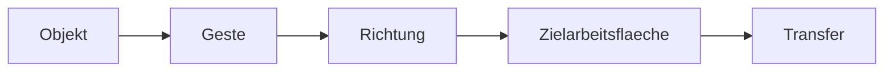

# 05 UX Gestures

Dokument-ID: RKWS-DOC-05  
Version: 0.2.0  
Status: Accepted  
Datum: 2026-07-02

## UX-Grundsatz

Die normale RK Workspace GUI soll spaeter nahezu unsichtbar sein. Der Benutzer arbeitet ueber Gesten, visuelles Feedback, Zielraender und Richtung. Sichtbare Oberflaechen dienen Einrichtung, Pairing, Diagnose, Logs, Firmware, Hardware und Tests. Dieses Prinzip verhindert, dass RK Workspace zu einem klassischen Datei-Sende-Dialog wird.

## Touchpad

Auf MacBook, Windows-Laptops und Linux-Laptops ist die geplante Interaktion eine Drei-Finger-Geste. Der Benutzer markiert ein Objekt, aktiviert es durch die Geste, erhaelt visuelles Feedback und schiebt es zum Bildschirmrand. Der Zielrand leuchtet oder zeigt die benachbarte Arbeitsflaeche an. Loslassen startet den Transfer.

## Touch

Auf iPhone, iPad und Android wird ein Objekt gehalten. Wenn das Betriebssystem es erlaubt, bestaetigt Haptik die Aktivierung. Eine Richtungsgeste bestimmt das Ziel. Falls mehrere Ziele in Frage kommen, zeigt die App eine Auswahl an, ohne den Arbeitsfluss in einen Dateimanager zu verwandeln.

## Desktop mit Maus

Auf Systemen ohne Touchpad wird ein langer Linksklick als Aktivierung vorgesehen. Das Objekt erhaelt einen Rahmen, pulsiert oder bewegt sich leicht, und der relevante Bildschirmrand leuchtet. Optional koennen Modifier-Tasten Fehlbedienungen reduzieren.

## V1 Reduktion

V1 ersetzt echte Gesten durch eine explizite Richtung wie `Right`. Diese Reduktion ist beabsichtigt. Sie erlaubt es, Raumkarte, Zielaufloesung, Trust-State, Capabilities und Transferobjekt zu pruefen, bevor globale Gesten oder plattformspezifische UI-Hooks gebaut werden.

## Diagramm

## Querverweise

- `Spec/GestureModel.md`
- `Spec/UX.md`
- `Docs/ADR/ADR-0006-gestures-as-primary-interaction.md`

## Aenderungsverlauf

| Version | Datum | Aenderung |
| --- | --- | --- |
| 0.2.0 | 2026-07-02 | Gestenmodell und Dokumentstandard ergaenzt. |
| 0.1.0 | 2026-07-02 | UX-Gesten dokumentiert. |
