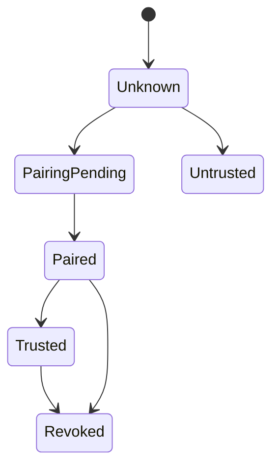

# 06 Security Model

Dokument-ID: RKWS-DOC-06  
Version: 0.2.0  
Status: Accepted  
Datum: 2026-07-02

## Ziele

RK Workspace muss lokale Transfers ohne Cloud-Zwang ermoeglichen, darf aber keine ungepaarten Arbeitsflaechen akzeptieren. Sicherheit beginnt deshalb im Modell. Jede Arbeitsflaeche hat einen Trust-State, jedes Geraet oder jeder Dongle hat eine Identitaet, und jedes Transferobjekt traegt Metadaten fuer Integritaet und Verschluesselung.

## Identitaet

`DeviceIdentity` beschreibt ein Geraet oder einen Dongle mit stabiler ID, Anzeigename, Plattform und Public-Key-Fingerprint.

`Workspace` beschreibt die konkrete Arbeitsflaeche, die ein Geraet oder Dongle repraesentiert.

## Trust-State

Arbeitsflaechen koennen folgende Zustaende haben:

- `Unknown`
- `Untrusted`
- `PairingPending`
- `Paired`
- `Trusted`
- `Revoked`

V1-Transferplanung erlaubt Transfers nur zwischen gekoppelten oder vertrauten Arbeitsflaechen.

## Payload-Schutz

Jedes Transferobjekt traegt:

- Checksum
- MIME-Type
- Groesse
- PayloadReference
- EncryptionInfo

Die erste Simulation nutzt noch keine echte Verschluesselung, modelliert aber `EncryptionInfo`, damit das Protokoll spaeter ohne Modellbruch erweitert werden kann.

## Transferentscheidung

Ein Transfer darf nur geplant werden, wenn Quelle und Ziel gepaart oder vertraut sind, beide Arbeitsflaechen den Objekttyp unterstuetzen, die Richtung in der Raumkarte eindeutig aufgeloest werden kann und das Transferobjekt vollstaendige Metadaten besitzt. Diese Regeln gelten vor jeder spaeteren OS- oder Netzwerkentscheidung.

## Offene Risiken

- Identitaetsdiebstahl bei ungeschuetztem Schluesselspeicher
- falsche Raumkarten durch manuelle Konfiguration
- versehentliche Transfers an falsche Zielarbeitsflaechen
- Dateityp-Spoofing durch irrefuehrende Namen
- unsichere Firmware-Provisionierung beim Dongle
- unklare Revocation-Synchronisierung zwischen Arbeitsflaechen

## Querverweise

- `Spec/SecurityModel.md`
- `Spec/Protocol.md`
- `Docs/ADR/ADR-0003-platform-neutral-core.md`

## Aenderungsverlauf

| Version | Datum | Aenderung |
| --- | --- | --- |
| 0.2.0 | 2026-07-02 | Vollstaendige Security-Spec verlinkt. |
| 0.1.0 | 2026-07-02 | Sicherheitsmodell angelegt. |
