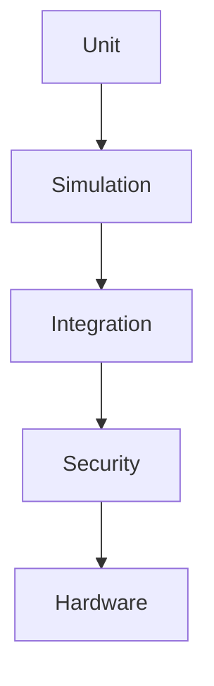

# 07 Test Plan

Dokument-ID: RKWS-DOC-07  
Version: 0.2.0  
Status: Accepted  
Datum: 2026-07-02

## Testziel

Tests muessen beweisen, dass RK Workspace seine zentralen Begriffe korrekt behandelt, bevor echte Plattformagenten oder Hardware entstehen. Der erste Testumfang konzentriert sich deshalb auf Core-Modelle, Raumkarte, Transferplanung und lokale Simulation.

## Testarten

### Unit

- Datenmodelle validieren
- Capabilities gegen Objekttypen pruefen
- Raumkarten-Richtung auf Zielarbeitsflaeche aufloesen
- Transferobjekte mit Metadaten erzeugen
- lokale Simulation mit vollstaendigem Log pruefen

### Integration

- zwei simulierte Arbeitsflaechen erzeugen
- Textobjekt von A nach B planen
- Richtung `Right` korrekt aufloesen
- Ergebnis protokollieren

### Protocol

- Nachrichtenreihenfolge fuer Discovery, Pairing und Transfer pruefen
- unvollstaendige Transfers erkennen
- Checksums validieren

### Hardware

- Dongle-Boot
- Identity-Provisioning
- BLE/WLAN-Discovery
- UWB-Positionsdaten gegen manuelle Karte vergleichen

## Aktueller Stand

Die erste Version enthaelt paketfreie Unit-Tests und eine lokale Simulation. Netzwerk-, Protokoll- und Hardwaretests sind als naechste Schritte vorgesehen.

## Foundation-Abnahme

Der Foundation-Stand ist akzeptiert, wenn `tools/run-tests.ps1` erfolgreich laeuft. Dieses Skript baut den Core, fuehrt die Unit-Tests aus und startet die lokale Simulation. Die Simulation muss zwei Arbeitsflaechen erzeugen, B rechts von A platzieren, Richtung `Right` auf B aufloesen, ein Textobjekt erzeugen und ein Log mit allen wesentlichen Schritten ausgeben.

## Diagramm

## Querverweise

- `Spec/TestStrategy.md`
- `Spec/TestSpecification.md`
- `Docs/Architecture/ArchitectureReview.md`

## Aenderungsverlauf

| Version | Datum | Aenderung |
| --- | --- | --- |
| 0.2.0 | 2026-07-02 | Vollstaendige Teststrategie verlinkt. |
| 0.1.0 | 2026-07-02 | Testplan angelegt. |
