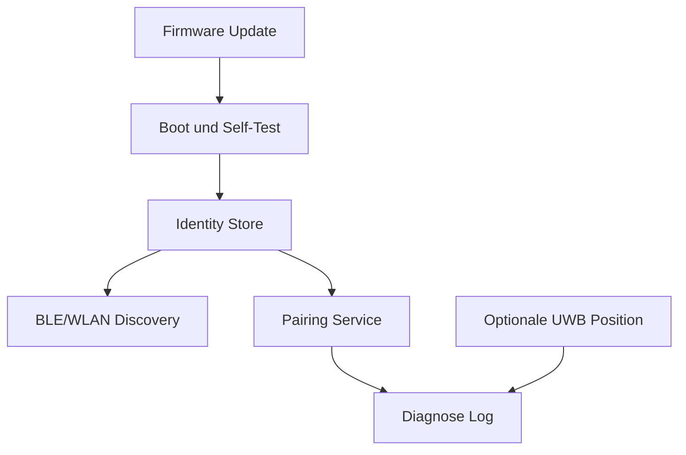

# 09 Firmware Architecture

Dokument-ID: RKWS-DOC-09  
Version: 0.2.0  
Status: Accepted  
Datum: 2026-07-02

## Status

Die Firmwarearchitektur ist dokumentiert, aber noch nicht implementiert. RKWS-0013 verlangt eine Architekturgrundlage vor Firmwareentwicklung. Es gibt deshalb noch keinen produktiven ESP32-S3-Code und keine Board-spezifische Implementierung.

## Firmware-Rolle

Firmware wird fuer den spaeteren RK Workspace Dongle benoetigt. Der Dongle soll eine Arbeitsflaeche repraesentieren, sichere Identitaet tragen, Discovery unterstuetzen, Pairing ermoeglichen, verschluesselte Kommunikation vorbereiten, optionale UWB-Positionsdaten liefern und Firmware-Updates akzeptieren.

## Abgrenzung

Die Firmware ist nicht fuer grosse Datenuebertragungen gedacht. Payloads sollen ueber Netzwerkpfade laufen. Die Firmware liefert Identitaet, Praesenz, Position und Kontrollsignale. Diese Trennung reduziert Funklast, Energiebedarf und Sicherheitsrisiken.

## Vorlaeufige Module

## Sicherheitsfragen

Die wichtigste offene Frage ist, wie private Schluessel und Pairing-Material sicher gespeichert werden. Ein Secure Element ist zu bewerten. Falls der erste Prototyp ohne Secure Element startet, muss das Risiko in ADRs sichtbar dokumentiert werden.

## Querverweise

- `Spec/Firmware.md`
- `Spec/HardwareArchitectureV0.md`
- `Spec/SecurityModel.md`

## Aenderungsverlauf

| Version | Datum | Aenderung |
| --- | --- | --- |
| 0.2.0 | 2026-07-02 | Dokumentstandard und Querverweise ergaenzt. |
| 0.1.0 | 2026-07-02 | Firmwarearchitektur angelegt. |
