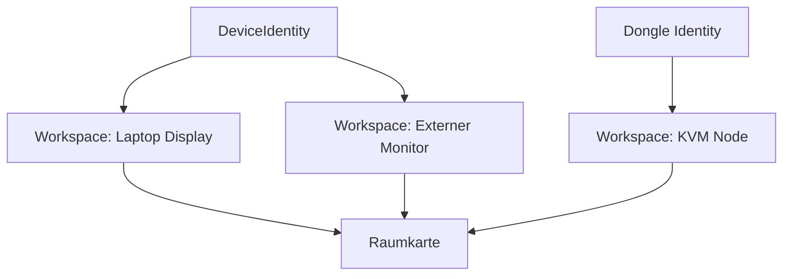

# ADR-0001 Warum Arbeitsflaechen statt Geraete?

Dokument-ID: RKWS-ADR-0001  
Version: 1.0.0  
Status: Accepted  
Datum: 2026-07-02

## Problemstellung

Klassische Uebertragungssysteme adressieren Geraete, Hosts, IP-Adressen oder Benutzerkonten. RK Workspace soll jedoch raeumliches Arbeiten abbilden. Ein Benutzer denkt in der Zielinteraktion nicht an einen Hostnamen, sondern an die Arbeitsflaeche rechts, links, oben oder unten.

## Moegliche Alternativen

1. Geraete als zentrale Abstraktion.
2. Benutzerkonten als zentrale Abstraktion.
3. Dateien oder Objekte als zentrale Abstraktion.
4. Arbeitsflaechen als zentrale Abstraktion.

## Bewertung der Alternativen

Geraete sind technisch eindeutig, aber fuer Gesten ungeeignet. Benutzerkonten sind fuer Cloud-Synchronisierung stark, aber fuer lokale Raumlogik zu indirekt. Objekte sind fuer Payload-Modellierung notwendig, loesen aber nicht die Zielfrage. Arbeitsflaechen passen zum Produktziel, weil sie raeumlich angeordnet werden koennen und sowohl Smart Devices als auch Dongle-Knoten abdecken.

## Getroffene Entscheidung

RK Workspace verwendet `Workspace` als primaere Produkt- und Architekturabstraktion. `DeviceIdentity` bleibt technische Identitaet, ist aber nicht der primaere Benutzerbegriff.

## Konsequenzen

Alle Transferentscheidungen beziehen sich auf SourceWorkspace und TargetWorkspace. Die Raumkarte ordnet Arbeitsflaechen an, nicht Geraete. Ein Dongle kann eine Arbeitsflaeche repraesentieren, ohne selbst der eigentliche Rechner zu sein.

## Risiken

Benutzer koennen Arbeitsflaechen und Geraete verwechseln, wenn die Einrichtung nicht klar genug ist. Mehrere Arbeitsflaechen auf einem Geraet muessen spaeter eindeutig dargestellt werden.

## Offene Punkte

- Darstellung mehrerer Arbeitsflaechen pro Device.
- Benennungskonventionen fuer gemeinsam genutzte Arbeitsflaechen.
- Migration, wenn ein Device eine Arbeitsflaeche dauerhaft ersetzt.

## Diagramm

## Querverweise

- `Spec/WorkspaceModel.md`
- `Spec/DisplayNodeModel.md`
- `Docs/01_SystemArchitecture.md`

## Aenderungsverlauf

| Version | Datum | Aenderung |
| --- | --- | --- |
| 1.0.0 | 2026-07-02 | Entscheidung fuer Arbeitsflaechen als Primaerabstraktion eingefroren. |
