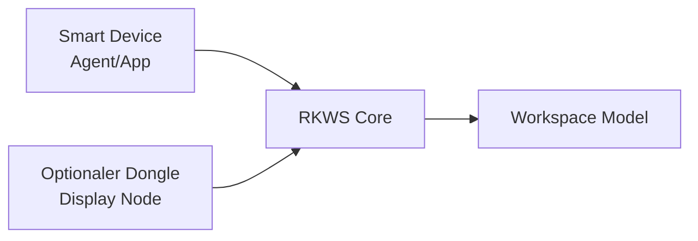

# ADR-0002 Warum optionale Hardware-Dongles?

Dokument-ID: RKWS-ADR-0002  
Version: 1.0.0  
Status: Accepted  
Datum: 2026-07-02

## Problemstellung

Einige Arbeitsflaechen koennen keinen RK Workspace Agent ausfuehren. Dazu gehoeren Monitore ohne Betriebssystem, KVM-Systeme, Headless-Systeme, gekapselte Industrieumgebungen und Leitstaende.

## Moegliche Alternativen

1. Nur Smart Devices unterstuetzen.
2. Dongle als zwingende Voraussetzung fuer alle Arbeitsflaechen.
3. Dongle als optionale Arbeitsflaechen-Repraesentation.

## Bewertung der Alternativen

Nur Smart Devices wuerden industrielle und KVM-Szenarien ausschliessen. Ein zwingender Dongle wuerde normale Laptops, Tablets und Telefone unnoetig verteuern. Ein optionaler Dongle erweitert das System, ohne die Softwareversion zu blockieren.

## Getroffene Entscheidung

RK Workspace behandelt Hardware-Dongles als optionale Klasse-B-Arbeitsflaechen. Smart Devices bleiben ohne Dongle nutzbar.

## Konsequenzen

Hardware darf die erste Softwareversion nicht blockieren. Der Core muss Display Nodes und Dongle Nodes modellieren koennen. Dongles repraesentieren Arbeitsflaechen, nicht zwingend Rechner.

## Risiken

Dongles erhoehen spaeter Produktions-, Sicherheits- und Supportaufwand. Eine falsche Hardwareentscheidung koennte Firmware und Security langfristig belasten.

## Offene Punkte

- Secure-Element ja oder nein.
- Erste Entwicklungsplattform.
- Firmware-Update- und Recovery-Pfad.

## Diagramm

## Querverweise

- `Spec/HardwareArchitectureV0.md`
- `Spec/DisplayNodeModel.md`
- `Docs/03_HardwareArchitecture.md`

## Aenderungsverlauf

| Version | Datum | Aenderung |
| --- | --- | --- |
| 1.0.0 | 2026-07-02 | Optionale Dongle-Strategie eingefroren. |
