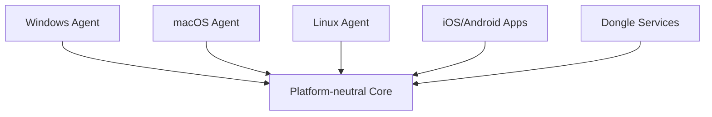

# ADR-0003 Warum plattformneutraler Core?

Dokument-ID: RKWS-ADR-0003  
Version: 1.0.0  
Status: Accepted  
Datum: 2026-07-02

## Problemstellung

RK Workspace soll Windows, macOS, Linux, iOS, Android und spaeter Dongle-nahe Komponenten unterstuetzen. Plattform-APIs unterscheiden sich stark bei Clipboard, Gesten, Dateizugriff, Berechtigungen und UI.

## Moegliche Alternativen

1. Eine Plattform zuerst tief integrieren und spaeter portieren.
2. Gemeinsame Logik direkt in jede Plattform kopieren.
3. Einen plattformneutralen Core definieren und Plattformen als Adapter behandeln.

## Bewertung der Alternativen

Eine tiefe Erstplattform waere schnell, wuerde aber Architekturentscheidungen verzerren. Kopierte Logik wuerde Inkonsistenzen erzeugen. Ein neutraler Core erfordert mehr Vorarbeit, passt aber zum langfristigen Produktziel.

## Getroffene Entscheidung

Der Core bleibt plattformneutral. Betriebssystemzugriffe, globale Gesten, UI, Netzwerkadapter und Hardwaretreiber liegen ausserhalb des Core.

## Konsequenzen

Core-Tests laufen ohne Plattformdienste. Plattformagenten duerfen OS-spezifisch sein, muessen aber auf Core-Modelle und Core-Regeln abbilden. Der Core ist die verbindliche Semantikschicht.

## Risiken

Zu strenge Neutralitaet kann notwendige Plattformdetails zu spaet sichtbar machen. Adapter muessen sorgfaeltig spezifiziert werden.

## Offene Punkte

- Adapter-API zwischen Core und Plattformagenten.
- Persistenzgrenze fuer Pairing- und Raumkartendaten.
- Gemeinsames Logging-Format.

## Diagramm

## Querverweise

- `Docs/02_SoftwareArchitecture.md`
- `Spec/ObjectModel.md`
- `Spec/WorkspaceModel.md`

## Aenderungsverlauf

| Version | Datum | Aenderung |
| --- | --- | --- |
| 1.0.0 | 2026-07-02 | Plattformneutraler Core als verbindliche Architekturentscheidung eingefroren. |
