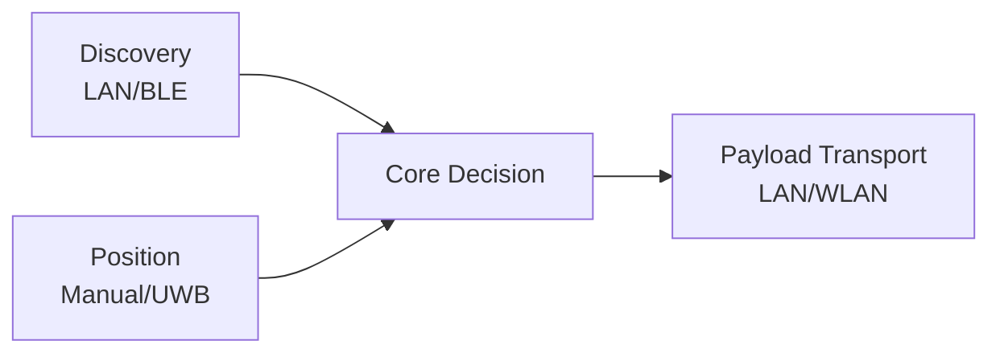

# ADR-0004 Warum Discovery und Datenuebertragung getrennt werden

Dokument-ID: RKWS-ADR-0004  
Version: 1.0.0  
Status: Accepted  
Datum: 2026-07-02

## Problemstellung

Discovery, Positionsbestimmung und Payload-Transport haben unterschiedliche technische Anforderungen. BLE eignet sich fuer Praesenz, aber nicht fuer grosse Dateien. UWB eignet sich fuer Position, aber nicht fuer Nutzdaten.

## Moegliche Alternativen

1. Ein gemeinsamer Kanal fuer alles.
2. BLE fuer Discovery und Payload.
3. UWB fuer Position und Payload.
4. Getrennte Kanaele fuer Discovery, Position und Payload.

## Bewertung der Alternativen

Ein gemeinsamer Kanal waere einfach, aber technisch schwach. BLE-Payloads waeren langsam und fehleranfaellig. UWB-Payloads sind nicht das Ziel der Technologie. Getrennte Kanaele erlauben passende Sicherheits- und Performanceentscheidungen.

## Getroffene Entscheidung

RK Workspace trennt Discovery, Positionsbestimmung und Datenuebertragung. Payloads laufen ueber LAN, WLAN oder spaeter spezifizierten Cloud-Fallback.

## Konsequenzen

Discovery kann BLE oder Netzwerk nutzen. UWB liefert nur Position. Transport kann unabhaengig abgesichert, versioniert und optimiert werden.

## Risiken

Mehr Subsysteme erhoehen Komplexitaet. Fehlerdiagnose muss klar zwischen Discovery-, Positions- und Transportproblemen unterscheiden.

## Offene Punkte

- Konkreter Discovery-Mechanismus fuer V0.1.
- Session-Protokoll fuer verschluesselte Payloads.
- Fallback-Verhalten bei mehreren Netzwerkpfaden.

## Diagramm

## Querverweise

- `Spec/Communication.md`
- `Spec/Protocol.md`
- `Docs/04_CommunicationProtocol.md`

## Aenderungsverlauf

| Version | Datum | Aenderung |
| --- | --- | --- |
| 1.0.0 | 2026-07-02 | Trennung von Discovery und Payload-Transport eingefroren. |
