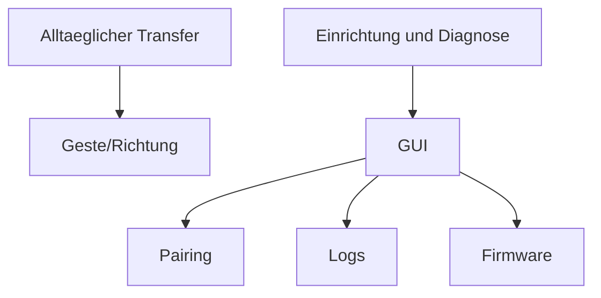

# ADR-0005 Warum GUI nur fuer Einrichtung, Diagnose und Administration vorgesehen ist

Dokument-ID: RKWS-ADR-0005  
Version: 1.0.0  
Status: Accepted  
Datum: 2026-07-02

## Problemstellung

RK Workspace koennte als klassische Datei-Sende-App mit Fenstern, Listen und Dialogen gebaut werden. Das widerspricht dem Ziel einer nahezu unsichtbaren Arbeitsflaechen-Erweiterung.

## Moegliche Alternativen

1. Vollstaendige Haupt-GUI fuer alle Transfers.
2. Kontextmenue- und Share-Sheet-zentrierte Bedienung.
3. GUI fuer Einrichtung, Diagnose und Administration; Alltag ueber Gesten.

## Bewertung der Alternativen

Eine Haupt-GUI waere leicht zu verstehen, aber produktstrategisch falsch. Kontextmenues sind nuetzlich als Fallback, aber nicht als Primaerinteraktion. Eine administrative GUI erhaelt Sichtbarkeit dort, wo sie noetig ist, und laesst normale Transfers im Arbeitsfluss.

## Getroffene Entscheidung

Die GUI dient Einrichtung, Pairing, Diagnose, Logs, Firmware, Hardware und Tests. Primaere Alltagsinteraktion erfolgt ueber Gesten und Richtung.

## Konsequenzen

UX- und Agentenarbeit muessen Feedback, Zielanzeige und Fehlerbehandlung ohne zentralen Transferdialog loesen. Diagnose und Logs werden trotzdem professionell sichtbar.

## Risiken

Unsichtbare Systeme koennen schwer verstaendlich sein. Gute Onboarding- und Diagnoseoberflaechen sind zwingend.

## Offene Punkte

- Minimaler Setup-Wizard.
- Diagnoseansicht fuer fehlgeschlagene Transfers.
- Fallback-UI fuer Barrierefreiheit.

## Diagramm

## Querverweise

- `Spec/UX.md`
- `Spec/GestureModel.md`
- `Docs/05_UX_Gestures.md`

## Aenderungsverlauf

| Version | Datum | Aenderung |
| --- | --- | --- |
| 1.0.0 | 2026-07-02 | GUI-Rolle als administrativ und diagnostisch eingefroren. |
