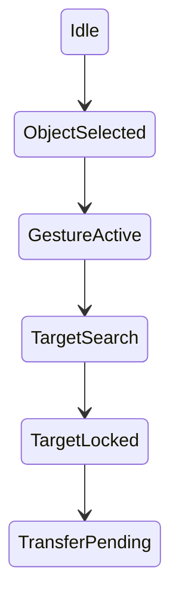

# ADR-0006 Warum Gesten das primaere Bedienkonzept sind

Dokument-ID: RKWS-ADR-0006  
Version: 1.0.0  
Status: Accepted  
Datum: 2026-07-02

## Problemstellung

RK Workspace muss die mentale Handlung "Objekt auf eine andere Arbeitsflaeche verschieben" ausdruecken. Menues, Dialoge und Dateiauswahllisten bilden diese Handlung nur indirekt ab.

## Moegliche Alternativen

1. Datei- oder Objektliste mit Zielauswahl.
2. Kontextmenue oder Share-Sheet.
3. Gestenbasierte Richtungseingabe als Primaerinteraktion.

## Bewertung der Alternativen

Listen sind praezise, aber langsam. Kontextmenues sind gute Fallbacks, aber nicht raeumlich. Gesten uebersetzen Richtung und Objektbesitz direkt in den Produktkern.

## Getroffene Entscheidung

Gesten sind das primaere Bedienkonzept. Desktop, Touchpad und Touch erhalten jeweils passende Geste-zu-State-Machine-Abbildungen.

## Konsequenzen

Der Core muss Richtungen modellieren. Plattformagenten muessen Gestenkonflikte mit Betriebssystemen behandeln. Tests muessen Gestenzustaende simulieren koennen.

## Risiken

OS-Gesten koennen kollidieren. Fehlbedienungen sind moeglich. Barrierefreiheit braucht Alternativen.

## Offene Punkte

- Konkrete Gestenbelegung pro Betriebssystem.
- Modifier-Strategie fuer Desktop.
- Barrierefreie Fallbacks.

## Diagramm

## Querverweise

- `Spec/GestureModel.md`
- `Spec/StateMachine.md`
- `Docs/05_UX_Gestures.md`

## Aenderungsverlauf

| Version | Datum | Aenderung |
| --- | --- | --- |
| 1.0.0 | 2026-07-02 | Gesten als Primaerinteraktion eingefroren. |
