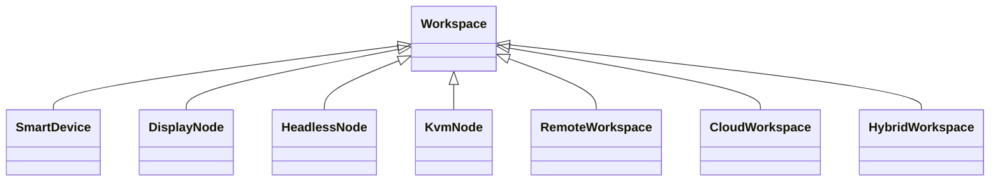

# ADR-0007 Warum Smart Devices und Display Nodes getrennt behandelt werden

Dokument-ID: RKWS-ADR-0007  
Version: 1.0.0  
Status: Accepted  
Datum: 2026-07-02

## Problemstellung

Nicht jede Arbeitsflaeche ist ein normales Endgeraet. Ein Display Node, KVM Node oder Headless Node kann eine Arbeitsflaeche darstellen, ohne dass dort ein vollstaendiger Agent mit UI laeuft.

## Moegliche Alternativen

1. Alle Arbeitsflaechen als Smart Device behandeln.
2. Display Nodes als Sonderfaelle ausserhalb des Modells behandeln.
3. Smart Devices und Display Nodes als getrennte Workspace-Klassen modellieren.

## Bewertung der Alternativen

Alles als Smart Device zu behandeln wuerde KVM- und Industrieumgebungen verfaelschen. Sonderfaelle ausserhalb des Modells wuerden spaeter Architekturbruch erzeugen. Getrennte Klassen erhalten Klarheit und Erweiterbarkeit.

## Getroffene Entscheidung

RK Workspace unterscheidet Smart Devices, Display Nodes, Headless Nodes, KVM Nodes, Remote Workspaces, Cloud Workspaces und Hybrid Workspaces.

## Konsequenzen

Capabilities, Discovery, Pairing und Sicherheitsmodell muessen pro Workspace-Klasse definiert werden. Dongles werden als Repraesentanten bestimmter Node-Klassen behandelt.

## Risiken

Zu viele Klassen koennen Konfiguration und UI verkomplizieren. Gemeinsame Basisfelder muessen streng bleiben.

## Offene Punkte

- Kanonische Klassenliste fuer V0.1.
- Uebergang von Display Node zu Hybrid Workspace.
- Darstellung in der Raumkarte.

## Diagramm

## Querverweise

- `Spec/DisplayNodeModel.md`
- `Spec/WorkspaceModel.md`
- `Docs/01_SystemArchitecture.md`

## Aenderungsverlauf

| Version | Datum | Aenderung |
| --- | --- | --- |
| 1.0.0 | 2026-07-02 | Workspace-Klassen fuer Smart Devices und Nodes eingefroren. |
