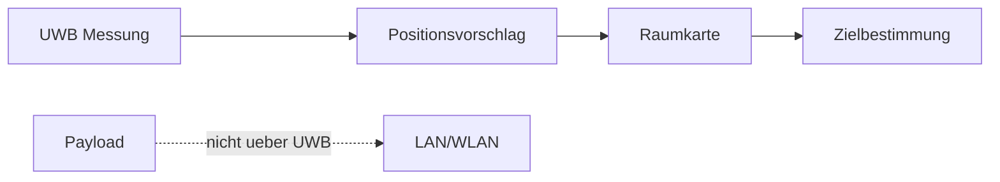

# ADR-0008 Warum UWB ausschliesslich fuer Positionsbestimmung vorgesehen ist

Dokument-ID: RKWS-ADR-0008  
Version: 1.0.0  
Status: Accepted  
Datum: 2026-07-02

## Problemstellung

UWB kann praezise Positionsdaten liefern. Es waere technisch verlockend, UWB auch als Datenkanal zu betrachten, obwohl es dafuer nicht zum Produktziel passt.

## Moegliche Alternativen

1. UWB ignorieren.
2. UWB fuer Payload-Transport nutzen.
3. UWB ausschliesslich fuer Positionsbestimmung nutzen.

## Bewertung der Alternativen

UWB zu ignorieren verschenkt spaeteres Automatisierungspotenzial. UWB fuer Payloads zu nutzen waere langsam, komplex und am Ziel vorbei. UWB fuer Position passt zur Raumkartenidee.

## Getroffene Entscheidung

UWB wird ausschliesslich fuer Positionsbestimmung und Raumkartenunterstuetzung vorgesehen. Payloads laufen nicht ueber UWB.

## Konsequenzen

Manuelle Raumkarten bleiben der V0.1-Standard. UWB kann spaeter manuelle Positionen vorschlagen oder validieren. Hardware- und Firmwaretests behandeln UWB als Positionssensor.

## Risiken

UWB-Genauigkeit kann durch Umgebung, Abschattung und Hardwarequalitaet schwanken. Falsche automatische Positionen koennen falsche Transferziele erzeugen.

## Offene Punkte

- Kalibrierung gegen manuelle Raumkarten.
- Mindestgenauigkeit fuer produktive Nutzung.
- Datenschutz und Logging von Positionsdaten.

## Diagramm

## Querverweise

- `Spec/HardwareArchitectureV0.md`
- `Spec/HardwareSourcing.md`
- `Spec/Communication.md`

## Aenderungsverlauf

| Version | Datum | Aenderung |
| --- | --- | --- |
| 1.0.0 | 2026-07-02 | UWB-Rolle auf Positionsbestimmung begrenzt. |
