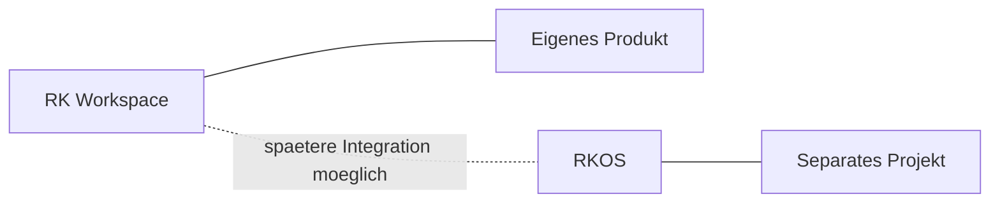

# ADR-0009 RK Workspace bleibt getrennt von RKOS

Dokument-ID: RKWS-ADR-0009  
Version: 1.0.0  
Status: Accepted  
Datum: 2026-07-02

## Problemstellung

RK Workspace hat eigene Plattformagenten, eigene Hardwareoptionen, eigene Sicherheitsrisiken und eigene Release-Zyklen. Eine Einbettung in RKOS wuerde Produktgrenzen verwischen.

## Moegliche Alternativen

1. RK Workspace als RKOS-Modul entwickeln.
2. RK Workspace als Plugin fuer RKOS entwickeln.
3. RK Workspace als eigenstaendiges Produkt entwickeln.

## Bewertung der Alternativen

Ein RKOS-Modul waere eng gekoppelt. Ein Plugin waere flexibler, aber weiterhin vom RKOS-Takt abhaengig. Ein eigenstaendiges Produkt ermoeglicht Plattformbreite, Hardware-Roadmap und eigene Releases.

## Getroffene Entscheidung

RK Workspace bleibt ein eigenstaendiges Produkt.

## Konsequenzen

Das Projekt hat eigenes Repository, eigene Dokumentation, eigene Roadmap und eigene Releases. RKOS kann spaeter integriert werden, ist aber keine Voraussetzung.

## Risiken

Getrennte Projekte verursachen mehr Koordination. Gemeinsame Begriffe muessen spaeter konsistent gehalten werden.

## Offene Punkte

- Spaetere RKOS-Integrationspunkte.
- Gemeinsame Identitaets- oder Rechteverwaltung, falls erforderlich.

## Diagramm

## Querverweise

- `README.md`
- `Docs/00_ProductVision.md`
- `Docs/08_Roadmap.md`

## Aenderungsverlauf

| Version | Datum | Aenderung |
| --- | --- | --- |
| 1.0.0 | 2026-07-02 | Produkttrennung als ADR nachgezogen. |
