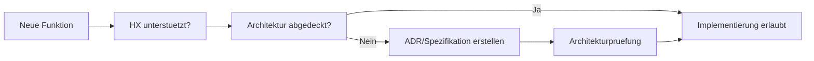

# RKWS-0200 Architecture Decision Records

Dokument-ID: RKWS-ADR-INDEX  
Version: 0.3.0
Status: Accepted  
Datum: 2026-07-02

## Zweck

Architecture Decision Records dokumentieren verbindliche Grundsatzentscheidungen fuer RK Workspace. Neue Implementierungen duerfen nur begonnen werden, wenn sie durch Architektur, Spezifikation und ADRs abgedeckt sind.

ADRs folgen HX-000. Eine technisch saubere Entscheidung ist nicht ausreichend, wenn sie die Arbeitsraum-Wahrnehmung zerstoert oder den Benutzer wieder an Geraete, Fenster oder Betriebssysteme erinnert.

## Pflichtstruktur

Jede ADR enthaelt:

- Problemstellung
- Moegliche Alternativen
- Bewertung der Alternativen
- Getroffene Entscheidung
- Konsequenzen
- Risiken
- Offene Punkte

## Diagramm

## ADR-Liste

- `ADR-0001-workspaces-instead-of-devices.md`
- `ADR-0002-optional-hardware-dongles.md`
- `ADR-0003-platform-neutral-core.md`
- `ADR-0004-separate-discovery-and-data-transfer.md`
- `ADR-0005-gui-for-setup-diagnostics-administration.md`
- `ADR-0006-gestures-as-primary-interaction.md`
- `ADR-0007-smart-devices-and-display-nodes.md`
- `ADR-0008-uwb-for-positioning-only.md`
- `ADR-0009-rk-workspace-separate-from-rkos.md`

## Querverweise

- `Spec/HumanExperienceSpecification_HX000.md`
- `Docs/Architecture/ArchitectureFreeze.md`
- `Docs/Decisions/DecisionLog.md`
- `Spec/DocumentationQuality.md`

## Aenderungsverlauf

| Version | Datum | Aenderung |
| --- | --- | --- |
| 0.3.0 | 2026-07-03 | HX-000 als Vorrangregel fuer ADRs ergaenzt. |
| 0.2.0 | 2026-07-02 | ADR-Struktur fuer Master-Arbeitsauftrag 002 vervollstaendigt. |
| 0.1.0 | 2026-07-02 | Erste ADR-Struktur angelegt. |
