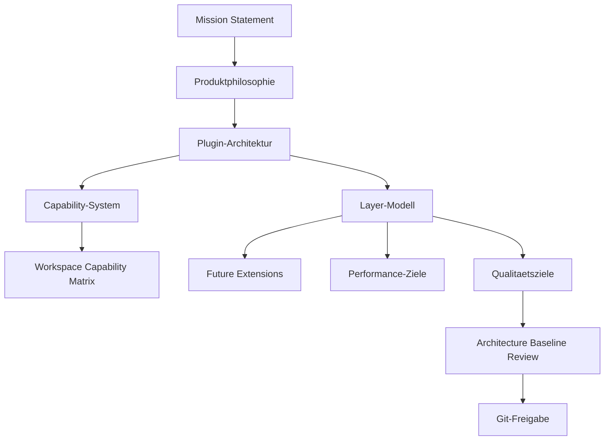

# RKWS Architecture Baseline Completion

Dokument-ID: RKWS-ARCH-BASELINE-001  
Version: 1.0.0  
Status: Accepted  
Datum: 2026-07-02

## Zweck

Dieses Dokument markiert den Abschluss der Architecture Baseline nach Master-Arbeitsauftrag 002A. Die Baseline ist die verbindliche technische Grundlage fuer alle spaeteren Implementierungen.

## Baseline-Bestandteile

## Verbindliche Architekturgrundlagen

- Benutzer arbeiten mit Arbeitsflaechen, nicht mit Geraeten.
- Objekte gehoeren dem Benutzer und seinem Arbeitskontext, nicht einem Geraet.
- Plattformen sind Implementierungsdetails.
- Der Core bleibt plattformneutral.
- Alle Plattform- und Integrationsfunktionen laufen ueber Plugins oder Adapter.
- Capabilities entscheiden ueber Funktionen, nicht Geraeteklassen.
- Plugin-Abhaengigkeiten muessen azyklisch bleiben.
- Das Layer-Modell definiert erlaubte Kommunikationsrichtungen.
- Hardware, Firmware, Cloud und UWB bleiben optionale Erweiterungen.
- Performance- und Qualitaetsziele sind Referenz fuer spaetere Releases.

## Scope-Grenzen bis Master-Arbeitsauftrag 003

Bis zum Beginn von Master-Arbeitsauftrag 003 gilt weiterhin:

- keine Plattformimplementierung
- keine GUI-Entwicklung
- keine Firmwareentwicklung
- keine Hardwareentwicklung
- keine Netzwerkimplementierung
- keine Betriebssystemintegration

Master-Arbeitsauftrag 003 darf erst produktive Core- und Komponentenentwicklung starten, wenn er die Baseline respektiert.

## Querverweise

- `Spec/ProductPhilosophy.md`
- `Spec/PluginArchitecture.md`
- `Spec/CapabilityModel.md`
- `Spec/LayerModel.md`
- `Docs/Architecture/ArchitectureBaselineReview.md`
- `Docs/Architecture/GitReleaseReadiness.md`

## Aenderungsverlauf

| Version | Datum | Aenderung |
| --- | --- | --- |
| 1.0.0 | 2026-07-02 | Architecture Baseline Completion fuer RKWS-0450 freigegeben. |
