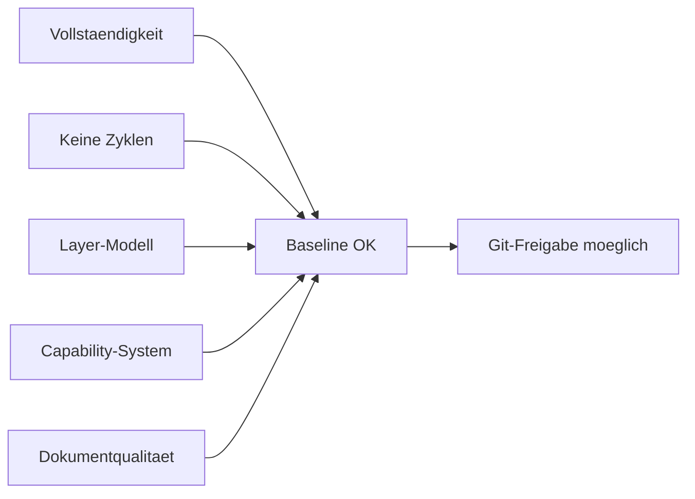

# RKWS-0440 Architecture Baseline Review

Dokument-ID: RKWS-ARCH-BASELINE-REVIEW-001  
Version: 1.0.0  
Status: Accepted  
Datum: 2026-07-02

## Zweck

Dieses Dokument dokumentiert die abschliessende Architekturpruefung fuer Master-Arbeitsauftrag 002A. Geprueft wurden Vollstaendigkeit, Widersprueche, Redundanzen, zyklische Abhaengigkeiten, Pluginfaehigkeit, Layermodell, Erweiterbarkeit, Hardwareintegration, Firmwareintegration und Dokumentationsqualitaet.

## Pruefmatrix

| Bereich | Ergebnis | Bemerkung |
| --- | --- | --- |
| Vollstaendigkeit | Bestanden | RKWS-0340 bis RKWS-0450 sind dokumentiert. |
| Widersprueche | Bestanden | Workspace-, Plugin-, Capability- und Layer-Modell sind konsistent. |
| Redundanzen | Bestanden | `Docs` erklaert, `Spec` definiert normativ. |
| Zyklische Abhaengigkeiten | Bestanden | Plugin-Dependency-Regeln verbieten Zyklen. |
| Pluginfaehigkeit | Bestanden | Plugin Manager, Schnittstellen und Lebenszyklus definiert. |
| Layermodell | Bestanden | Erlaubte und verbotene Kommunikationsrichtungen dokumentiert. |
| Erweiterbarkeit | Bestanden | Future Extensions sind architektonisch eingeordnet. |
| Hardwareintegration | Bestanden | Hardware bleibt optional und capability-basiert. |
| Firmwareintegration | Bestanden | Firmware ist ueber Firmware/Update/Hardware Plugins eingeordnet. |
| Dokumentationsqualitaet | Bestanden | Neue Baseline-Dokumente sind versioniert, verlinkt und diagrammiert. |

## Review-Diagramm

## Gefundene Punkte

| ID | Kategorie | Fund | Massnahme |
| --- | --- | --- | --- |
| ABR-001 | Produkt | Mission Statement fehlte als eigener Abschnitt. | In `Docs/00_ProductVision.md` und `Spec/ProductVision.md` ergaenzt. |
| ABR-002 | Produkt | Produktphilosophie war implizit, aber nicht normativ. | `Spec/ProductPhilosophy.md` erstellt. |
| ABR-003 | Architektur | Plugin-System war noch nicht definiert. | `Spec/PluginArchitecture.md` erstellt. |
| ABR-004 | Architektur | Plugin-Abhaengigkeiten und Zyklen waren nicht explizit. | `Spec/PluginDependencyDiagram.md` erstellt. |
| ABR-005 | Architektur | Layer-Modell fehlte. | `Spec/LayerModel.md` erstellt. |
| ABR-006 | Capabilities | Capability-System fehlte als vollstaendiges Modell. | `Spec/CapabilityModel.md` erstellt. |
| ABR-007 | Capabilities | Workspace-Capability-Matrix fehlte. | `Spec/WorkspaceCapabilityMatrix.md` erstellt. |
| ABR-008 | Zukunft | Future Extensions waren nicht eingeordnet. | `Spec/FutureExtensions.md` erstellt. |
| ABR-009 | Betrieb | Messbare Performance-Ziele fehlten. | `Spec/PerformanceTargets.md` erstellt. |
| ABR-010 | Qualitaet | Produktweite Qualitaetsziele fehlten. | `Spec/QualityGoals.md` erstellt. |

## Restrisiken

- Die Plugin-Schnittstellen sind noch Architekturvertraege, keine API-Spezifikation.
- Performance-Ziele muessen nach ersten produktiven Messungen kalibriert werden.
- Runtime-Capability-Erkennung wird erst in spaeteren Implementierungsauftraegen konkretisiert.
- Hardwarepreise und Verfuegbarkeit muessen vor echter Beschaffung neu geprueft werden.

## Freigabe

Architecture Baseline Completion ist bestanden. Initial Commit ist nach erfolgreichem Regressionstest und sauberem Git-Status freigabefaehig.

## Querverweise

- `Docs/Architecture/ArchitectureBaseline.md`
- `Docs/Architecture/GitReleaseReadiness.md`
- `Spec/PluginArchitecture.md`
- `Spec/CapabilityModel.md`
- `Spec/LayerModel.md`
- `Spec/QualityGoals.md`

## Aenderungsverlauf

| Version | Datum | Aenderung |
| --- | --- | --- |
| 1.0.0 | 2026-07-02 | Abschlusspruefung fuer RKWS-0440 dokumentiert. |
