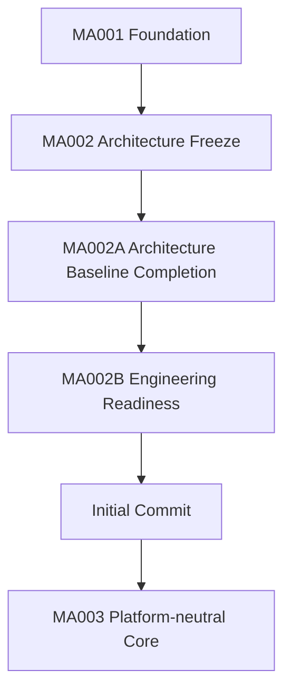

# RKWS-0540 Architecture Baseline v1.0

Dokument-ID: RKWS-ARCH-BASELINE-V1  
Version: 1.0.1  
Status: Accepted  
Datum: 2026-07-02

## Zweck

Dieses Dokument gibt die Architecture Baseline v1.0 fuer den Initial Commit frei. Es konsolidiert den freigegebenen Stand, enthaltene Dokumente, ADRs, Spezifikationen, Testergebnis, bekannte offene Punkte und die Freigabe fuer MA003 nach Commit.

## Freigegebener Stand

Architecture Baseline v1.0 umfasst die Ergebnisse aus MA001, MA002, MA002A und MA002B. Die Baseline enthaelt Projektstruktur, Dokumentation, ADRs, Spezifikationen, Core-Datenmodelle, lokale Simulation, Unit-Tests, CI-Grundstruktur, Engineering Readiness Check und Git-Readiness-Bericht.



## Enthaltene zentrale Dokumente

- `README.md`
- `Docs/00_ProductVision.md`
- `Docs/01_SystemArchitecture.md`
- `Docs/02_SoftwareArchitecture.md`
- `Docs/Glossary.md`
- `Docs/Architecture/ArchitectureFreeze.md`
- `Docs/Architecture/ArchitectureBaseline.md`
- `Docs/Architecture/ArchitectureBaselineReview.md`
- `Docs/Architecture/EngineeringReadinessCheck.md`
- `Docs/Architecture/OpenIssuesBeforeMA003.md`
- `Docs/Architecture/GitInitialCommitReadiness.md`

## Enthaltene ADRs

- `Docs/ADR/ADR-0001-workspaces-instead-of-devices.md`
- `Docs/ADR/ADR-0002-optional-hardware-dongles.md`
- `Docs/ADR/ADR-0003-platform-neutral-core.md`
- `Docs/ADR/ADR-0004-separate-discovery-and-data-transfer.md`
- `Docs/ADR/ADR-0005-gui-for-setup-diagnostics-administration.md`
- `Docs/ADR/ADR-0006-gestures-as-primary-interaction.md`
- `Docs/ADR/ADR-0007-smart-devices-and-display-nodes.md`
- `Docs/ADR/ADR-0008-uwb-for-positioning-only.md`
- `Docs/ADR/ADR-0009-rk-workspace-separate-from-rkos.md`

## Enthaltene Spezifikationen

- `Spec/ProductVision.md`
- `Spec/ProductPhilosophy.md`
- `Spec/ObjectModel.md`
- `Spec/WorkspaceModel.md`
- `Spec/DisplayNodeModel.md`
- `Spec/StateMachine.md`
- `Spec/SecurityModel.md`
- `Spec/Communication.md`
- `Spec/Protocol.md`
- `Spec/PluginArchitecture.md`
- `Spec/PluginDependencyDiagram.md`
- `Spec/LayerModel.md`
- `Spec/CapabilityModel.md`
- `Spec/WorkspaceCapabilityMatrix.md`
- `Spec/GestureModel.md`
- `Spec/HardwareArchitectureV0.md`
- `Spec/HardwareSourcing.md`
- `Spec/Firmware.md`
- `Spec/FutureExtensions.md`
- `Spec/PerformanceTargets.md`
- `Spec/QualityGoals.md`
- `Spec/TestStrategy.md`
- `Spec/VersionV0.1.md`
- `Spec/DocumentationQuality.md`

## Testergebnis

Finaler Regressionstest fuer diesen Stand:

```powershell
.\tools\run-tests.ps1
```

Final bestaetigtes Ergebnis am 2026-07-02:

- Build erfolgreich
- 0 Warnungen
- 0 Fehler
- alle 6 Tests bestanden
- lokale Simulation A nach B erfolgreich
- Build-Artefakte nach Testlauf bereinigt

## Bekannte offene Punkte

Alle bekannten offenen Punkte sind zentral in `Docs/Architecture/OpenIssuesBeforeMA003.md` dokumentiert. Keiner dieser Punkte blockiert den Initial Commit.

## Freigabe fuer Initial Commit

Architecture Baseline v1.0 ist fuer den Initial Commit freigegeben. Der Commit kann technisch ausgefuehrt werden, sobald Git-Autorname und Git-E-Mail gesetzt oder fuer den Commit bereitgestellt wurden.

Empfohlene Commit-Nachricht:

```text
chore: establish RK Workspace architecture baseline v1.0
```

## Freigabe fuer MA003

MA003 darf nach Initial Commit, privatem Remote und erstem Push beginnen. MA003 entwickelt den plattformneutralen Core und erste produktive Komponenten auf Grundlage dieser Baseline.

## Post-Baseline Addendum

MA003.01 baut auf Architecture Baseline v1.0 auf und fuehrt den Plugin Manager als erste produktive Core-Komponente ein. Diese Ergaenzung aendert die Baseline nicht inhaltlich; sie dokumentiert nur den Beginn der Entwicklung nach der freigegebenen Baseline.

## Querverweise

- `Docs/Architecture/GitInitialCommitReadiness.md`
- `Docs/Architecture/OpenIssuesBeforeMA003.md`
- `Docs/Architecture/EngineeringReadinessCheck.md`
- `Spec/VersionV0.1.md`
- `Docs/Development/MA003_Progress.md`
- `tools/run-tests.ps1`

## Aenderungsverlauf

| Version | Datum | Aenderung |
| --- | --- | --- |
| 1.0.1 | 2026-07-02 | Post-Baseline-Hinweis fuer MA003.01 ergaenzt. |
| 1.0.0 | 2026-07-02 | Architecture Baseline v1.0 fuer Initial Commit freigegeben. |
