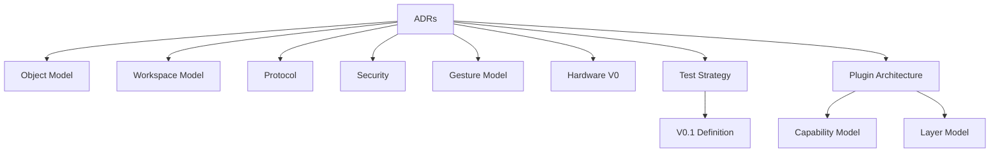

# RKWS Architecture Freeze

Dokument-ID: RKWS-ARCH-FREEZE-001  
Version: 1.1.0  
Status: Accepted  
Datum: 2026-07-02

## Zweck

Dieses Dokument friert die technische Grundlage nach Master-Arbeitsauftrag 002 ein. Neue groessere Implementierungen duerfen erst beginnen, wenn sie durch ADR, Spezifikation und Teststrategie abgedeckt sind.

## Eingefrorene Architekturentscheidungen

- Arbeitsflaechen sind die primaere Abstraktion.
- Hardware-Dongles sind optional.
- Der Core bleibt plattformneutral.
- Discovery, Position und Payload-Transport sind getrennt.
- Die GUI dient Einrichtung, Diagnose und Administration.
- Gesten sind Primaerinteraktion.
- Smart Devices und Display Nodes sind getrennte Workspace-Klassen.
- UWB dient ausschliesslich Positionsbestimmung.
- Funktionen werden ueber Plugins eingebunden.
- Capabilities entscheiden ueber Verhalten, nicht Geraetetypen.
- Das Layer-Modell ist verbindlich.

## Eingefrorene Spezifikationen

## Regeln ab Freeze

Keine Plattformimplementierung ohne Abdeckung in `Docs/ADR`, `Spec` und Tests. Keine Hardwareauswahl ohne `Spec/HardwareSourcing.md`. Keine Protokollimplementierung ohne `Spec/Protocol.md`. Keine neue Geste ohne `Spec/GestureModel.md`.

## Querverweise

- `Docs/ADR/README.md`
- `Spec/DocumentationQuality.md`
- `Docs/Architecture/ArchitectureReview.md`
- `Docs/Architecture/ArchitectureBaseline.md`
- `Spec/PluginArchitecture.md`
- `Spec/CapabilityModel.md`
- `Spec/LayerModel.md`

## Aenderungsverlauf

| Version | Datum | Aenderung |
| --- | --- | --- |
| 1.1.0 | 2026-07-02 | Architecture Baseline Completion aus 002A aufgenommen. |
| 1.0.0 | 2026-07-02 | Architektur-Freeze fuer Master-Arbeitsauftrag 002 dokumentiert. |
