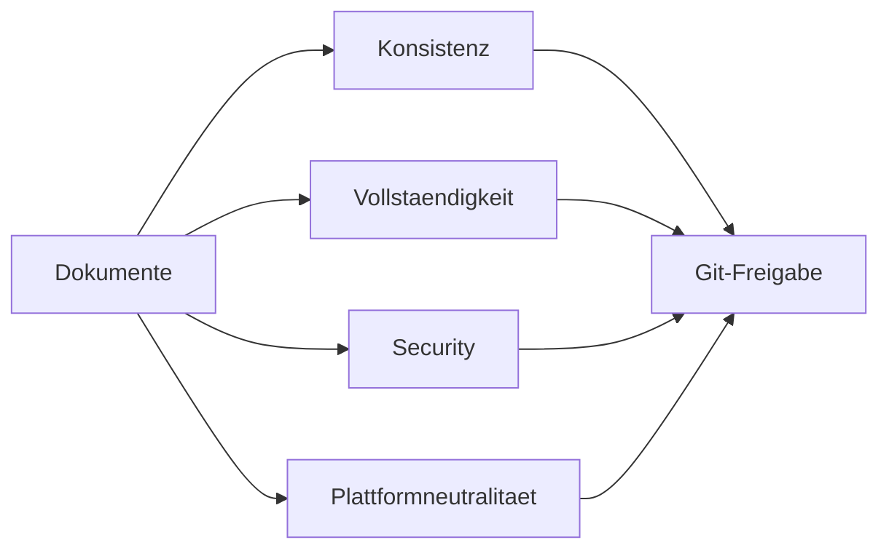

# RKWS-0320 Architecture Review

Dokument-ID: RKWS-ARCH-REVIEW-001  
Version: 1.0.0  
Status: Accepted  
Datum: 2026-07-02

## Zweck

Dieses Dokument dokumentiert die Architekturpruefung vor Git-Freigabe. Geprueft wurden Konsistenz, Vollstaendigkeit, Redundanzen, Widersprueche, Plattformneutralitaet, Erweiterbarkeit, Wartbarkeit und Sicherheitskonzept.

## Pruefdiagramm

## Gefundene Punkte und Ergebnis

| ID | Kategorie | Fund | Ergebnis |
| --- | --- | --- | --- |
| AR-001 | Konsistenz | ADR-Nummern aus Auftrag 001 passten nicht zu RKWS-0200. | ADR-0001 bis ADR-0008 neu ausgerichtet, RKOS-Trennung als ADR-0009 erhalten. |
| AR-002 | Vollstaendigkeit | Objektmodell enthielt noch kein `TransferStatus`. | `TransferStatus` in Spec und Core-Modell ergaenzt. |
| AR-003 | Vollstaendigkeit | Transfer-State-Machine fehlte. | `Spec/StateMachine.md` erstellt. |
| AR-004 | Sicherheit | Security-Doku war noch high-level. | `Spec/SecurityModel.md` erstellt. |
| AR-005 | Kommunikation | Protokollphasen waren dokumentiert, aber nicht vollstaendig spezifiziert. | `Spec/Protocol.md` erstellt. |
| AR-006 | UX | Gesten waren beschrieben, aber nicht als Zustandsdiagramme. | `Spec/GestureModel.md` erstellt. |
| AR-007 | Hardware | Hardwarearchitektur und Beschaffung waren noch getrennt unscharf. | `Spec/HardwareArchitectureV0.md` und `Spec/HardwareSourcing.md` erstellt. |
| AR-008 | Teststrategie | Testplan war nicht vollstaendig genug fuer Langzeitprodukt. | `Spec/TestStrategy.md` erstellt. |
| AR-009 | Git-Freigabe | V0.1 war nicht normativ definiert. | `Spec/VersionV0.1.md` erstellt. |

## Bewertung

Konsistenz: akzeptiert. Die Begriffe Workspace, DeviceIdentity, Display Node, TransferObject, TransferStatus und Protocol sind aufeinander bezogen.  
Vollstaendigkeit: akzeptiert fuer Architektur-Freeze. Echte Implementierungsdetails fuer Netzwerk und Plattformagenten bleiben bewusst spaeter.  
Redundanzen: akzeptiert. `Docs` erklaert Architektur, `Spec` definiert Verhalten.  
Widersprueche: keine blockierenden Widersprueche gefunden.  
Plattformneutralitaet: akzeptiert. Core bleibt frei von OS-APIs.  
Erweiterbarkeit: akzeptiert. Dongle, UWB, Remote und Cloud sind modelliert, aber nicht erzwungen.  
Wartbarkeit: akzeptiert. ADRs, Decision-Log, CI und Dokumentstandard sind vorhanden.  
Sicherheitskonzept: akzeptiert fuer Spezifikationsebene; Implementierung benoetigt spaeter Security Review.

## Restrisiken

- Preise und Verfuegbarkeit aus Hardware-Sourcing muessen vor Beschaffung aktuell geprueft werden.
- Protokoll-Cipher-Suite ist noch nicht final ausgewaehlt.
- Windows-V0.1-Agent braucht spaeter eigene ADRs fuer OS-Hooks, Clipboard und lokale Speicherung.

## Freigabeempfehlung

Master-Arbeitsauftrag 002 ist architektonisch freigabefaehig, sobald Build, Tests und Simulation erneut erfolgreich laufen.

## Querverweise

- `Docs/Architecture/ArchitectureFreeze.md`
- `Spec/DocumentationQuality.md`
- `Spec/VersionV0.1.md`
- `Docs/Decisions/DecisionLog.md`

## Aenderungsverlauf

| Version | Datum | Aenderung |
| --- | --- | --- |
| 1.0.0 | 2026-07-02 | Architekturpruefung fuer RKWS-0320 dokumentiert. |
