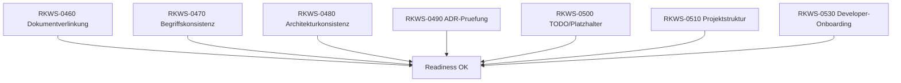

# RKWS Engineering Readiness Check

Dokument-ID: RKWS-ARCH-READINESS-CHECK-001  
Version: 1.0.0  
Status: Accepted  
Datum: 2026-07-02

## Zweck

Dieses Dokument dokumentiert den Engineering Readiness Check vor dem Initial Commit. Es deckt RKWS-0460 bis RKWS-0510 und RKWS-0530 ab.

## Pruefuebersicht

## RKWS-0460 Dokumentverlinkung

Geprueft wurden `Docs/`, `Spec/`, `hardware/`, `firmware/`, `tests/` und `README.md`. Der maschinelle Linkcheck fand zwei nicht aufloesbare Wildcard-Verweise im README. Diese wurden durch konkrete Verzeichnisnamen ersetzt. README ist jetzt der zentrale Einstiegspunkt und verlinkt Produktvision, Glossar, Baseline v1.0, Spezifikationen, ADRs und offene Punkte.

Ergebnis: bestanden.

## RKWS-0470 Begriffskonsistenz

Zentrale Begriffe wurden in `Docs/Glossary.md` definiert. Deutsch/Englisch-Zuordnung ist dokumentiert. Die bevorzugte Semantik lautet: Benutzer arbeiten mit Workspaces/Arbeitsflaechen; Devices/Geraete sind technische Identitaeten; Capabilities entscheiden Verhalten; Plugins binden Funktionen ein; Platform Adapter kapseln OS-Details.

Ergebnis: bestanden.

## RKWS-0480 Architekturkonsistenz

Geprueft wurden ObjectModel, WorkspaceModel, StateMachine, SecurityModel, Protocol, PluginArchitecture, CapabilityModel, LayerModel, WorkspaceCapabilityMatrix, HardwareArchitectureV0 und VersionV0.1. Die Modelle sind konsistent verknuepft. Der Core bleibt plattformneutral, Transfers folgen State Machine und Security-Modell, Protocol referenziert Security und State Machine, Capability Matrix bleibt Runtime-Default statt harter Geraeteentscheidung.

Groessere offene Punkte sind in `Docs/Architecture/OpenIssuesBeforeMA003.md` dokumentiert.

Ergebnis: bestanden.

## RKWS-0490 ADR-Pruefung

ADR-0001 bis ADR-0009 sind vorhanden, nummeriert, auf `Accepted` gesetzt und im DecisionLog referenziert. Jede grundlegende Architekturentscheidung der Architecture Baseline ist durch eine ADR abgedeckt.

Ergebnis: bestanden.

## RKWS-0500 TODO- und Platzhalterpruefung

Es wurden keine versteckten `TODO`, `FIXME` oder `TBD`-Marker gefunden. Reservierte Verzeichnisse wurden sprachlich bereinigt. Bekannte offene Architekturpunkte sind zentral in `Docs/Architecture/OpenIssuesBeforeMA003.md` dokumentiert.

Ergebnis: bestanden.

## RKWS-0510 Projektstruktur

Software, Firmware, Hardware, PCB, Mechanical, Tests, Tools und Release sind getrennt. Leere zukunftsrelevante Verzeichnisse enthalten `.gitkeep`. Build-Artefakte werden durch `.gitignore` ausgeschlossen und vor Abschluss entfernt.

Ergebnis: bestanden.

## RKWS-0530 Developer-Onboarding

README beantwortet: Was ist RK Workspace, Ziel, aktueller Stand, Build, Tests, Spezifikationen, ADRs, Verbote vor MA003 und naechster Entwicklungsschritt.

Ergebnis: bestanden.

## Querverweise

- `README.md`
- `Docs/Glossary.md`
- `Docs/Architecture/OpenIssuesBeforeMA003.md`
- `Docs/Architecture/ArchitectureBaseline_v1.0.md`
- `Docs/Architecture/GitInitialCommitReadiness.md`

## Aenderungsverlauf

| Version | Datum | Aenderung |
| --- | --- | --- |
| 1.0.0 | 2026-07-02 | Engineering Readiness Check fuer MA002B dokumentiert. |
