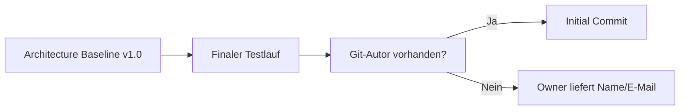

# RKWS-0550 Git Initial Commit Readiness

Dokument-ID: RKWS-ARCH-GIT-INITIAL-001  
Version: 1.0.0  
Status: Accepted  
Datum: 2026-07-02

## Zweck

Dieses Dokument bewertet, ob der aktuelle Stand fuer den Initial Commit bereit ist.

## Git-Status

Das Repository ist lokal initialisiert. Es gibt noch keinen Initial Commit. Der aktuelle Git-Status zeigt die Projektdateien als uncommitted/untracked, was vor dem Initial Commit erwartet ist.

```text
?? .gitattributes
?? .github/
?? .gitignore
?? Docs/
?? Mechanical/
?? PCB/
?? README.md
?? Spec/
?? firmware/
?? hardware/
?? release/
?? src/
?? tests/
?? tools/
```

Git-Autorname und Git-E-Mail sind noch nicht konfiguriert oder wurden Codex noch nicht bereitgestellt.

## Gepruefte Ordner

- `Docs/`
- `Spec/`
- `hardware/`
- `firmware/`
- `tests/`
- `tools/`
- `src/`
- `PCB/`
- `Mechanical/`
- `release/`
- `.github/`

## Buildstatus

Buildstatus: freigegeben.

Final bestaetigter Nachweis am 2026-07-02:

- `dotnet build` erfolgreich
- 0 Warnungen
- 0 Fehler

## Teststatus

Teststatus: freigegeben.

Final bestaetigter Nachweis am 2026-07-02:

- alle 6 Unit-Tests bestanden
- lokale Simulation A nach B erfolgreich
- Simulation erzeugt vollstaendiges Log
- Build-Artefakte wurden nach dem Testlauf bereinigt

## Offene Punkte

Bekannte offene Punkte sind in `Docs/Architecture/OpenIssuesBeforeMA003.md` dokumentiert. Keine bekannten offenen Punkte blockieren den Initial Commit.

## Empfehlung

Commit ist fachlich freigegeben.

Commit darf technisch erst ausgefuehrt werden, wenn Git-Autorname und Git-E-Mail vorhanden sind.

Empfohlene Commit-Nachricht:

```text
chore: establish RK Workspace architecture baseline v1.0
```

## Diagramm



## Querverweise

- `Docs/Architecture/ArchitectureBaseline_v1.0.md`
- `Docs/Architecture/EngineeringReadinessCheck.md`
- `Docs/Architecture/OpenIssuesBeforeMA003.md`
- `tools/run-tests.ps1`

## Aenderungsverlauf

| Version | Datum | Aenderung |
| --- | --- | --- |
| 1.0.0 | 2026-07-02 | Git Readiness Report fuer Initial Commit erstellt. |
