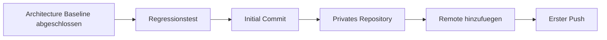

# RKWS-0450 Git Release Readiness

Dokument-ID: RKWS-ARCH-GIT-READINESS-001  
Version: 1.0.0  
Status: Accepted  
Datum: 2026-07-02

## Zweck

Dieses Dokument dokumentiert die Git-Freigabe vor Initial Commit, privatem Repository, Remote und erstem Push.

## Freigabe-Checkliste

| Punkt | Status | Nachweis |
| --- | --- | --- |
| Mission Statement | Erfuellt | `Docs/00_ProductVision.md` |
| Produktphilosophie | Erfuellt | `Spec/ProductPhilosophy.md` |
| Plugin-Architektur | Erfuellt | `Spec/PluginArchitecture.md` |
| Capability-System | Erfuellt | `Spec/CapabilityModel.md` |
| Workspace Capability Matrix | Erfuellt | `Spec/WorkspaceCapabilityMatrix.md` |
| Plugin-Abhaengigkeitsdiagramm | Erfuellt | `Spec/PluginDependencyDiagram.md` |
| Schichtenmodell | Erfuellt | `Spec/LayerModel.md` |
| Future Extensions | Erfuellt | `Spec/FutureExtensions.md` |
| Performance-Ziele | Erfuellt | `Spec/PerformanceTargets.md` |
| Qualitaetsziele | Erfuellt | `Spec/QualityGoals.md` |
| Architekturpruefung | Erfuellt | `Docs/Architecture/ArchitectureBaselineReview.md` |
| Keine Plattformimplementierung | Erfuellt | Nur Architektur-/Spec-Dokumente und bestehendes Datenmodell. |
| Keine Hardwareentwicklung | Erfuellt | Keine PCB- oder Firmware-Implementierung. |
| Keine Netzwerkimplementierung | Erfuellt | Protokoll nur dokumentiert. |

## Prozess

## Freigabestatus

Architecture Baseline ist freigegeben. Der Initial Commit darf nach lokal erfolgreichem `tools/run-tests.ps1` erfolgen.

## Querverweise

- `Docs/Architecture/ArchitectureBaseline.md`
- `Docs/Architecture/ArchitectureBaselineReview.md`
- `Spec/DocumentationQuality.md`
- `tools/run-tests.ps1`

## Aenderungsverlauf

| Version | Datum | Aenderung |
| --- | --- | --- |
| 1.0.0 | 2026-07-02 | Git-Freigabe fuer RKWS-0450 dokumentiert. |
