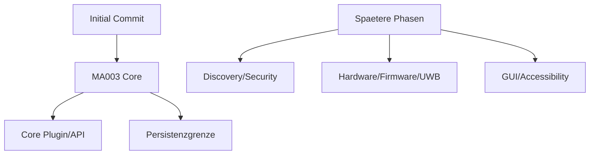

# RKWS-0500 Open Issues Before MA003

Dokument-ID: RKWS-ARCH-OPEN-ISSUES-001  
Version: 1.0.0  
Status: Accepted  
Datum: 2026-07-02

## Zweck

Dieses Dokument sammelt die vor MA003 bekannten offenen Punkte. Es ersetzt versteckte TODOs im Projekt. Die Punkte sind keine Blocker fuer den Initial Commit, muessen aber vor oder waehrend MA003 bewusst entschieden werden.

## Status

Es wurden keine `TODO`, `FIXME` oder `TBD`-Marker im Projektstand gefunden. Formal dokumentierte offene Punkte aus ADRs und Architekturpruefungen sind hier zentral zusammengefuehrt.

## Offene Punkte

| ID | Kategorie | Punkt | Quelle | Kritikalitaet fuer Initial Commit | Erwartete Behandlung |
| --- | --- | --- | --- | --- | --- |
| OI-001 | Workspace | Darstellung mehrerer Arbeitsflaechen pro Device. | ADR-0001 | Nicht blockierend | MA003/UX-Spec spaeter konkretisieren. |
| OI-002 | Workspace | Benennung gemeinsamer Arbeitsflaechen. | ADR-0001 | Nicht blockierend | Configuration/Workspace Plugin API definieren. |
| OI-003 | Hardware | Secure Element fuer Dongles bewerten. | ADR-0002, SecurityModel | Nicht blockierend | Vor Hardwarebeschaffung entscheiden. |
| OI-004 | Firmware | Firmware-Update- und Recovery-Pfad konkretisieren. | ADR-0002, Firmware | Nicht blockierend | Vor Firmwareentwicklung spezifizieren. |
| OI-005 | Core | Adapter-API zwischen Core und Plugins/Plattformagenten. | ADR-0003, PluginArchitecture | Relevant fuer MA003 | In MA003 als Core-Vertrag entwerfen. |
| OI-006 | Persistence | Persistenzgrenze fuer Pairing- und Raumkartendaten. | ADR-0003, SecurityModel | Relevant fuer MA003 | Vor produktiver Persistenz spezifizieren. |
| OI-007 | Discovery | Konkreter Discovery-Mechanismus fuer V0.1. | ADR-0004, Protocol | Nicht vor Initial Commit | Vor Netzwerkimplementierung entscheiden. |
| OI-008 | Security | Session-Protokoll/Cipher Suite fuer Payloads. | ADR-0004, SecurityModel | Nicht vor Initial Commit | Security ADR vor Implementierung. |
| OI-009 | UX | Minimaler Setup-Wizard und Diagnoseansicht. | ADR-0005 | Nicht vor MA003 | Vor GUI-Arbeit spezifizieren. |
| OI-010 | Accessibility | Barrierefreie Fallbacks fuer Gesten. | ADR-0006 | Nicht vor MA003 | UX-Spezifikation erweitern. |
| OI-011 | Nodes | Uebergang Display Node zu Hybrid Workspace. | ADR-0007 | Nicht blockierend | Future extension konkretisieren. |
| OI-012 | UWB | Kalibrierung gegen manuelle Raumkarten. | ADR-0008 | Nicht blockierend | Vor UWB-Hardwaretests definieren. |
| OI-013 | Integration | Spaetere RKOS-Integrationspunkte. | ADR-0009 | Nicht blockierend | Nur bei Bedarf eigener ADR. |
| OI-014 | Performance | Zielwerte nach ersten Messungen kalibrieren. | PerformanceTargets | Nicht blockierend | Nach V0.1-Prototyp messen. |

## Diagramm

## Bewertung

Keiner der bekannten offenen Punkte blockiert den Initial Commit der Architecture Baseline v1.0. Die Punkte sind bewusst dokumentiert und duerfen nicht als versteckte TODOs behandelt werden.

## Querverweise

- `Docs/Architecture/ArchitectureBaseline_v1.0.md`
- `Docs/Architecture/ArchitectureBaselineReview.md`
- `Docs/ADR/README.md`
- `Spec/PluginArchitecture.md`
- `Spec/VersionV0.1.md`

## Aenderungsverlauf

| Version | Datum | Aenderung |
| --- | --- | --- |
| 1.0.0 | 2026-07-02 | Zentrale Open-Issues-Liste fuer RKWS-0500 angelegt. |
