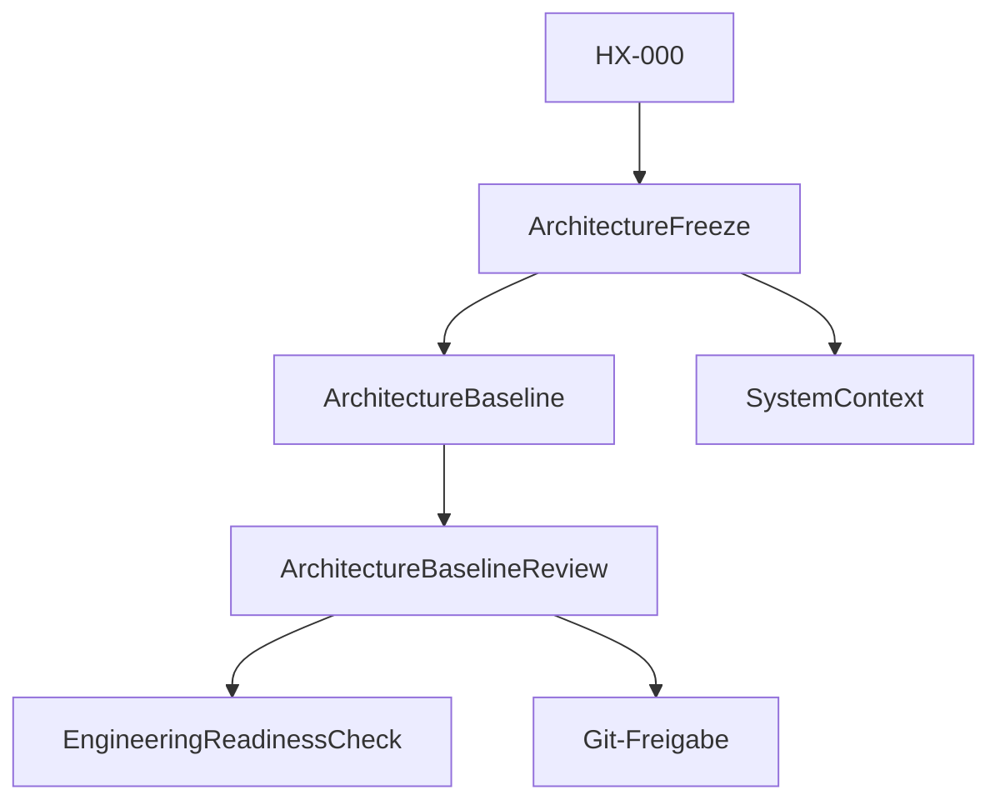

# RKWS Architecture Notes

Dokument-ID: RKWS-ARCH-INDEX  
Version: 0.6.0
Status: Accepted  
Datum: 2026-07-07

## Zweck

Dieses Verzeichnis sammelt vertiefende Architekturunterlagen, die die nummerierten Hauptdokumente ergaenzen.

Alle Architekturunterlagen folgen HX-000. Wenn eine Architekturentscheidung den Benutzer wieder an Geraete, Fenster oder Betriebssysteme erinnert, muss sie ueberarbeitet werden.

## Diagramm

## Startpunkte

- `Spec/HumanExperienceSpecification_HX000.md`
- `Docs/README.md`
- `Docs/Architecture/ArchitectureFreeze.md`
- `Docs/Architecture/ArchitectureBaseline.md`
- `Docs/Architecture/ArchitectureBaseline_v1.0.md`
- `Docs/Architecture/ArchitectureBaselineReview.md`
- `Docs/Architecture/EngineeringReadinessCheck.md`
- `Docs/Architecture/OpenIssuesBeforeMA003.md`
- `Docs/Architecture/GitReleaseReadiness.md`
- `Docs/Architecture/GitInitialCommitReadiness.md`
- `Docs/Architecture/ArchitectureReview.md`
- `Docs/Architecture/SystemContext.md`
- `Docs/Glossary.md`
- `Docs/00_ProductVision.md`
- `Docs/01_SystemArchitecture.md`
- `Docs/02_SoftwareArchitecture.md`
- `Docs/04_CommunicationProtocol.md`
- `Docs/06_SecurityModel.md`

## MA016 Architekturpfad

MA016 verbindet RKWP, PDF Lifecycle, Cross-Platform Surfaces, Proximity und SecureDev zu einem kontrollierten Pilotpfad:

- RKWP beschreibt Ownership, Leases, FrameSession, Policy und Audit.
- PDF Lifecycle trennt Closed Capsule und OpenFrame.
- Surface Contracts halten Windows, macOS und iOS/iPadOS auf einer gemeinsamen Semantik.
- Proximity Fusion waehlt genau eine naechste Ablage fuer die Glass Edge.
- SecureDev bleibt ein Entwicklungsmodus; Production Security ist ein eigener Folgeschritt.

Die Architekturentscheidung fuer Original-Owned PDF Lifecycle und Proximity Fusion ist in den MA016-ADRs dokumentiert.

## Querverweise

- `Spec/HumanExperienceSpecification_HX000.md`
- `Docs/ADR/README.md`
- `Docs/ADR/ADR_MA016_OriginalOwnedPdfLifecycle.md`
- `Docs/ADR/ADR_MA016_ProximityFusion.md`
- `Spec/DocumentationQuality.md`

## Aenderungsverlauf

| Version | Datum | Aenderung |
| --- | --- | --- |
| 0.6.0 | 2026-07-07 | MA016 Architekturpfad fuer RKWP, PDF Lifecycle, Surface, Proximity und SecureDev ergaenzt. |
| 0.5.0 | 2026-07-03 | HX-000 als uebergeordnete Regel fuer Architekturentscheidungen ergaenzt. |
| 0.4.0 | 2026-07-02 | Engineering Readiness Check und Baseline v1.0 aufgenommen. |
| 0.3.0 | 2026-07-02 | Architecture Baseline Completion aufgenommen. |
| 0.2.0 | 2026-07-02 | Architecture-Freeze und Review aufgenommen. |
| 0.1.0 | 2026-07-02 | Architektur-Index angelegt. |
