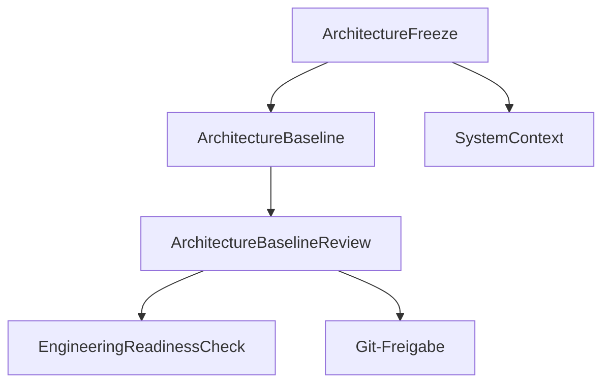

# RKWS Architecture Notes

Dokument-ID: RKWS-ARCH-INDEX  
Version: 0.4.0  
Status: Accepted  
Datum: 2026-07-02

## Zweck

Dieses Verzeichnis sammelt vertiefende Architekturunterlagen, die die nummerierten Hauptdokumente ergaenzen.

## Diagramm

## Startpunkte

- `Docs/Architecture/ArchitectureFreeze.md`
- `Docs/Architecture/ArchitectureBaseline.md`
- `Docs/Architecture/ArchitectureBaseline_v1.0.md`
- `Docs/Architecture/ArchitectureBaselineReview.md`
- `Docs/Architecture/EngineeringReadinessCheck.md`
- `Docs/Architecture/OpenIssuesBeforeMA003.md`
- `Docs/Architecture/GitReleaseReadiness.md`
- `Docs/Architecture/GitInitialCommitReadiness.md`
- `Docs/Architecture/ArchitectureReview.md`
- `Docs/Architecture/SystemContext.md`
- `Docs/Glossary.md`
- `Docs/00_ProductVision.md`
- `Docs/01_SystemArchitecture.md`
- `Docs/02_SoftwareArchitecture.md`
- `Docs/04_CommunicationProtocol.md`
- `Docs/06_SecurityModel.md`

## Querverweise

- `Docs/ADR/README.md`
- `Spec/DocumentationQuality.md`

## Aenderungsverlauf

| Version | Datum | Aenderung |
| --- | --- | --- |
| 0.4.0 | 2026-07-02 | Engineering Readiness Check und Baseline v1.0 aufgenommen. |
| 0.3.0 | 2026-07-02 | Architecture Baseline Completion aufgenommen. |
| 0.2.0 | 2026-07-02 | Architecture-Freeze und Review aufgenommen. |
| 0.1.0 | 2026-07-02 | Architektur-Index angelegt. |
