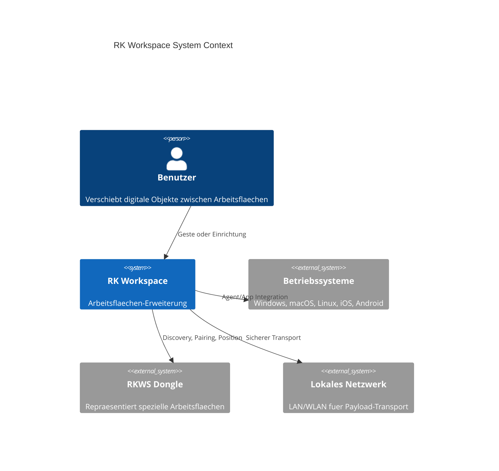

# RKWS System Context

Dokument-ID: RKWS-ARCH-CONTEXT-001  
Version: 0.2.0  
Status: Accepted  
Datum: 2026-07-02

## Kontext

RK Workspace sitzt zwischen Benutzerinteraktion, Plattformagenten, Arbeitsflaechenmodell und sicherem Transport. Die Architektur ist arbeitsflaechenzentriert.

Falls ein Markdown-Renderer kein C4-Mermaid unterstuetzt, gilt dieselbe Struktur wie in `Docs/01_SystemArchitecture.md`.

## Querverweise

- `Docs/01_SystemArchitecture.md`
- `Docs/Architecture/ArchitectureFreeze.md`
- `Spec/DisplayNodeModel.md`

## Aenderungsverlauf

| Version | Datum | Aenderung |
| --- | --- | --- |
| 0.2.0 | 2026-07-02 | Dokumentmetadaten und Querverweise ergaenzt. |
| 0.1.0 | 2026-07-02 | Systemkontext angelegt. |
