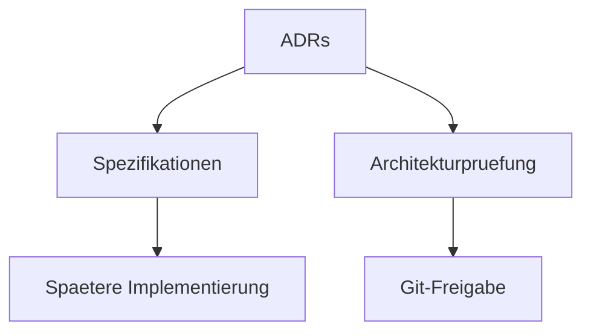

# RKWS Decision Log

Dokument-ID: RKWS-DECISION-LOG  
Version: 0.2.0  
Status: Accepted  
Datum: 2026-07-02

## Entscheidungen

| Date | Decision | Reference |
| --- | --- | --- |
| 2026-07-02 | Arbeitsflaechen sind wichtiger als Geraete. | `Docs/ADR/ADR-0001-workspaces-instead-of-devices.md` |
| 2026-07-02 | Hardware-Dongles sind optional. | `Docs/ADR/ADR-0002-optional-hardware-dongles.md` |
| 2026-07-02 | Der Core bleibt plattformneutral. | `Docs/ADR/ADR-0003-platform-neutral-core.md` |
| 2026-07-02 | Discovery und Datenuebertragung werden getrennt. | `Docs/ADR/ADR-0004-separate-discovery-and-data-transfer.md` |
| 2026-07-02 | GUI ist fuer Einrichtung, Diagnose und Administration vorgesehen. | `Docs/ADR/ADR-0005-gui-for-setup-diagnostics-administration.md` |
| 2026-07-02 | Gesten sind das primaere Bedienkonzept. | `Docs/ADR/ADR-0006-gestures-as-primary-interaction.md` |
| 2026-07-02 | Smart Devices und Display Nodes werden getrennt behandelt. | `Docs/ADR/ADR-0007-smart-devices-and-display-nodes.md` |
| 2026-07-02 | UWB ist ausschliesslich fuer Positionsbestimmung vorgesehen. | `Docs/ADR/ADR-0008-uwb-for-positioning-only.md` |
| 2026-07-02 | RK Workspace bleibt ein eigenes Produkt und wird nicht Teil von RKOS. | `Docs/ADR/ADR-0009-rk-workspace-separate-from-rkos.md` |

## Diagramm

## Querverweise

- `Docs/ADR/README.md`
- `Docs/Architecture/ArchitectureReview.md`
- `Spec/DocumentationQuality.md`

## Aenderungsverlauf

| Version | Datum | Aenderung |
| --- | --- | --- |
| 0.2.0 | 2026-07-02 | ADR-0001 bis ADR-0009 in den Decision-Log aufgenommen. |
| 0.1.0 | 2026-07-02 | Erster Decision-Log angelegt. |
