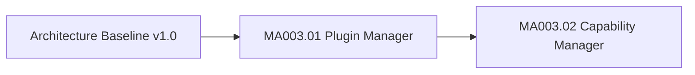

# MA003 Progress

Dokument-ID: RKWS-DEV-MA003-PROGRESS  
Version: 0.2.0
Status: Accepted  
Datum: 2026-07-02

## Zweck

Dieses Dokument verfolgt die produktive Core-Entwicklung nach der veroeffentlichten Architecture Baseline v1.0.

## Fortschritt

## MA003.01 Plugin Manager

Status: Abgeschlossen.

Umfang:

- `IPlugin`
- `IPluginManager`
- `PluginDescriptor`
- `PluginType`
- `PluginState`
- `PluginLoadResult`
- `PluginException`
- `PluginManager`
- FakePlugin im Testprojekt
- Unit-Tests fuer Registry, Lifecycle, Fehlerfaelle und Plattformneutralitaet

Nicht im Umfang:

- dynamisches Laden aus Dateien
- Platform Adapter
- Betriebssystemintegration
- Netzwerkkommunikation
- GUI
- Firmware oder Hardware

## MA003.02 Capability Manager

Status: Abgeschlossen.

Umfang:

- `CapabilityId`
- `CapabilityCategory`
- `Capability`
- `CapabilitySet`
- `CapabilityRequirement`
- `CapabilityMatchResult`
- `ICapabilityProvider`
- `ICapabilityManager`
- `CapabilityManager`
- `CapabilityException`
- FakeCapabilityProvider im Testprojekt
- Unit-Tests fuer Mengenoperationen, Provider-Registry, Matching, Fehlerfaelle und Plattformneutralitaet
- Dokumentation der semantischen Plugin-Integration ohne harte zyklische Abhaengigkeit

Nicht im Umfang:

- Runtime-Erkennung ueber Betriebssystem-APIs
- automatische Bindung von Plugins an Capability Provider
- Policy Engine
- Netzwerkkommunikation
- GUI
- Firmware oder Hardware

## Offene Punkte nach MA003.02

Der Core besitzt nun Plugin- und Capability-Grundbausteine. Spaetere Auftraege muessen Runtime-Erkennung, Policy-Filter, Trust-Integration und konkrete Plattformadapter weiterhin getrennt und auf Basis neuer ADRs bzw. freigegebener Spezifikationen umsetzen.

## Querverweise

- `Spec/PluginArchitecture.md`
- `Spec/CapabilityModel.md`
- `Docs/Architecture/ArchitectureBaseline_v1.0.md`
- `README.md`

## Aenderungsverlauf

| Version | Datum | Aenderung |
| --- | --- | --- |
| 0.2.0 | 2026-07-02 | MA003.01 abgeschlossen und MA003.02 Capability Manager dokumentiert. |
| 0.1.0 | 2026-07-02 | Fortschrittsdokument fuer MA003 angelegt. |
