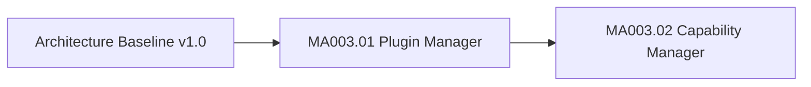

# MA003 Progress

Dokument-ID: RKWS-DEV-MA003-PROGRESS  
Version: 0.1.0  
Status: Accepted  
Datum: 2026-07-02

## Zweck

Dieses Dokument verfolgt die produktive Core-Entwicklung nach der veroeffentlichten Architecture Baseline v1.0.

## Fortschritt

## MA003.01 Plugin Manager

Status: In Umsetzung.

Umfang:

- `IPlugin`
- `IPluginManager`
- `PluginDescriptor`
- `PluginType`
- `PluginState`
- `PluginLoadResult`
- `PluginException`
- `PluginManager`
- FakePlugin im Testprojekt
- Unit-Tests fuer Registry, Lifecycle, Fehlerfaelle und Plattformneutralitaet

Nicht im Umfang:

- dynamisches Laden aus Dateien
- Platform Adapter
- Betriebssystemintegration
- Netzwerkkommunikation
- GUI
- Firmware oder Hardware

## Offene Punkte fuer MA003.02

MA003.02 entwickelt den Capability Manager auf Grundlage der Plugin-Vertraege. Der Capability Manager muss weiterhin ausschliesslich nach Capabilities entscheiden und darf keine Geraetetypen als Entscheidungsgrundlage verwenden.

## Querverweise

- `Spec/PluginArchitecture.md`
- `Spec/CapabilityModel.md`
- `Docs/Architecture/ArchitectureBaseline_v1.0.md`
- `README.md`

## Aenderungsverlauf

| Version | Datum | Aenderung |
| --- | --- | --- |
| 0.1.0 | 2026-07-02 | Fortschrittsdokument fuer MA003 angelegt. |
