# MA003 Progress

Dokument-ID: RKWS-DEV-MA003-PROGRESS  
Version: 0.7.0
Status: Accepted  
Datum: 2026-07-02

## Zweck

Dieses Dokument verfolgt die produktive Core-Entwicklung nach der veroeffentlichten Architecture Baseline v1.0.

## Fortschritt

```mermaid
flowchart LR
    Baseline["Architecture Baseline v1.0"] --> MA00301["MA003.01 Plugin Manager"]
    MA00301 --> MA00302["MA003.02 Capability Manager"]
    MA00302 --> MA00303["MA003.03 Workspace Registry"]
    MA00303 --> MA00304["MA003.04 Transfer Object Manager"]
    MA00304 --> MA00305["MA003.05 Core Integration Tests"]
    MA00305 --> MA00306["MA003.06 Core Demo Runner"]
    MA00306 --> MA00307["MA003.07 Transfer Engine Runtime"]
```

## MA003.01 Plugin Manager

Status: Abgeschlossen.

Umfang:

- `IPlugin`
- `IPluginManager`
- `PluginDescriptor`
- `PluginType`
- `PluginState`
- `PluginLoadResult`
- `PluginException`
- `PluginManager`
- FakePlugin im Testprojekt
- Unit-Tests fuer Registry, Lifecycle, Fehlerfaelle und Plattformneutralitaet

Nicht im Umfang:

- dynamisches Laden aus Dateien
- Platform Adapter
- Betriebssystemintegration
- Netzwerkkommunikation
- GUI
- Firmware oder Hardware

## MA003.02 Capability Manager

Status: Abgeschlossen.

Umfang:

- `CapabilityId`
- `CapabilityCategory`
- `Capability`
- `CapabilitySet`
- `CapabilityRequirement`
- `CapabilityMatchResult`
- `ICapabilityProvider`
- `ICapabilityManager`
- `CapabilityManager`
- `CapabilityException`
- FakeCapabilityProvider im Testprojekt
- Unit-Tests fuer Mengenoperationen, Provider-Registry, Matching, Fehlerfaelle und Plattformneutralitaet
- Dokumentation der semantischen Plugin-Integration ohne harte zyklische Abhaengigkeit

Nicht im Umfang:

- Runtime-Erkennung ueber Betriebssystem-APIs
- automatische Bindung von Plugins an Capability Provider
- Policy Engine
- Netzwerkkommunikation
- GUI
- Firmware oder Hardware

## MA003.03 Workspace Registry

Status: Abgeschlossen.

Umfang:

- `WorkspaceId`
- `WorkspaceType`
- `WorkspaceState`
- `WorkspacePosition`
- `WorkspaceDescriptor`
- `WorkspaceQuery`
- `WorkspaceMatchResult`
- `IWorkspace`
- `IWorkspaceRegistry`
- `WorkspaceRegistry`
- `WorkspaceException`
- FakeWorkspace im Testprojekt
- Unit-Tests fuer Registrierung, Aktualisierung, Suche, Zielauswahl V1, Snapshots, Fehlerfaelle und Plattformneutralitaet
- direkte Integration mit `CapabilitySet`

Nicht im Umfang:

- Netzwerkverbindungen
- automatische Discovery
- OS-APIs
- GUI
- UWB- oder Sensorlogik
- Firmware oder Hardware

## MA003.04 Transfer Object Manager

Status: Abgeschlossen.

Umfang:

- `TransferObjectId`
- `TransferObjectType`
- `TransferObjectState`
- `TransferMetadata`
- `TransferHistoryEntry`
- `ITransferObject`
- `ITransferObjectManager`
- `TransferObject`
- `TransferObjectManager`
- `TransferObjectException`
- FakeTransferObject im Testprojekt
- Unit-Tests fuer Create, Delete, Archive, Clone, Metadata, State, History, Find, Snapshot, Duplikate, Validierung, Fehlerfaelle und Plattformneutralitaet
- Vorbereitung fuer spaetere Integration mit Plugin Manager, Capability Manager und Workspace Registry

Nicht im Umfang:

- Netzwerkkommunikation
- Persistenz
- OS-APIs
- GUI
- Cloud
- Firmware oder Hardware

## MA003.05 Core Integration Tests

Status: Abgeschlossen.

Umfang:

- separates Integration-Test-Projekt `tests/Integration/RKWorkspace.Core.IntegrationTests/`
- `CoreIntegrationScenarioRunner`
- `CoreIntegrationScenarioResult`
- Szenario `CoreIntegrationScenario_TransferText_RightDirection`
- Szenario `CoreIntegrationScenario_NoMatchingTarget_Fails`
- Szenario `CoreIntegrationScenario_OnlyOneTarget_AnyDirection`
- Szenario `CoreIntegrationScenario_ForbiddenCapabilityRejected`
- Szenario `CoreIntegrationScenario_PriorityBreaksTie`
- Plattformneutralitaetspruefung fuer das Integration-Test-Assembly
- `tools/run-tests.ps1` fuehrt Build, Unit Tests, Integration Tests und Simulation getrennt aus

Nicht im Umfang:

- Netzwerkkommunikation
- Betriebssystem-APIs
- GUI
- Persistenz
- Cloud
- Firmware oder Hardware

## MA003.06 Core Demo Runner

Status: Abgeschlossen.

Umfang:

- Demo-Projekt `src/Demo/RKWorkspace.Core.Demo/`
- Startscript `tools/run-demo.ps1`
- sichtbarer End-to-End-Core-Ablauf in der Konsole
- Szenario `RKWS-Demo-Laptop` nach `RKWS-Demo-Display-Right`
- Demo nutzt Plugin Manager, Capability Manager, Workspace Registry und Transfer Object Manager
- Demo-Test in `tools/run-tests.ps1` prueft Build, Exitcode 0 und `RESULT: SUCCESS`

Nicht im Umfang:

- Produktagent
- GUI
- Netzwerkdienst
- Betriebssystem-APIs
- Persistenz
- Cloud
- Firmware oder Hardware

## MA003.07 Transfer Engine Runtime

Status: Abgeschlossen.

Umfang:

- Namespace `RKWorkspace.Core.Transfers`
- `TransferDirection`
- `TransferFailureReason`
- `TransferRequest`
- `TransferPlan`
- `TransferStep`
- `TransferResult`
- `ITransferEngine`
- `TransferEngine`
- `TransferEngineException`
- Zielauswahl ueber Workspace Registry und Capability Manager
- Required-, Optional- und Forbidden-Capability-Pruefung
- Prepare, Complete, Cancel, Fail und ExecuteLogicalTransfer
- Integrationstests verwenden die Transfer Engine statt manueller Orchestrierung
- Demo Runner verwendet die Transfer Engine statt manueller Ziel-/Statuslogik
- Unit-Tests fuer Request, Plan, Validierung, Zielauswahl, Fehlerfaelle, State-Uebergaenge, History und Plattformneutralitaet

Nicht im Umfang:

- Payload-Uebertragung
- Netzwerkkommunikation
- Betriebssystem-APIs
- GUI
- Persistenz
- Cloud
- Firmware oder Hardware

## Offene Punkte nach MA003.07

Der Core besitzt nun Plugin-, Capability-, Workspace-Registry-, Transfer-Object- und Transfer-Engine-Grundbausteine, Integrationstests und einen sichtbaren Demo Runner. Der naechste Teilauftrag kann darauf aufbauend weitere Core-Regeln definieren, weiterhin getrennt von Netzwerk, OS-Agenten, GUI, Persistenz, Cloud, Firmware und Hardware.

## Querverweise

- `Spec/PluginArchitecture.md`
- `Spec/CapabilityModel.md`
- `Docs/Architecture/ArchitectureBaseline_v1.0.md`
- `README.md`

## Aenderungsverlauf

| Version | Datum | Aenderung |
| --- | --- | --- |
| 0.7.0 | 2026-07-02 | MA003.07 Transfer Engine Runtime dokumentiert. |
| 0.6.0 | 2026-07-02 | MA003.06 Core Demo Runner als sichtbaren End-to-End-Core-Ablauf dokumentiert. |
| 0.5.0 | 2026-07-02 | MA003.05 erster vollstaendiger Core Integration Test dokumentiert. |
| 0.4.0 | 2026-07-02 | MA003.04 Transfer Object Manager als vierte produktive Core-Komponente dokumentiert. |
| 0.3.0 | 2026-07-02 | MA003.03 Workspace Registry als dritte produktive Core-Komponente dokumentiert. |
| 0.2.0 | 2026-07-02 | MA003.01 abgeschlossen und MA003.02 Capability Manager dokumentiert. |
| 0.1.0 | 2026-07-02 | Fortschrittsdokument fuer MA003 angelegt. |
