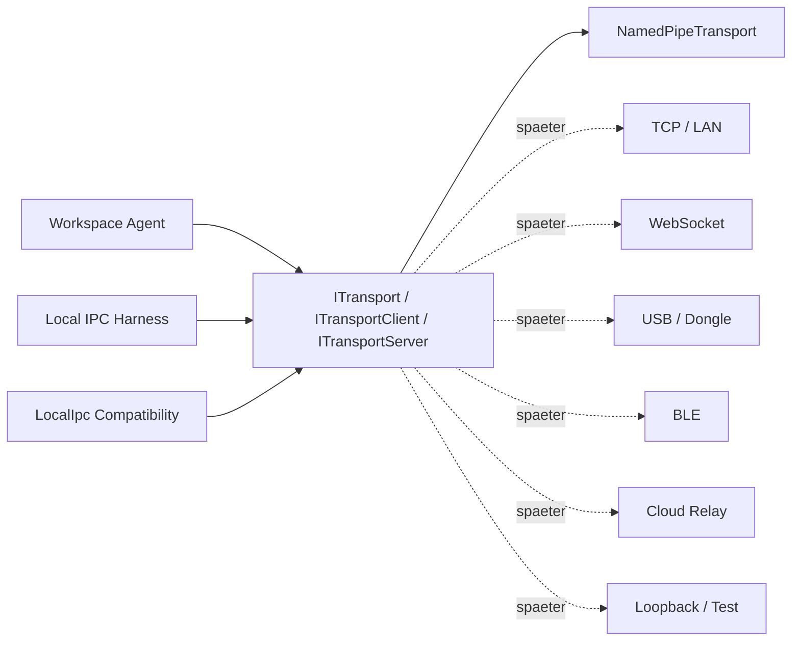

# Transport Abstraction Layer

Dokument-ID: RKWS-DEV-TRANSPORT-ABSTRACTION-LAYER
Version: 1.0.0
Status: Accepted
Datum: 2026-07-02

## Zweck

Die Transport Abstraction Layer (TAL) entkoppelt die Workspace-Agent-Kommunikation von einer konkreten lokalen IPC-Technik. Der Agent soll Nachrichten senden, Antworten empfangen und Fehler behandeln koennen, ohne direkt an Named Pipes gebunden zu sein.

MA004.04 fuehrt noch keine Netzwerkkommunikation ein. Es gibt weiterhin kein TCP, UDP, WebSocket, Discovery, Pairing, Hardware, Firmware oder Cloud Relay. Die TAL beschreibt nur den neutralen Kommunikationsvertrag und legt die bestehende lokale Named-Pipe-IPC unter diese Abstraktion.

## Struktur

```text
src/Communication/RKWorkspace.Transport/
  ITransport.cs
  ITransportClient.cs
  ITransportServer.cs
  ITransportMessage.cs
  TransportMessage.cs
  TransportMessageType.cs
  TransportEndpoint.cs
  TransportResult.cs
  TransportState.cs
  TransportException.cs

src/Communication/RKWorkspace.Transport.NamedPipes/
  NamedPipeTransport.cs
  NamedPipeTransportClient.cs
  NamedPipeTransportServer.cs
  NamedPipeTransportOptions.cs
```

`RKWorkspace.Transport` ist neutral. `RKWorkspace.Transport.NamedPipes` ist die erste Implementierung. `RKWorkspace.LocalIpc` bleibt als Kompatibilitaetsschicht erhalten und mappt alte LocalIpc-Nachrichten intern auf `TransportMessage`.

## Architektur



Die Pfeile zu spaeteren Transporten sind Architekturvorbereitung. MA004.04 implementiert nur Named Pipes.

## TransportMessage

`TransportMessage` ist generisch genug fuer Agent-IPC und spaetere Live-Workspace-Funktionen:

```text
MessageId
MessageType
SourceId
TargetId
Timestamp
Payload
CorrelationId
Headers
```

Unterstuetzte Typen:

- AgentHello
- AgentStatusRequest
- AgentStatusResponse
- WorkspaceAdvertisement
- TransferRequest
- TransferResponse
- ShutdownRequest
- ErrorResponse
- LiveSessionEvent
- WorkspaceWindowFrame
- WorkspaceObjectUpdate
- InputEvent

Die Live-Typen sind nur vorbereitet. Es gibt noch keine Live-Sitzung, kein Streaming, keine Bildschirmuebertragung und keine Eingabeweiterleitung.

## Warum TAL vor Discovery kommt

Discovery soll spaeter Agenten und Endpunkte auffindbar machen. Ohne TAL wuerde Discovery konkrete Named-Pipe-Namen oder spaetere Netzwerkdetails kennen muessen. Mit TAL kann Discovery spaeter neutrale `TransportEndpoint`-Informationen liefern, waehrend die Agent-Kommunikation gleich bleibt.

Damit bleibt die Reihenfolge stabil:

1. Agent Runtime
2. Dual Local Agent Simulation
3. Local IPC Two Process Test
4. Transport Abstraction Layer
5. Local Discovery Simulation

## Grenzen

MA004.04 erlaubt:

- lokale Named-Pipe-Kommunikation auf demselben Rechner
- neutrale Transport-Schnittstellen
- Request/Response
- Timeout- und Fehlerbehandlung
- Vorbereitung spaeterer Live-Workspace-Nachrichtentypen

MA004.04 erlaubt nicht:

- TCP, UDP oder WebSocket
- Discovery oder Pairing
- echte Remote-Kommunikation
- Betriebssystemdienst-Installation
- GUI-Erweiterung
- Hardware, Firmware oder Dongle-Kommunikation
- Cloud Relay

## Verifikation

Der Abschlusscheck fuer MA004.04 besteht aus:

```powershell
.\tools\run-tests.ps1
.\tools\run-demo.ps1
.\tools\run-agent.ps1 -Once
.\tools\run-dual-agent.ps1
.\tools\run-local-ipc.ps1
.\tools\run-studio.ps1 -SmokeTest
```

Erwartet werden 0 Warnungen, 0 Fehler, erfolgreiche Unit- und Integration-Tests, erfolgreiche Simulation, Demo `RESULT: SUCCESS`, Agent Smoke SUCCESS, Dual Agent SUCCESS, Local IPC SUCCESS und Studio Smoke SUCCESS.

## Aenderungsverlauf

| Version | Datum | Aenderung |
| --- | --- | --- |
| 1.0.0 | 2026-07-02 | Transport Abstraction Layer fuer MA004.04 dokumentiert. |
