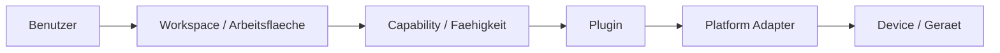

# RKWS-0470 Glossary

Dokument-ID: RKWS-GLOSSARY-001  
Version: 1.0.0  
Status: Accepted  
Datum: 2026-07-02

## Zweck

Dieses Glossar definiert bevorzugte Begriffe fuer RK Workspace und ordnet deutsche und englische Begriffe ein. Es ist verbindlich fuer Dokumentation, Spezifikation, Code-Namen und spaetere Implementierung.

## Begriffe

| Bevorzugter Begriff | Deutsch | Bedeutung | Nicht bevorzugt / Hinweis |
| --- | --- | --- | --- |
| Workspace | Arbeitsflaeche | Primaere Benutzer- und Architekturabstraktion. | Nicht "Geraet" als Zielbegriff verwenden. |
| Device | Geraet | Technische Identitaet oder Host, der eine oder mehrere Workspaces bereitstellen kann. | Nur technische Ebene, nicht Bedienphilosophie. |
| Smart Device | Smart Device | Geraet mit eigenem Agent oder App, z. B. Laptop, Phone, Tablet. | Kein Dongle erforderlich. |
| Display Node | Display-Knoten | Arbeitsflaeche, die durch Display oder Dongle repraesentiert wird. | Nicht zwingend eigener Rechner. |
| Headless Node | Headless-Knoten | Workspace ohne direktes Display. | Ziel oder Kontext, aber keine sichtbare Flaeche. |
| KVM Node | KVM-Knoten | Workspace an einem KVM-Arbeitsplatz. | Aktiver Host kann wechseln. |
| Dongle | Dongle | Optionale Hardware, die eine Arbeitsflaeche repraesentiert. | Nicht automatisch der Zielrechner. |
| TransferObject | Transferobjekt | Neutrales Objektmodell mit Metadaten, PayloadReference, Checksum und Status. | Nicht mit Payload gleichsetzen. |
| Capability | Faehigkeit | Effektive Eigenschaft eines Workspace oder Plugins. | Entscheidungen niemals nur ueber Geraetetyp treffen. |
| Plugin | Plugin | Erweiterungsbaustein fuer Plattform-, Kommunikations-, Hardware- oder Spezialfunktionen. | Core kennt nur Verträge, nicht Implementierungen. |
| Core | Core | Plattformneutraler Kern fuer Modelle, Regeln und Semantik. | Keine OS-, Netzwerk- oder Hardwarelogik. |
| Agent | Agent | Spaetere Plattformanwendung auf Desktop-/Laptop-Systemen. | Wird ueber Plugins/Adapter angebunden. |
| Platform Adapter | Plattformadapter | Schicht fuer OS-spezifische APIs unterhalb von Plugins. | Kein direkter Core-Zugriff. |
| Gesture | Geste | Benutzerinteraktion, die in neutrale Direction Intents uebersetzt wird. | Plattformgesten sind Implementierungsdetails. |
| Context | Kontext | Spaeterer Arbeits- oder App-Zustand jenseits einzelner Dateien. | Noch kein V0.1-Feature. |
| Payload | Nutzdaten | Der tatsaechliche Inhalt eines Transfers. | Wird durch TransferObject beschrieben. |
| PayloadReference | Payload-Referenz | Verweis auf Inline-Text, Pfad, Cache, URL oder Content-Adresse. | Kein Vertrauensnachweis. |
| TrustState | Vertrauenszustand | Sicherheitszustand einer Arbeitsflaeche. | Transfers nur bei `Paired` oder `Trusted`. |
| Architecture Baseline | Architektur-Baseline | Freigegebene technische Grundlage vor MA003. | Nicht ohne Review veraendern. |

## Konsistenzregeln

- In Benutzerkontexten wird `Arbeitsflaeche` oder `Workspace` verwendet.
- In Sicherheits- und Hardwarekontexten darf `Device` verwendet werden.
- `Dongle` wird als optionale Hardware fuer Node-Workspaces beschrieben.
- `Agent` bezeichnet spaetere Plattformsoftware, aber keine Core-Komponente.
- `Capability` ist die Entscheidungsgrundlage fuer Verhalten.

## Querverweise

- `Spec/ProductPhilosophy.md`
- `Spec/WorkspaceModel.md`
- `Spec/DisplayNodeModel.md`
- `Spec/CapabilityModel.md`
- `Spec/PluginArchitecture.md`

## Aenderungsverlauf

| Version | Datum | Aenderung |
| --- | --- | --- |
| 1.0.0 | 2026-07-02 | Glossar fuer RKWS-0470 angelegt. |
