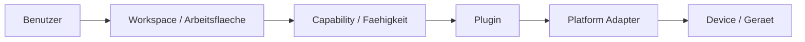

# RKWS-0470 Glossary

Dokument-ID: RKWS-GLOSSARY-001  
Version: 1.23.0
Status: Accepted  
Datum: 2026-07-07

## Zweck

Dieses Glossar definiert bevorzugte Begriffe fuer RK Workspace und ordnet deutsche und englische Begriffe ein. Es ist verbindlich fuer Dokumentation, Spezifikation, Code-Namen und spaetere Implementierung.

## Begriffe

| Bevorzugter Begriff | Deutsch | Bedeutung | Nicht bevorzugt / Hinweis |
| --- | --- | --- | --- |
| Workspace | Arbeitsflaeche | Primaere Benutzer- und Architekturabstraktion. | Nicht "Geraet" als Zielbegriff verwenden. |
| Device | Geraet | Technische Identitaet oder Host, der eine oder mehrere Workspaces bereitstellen kann. | Nur technische Ebene, nicht Bedienphilosophie. |
| Smart Device | Smart Device | Geraet mit eigenem Agent oder App, z. B. Laptop, Phone, Tablet. | Kein Dongle erforderlich. |
| Display Node | Display-Knoten | Arbeitsflaeche, die durch Display oder Dongle repraesentiert wird. | Nicht zwingend eigener Rechner. |
| Headless Node | Headless-Knoten | Workspace ohne direktes Display. | Ziel oder Kontext, aber keine sichtbare Flaeche. |
| KVM Node | KVM-Knoten | Workspace an einem KVM-Arbeitsplatz. | Aktiver Host kann wechseln. |
| Dongle | Dongle | Optionale Hardware, die eine Arbeitsflaeche repraesentiert. | Nicht automatisch der Zielrechner. |
| TransferObject | Transferobjekt | Neutrales Objektmodell mit Metadaten, PayloadReference, Checksum und Status. | Nicht mit Payload gleichsetzen. |
| Digital Thing | Digitales Ding / digitaler Gegenstand | Benutzerbezogener Begriff fuer digitale Information mit Bedeutung, Ort, Besitzer und Geschichte. | In UX-Kontexten bevorzugt gegenueber Datei oder Transferobjekt. |
| Digital Hand | Digitale Hand | UX-Metapher fuer den Moment, in dem ein Ding vom Benutzer gegriffen und getragen wird. | Nicht mit Mauszeiger, Cursor oder OS-Drag gleichsetzen. |
| Tactile Carry | Taktiles Tragen | Wahrnehmungspfad mit Widerstand, Loesen, Teilverdeckung, Tiefe, Vektor-Neigung und weichem Ablegen. | Nicht als neue Transporttechnik verstehen. |
| Partial Occlusion | Teilverdeckung | Ein Teil des Dings wird optisch von der digitalen Hand ueberdeckt, damit das Gehirn Halten ergaenzt. | Keine Comic-Hand und keine realistische Handgrafik. |
| Movement Vector Tilt | Bewegungsvektor-Neigung | Subtile Neigung nach der aktuellen Bewegungsrichtung des Fingers oder Cursors. | Nicht von absoluter Bildschirmposition ableiten. |
| Digital Tray | Digitales Tablett | Handy oder Tablet als Traeger eines digitalen Dings im realen Raum. | Nicht als Upload-App oder mobile Dateiliste verstehen. |
| Ablage | Ablage | Ort im Raum, auf dem ein digitales Ding abgelegt werden kann. | Nicht als Geraet, Host oder technisches Ziel beschreiben. |
| Ablage Compass | Ablage-Kompass | Ruhige Orientierung, welche Ablagen im Raum erreichbar sind. | Nicht als Bildschirmrand-Logik oder Device-Liste darstellen. |
| Ablage Bubble | Ablage-Bubble | Weiche, raeumliche Moeglichkeit, auf der ein digitales Ding abgelegt werden kann. | Keine Schaltflaeche, keine Box, kein technisches Ziel. |
| Ablage Lens | Ablage-Linse | Oeffnende innere Ablageflaeche, die bei aktiver Naehe sichtbar wird und zeigt, dass hier abgelegt werden kann. | Nicht als technische Zielmarkierung, Button oder Drop-Zone darstellen. |
| OpeningAblage | Oeffnende Ablage | Carry-Zustand, in dem eine Ablage auf Naehe antwortet, lesbar wird und `Hier ablegen` zeigt. | Nicht als abgeschlossene Platzierung oder Transportstatus verstehen. |
| Microtext | Mikrotext | Sehr kleine, transparente oder unscharfe Beschriftung, die Naehe andeutet, aber noch nicht voll lesbar ist. | Nicht als normale UI-Beschriftung behandeln. |
| Distance Readability | Distanz-Lesbarkeit | Prinzip, dass Ablagen erst bei ausreichender Naehe klar lesbar werden. | Nicht alle Ziele sofort voll beschriften. |
| Soft Snap | Weiches Einrasten | Subtiles Annaehern und Orientieren an einer Ablage ohne harte Sprungbewegung. | Kein aggressiver Magnetismus und kein hartes Snapping. |
| Glide Into Bubble | In die Bubble gleiten | Sichtbarer Uebergang, bei dem ein getragenes Ding in eine geoeffnete Ablage-Bubble hinein gleitet. | Kein Sprung, kein Teleport und kein Versandgefuehl. |
| Spatial Portal Carry | Raeumliches Portal-Tragen | Wahrnehmungspfad, bei dem ein Ding aus der Quelle in eine oeffnende Ablage am Rand eintritt und als Ghost im Ziel auftaucht. | Keine echte Portaltechnik, kein Netzwerk und kein Transferstatus. |
| Ablage Portal | Ablage-Portal | Geoeffnete Ablage-Bubble, die wie ein ruhiger Durchgang in eine andere Ablage wirkt. | Keine Drop-Zone, kein Button, keine technische Zielmarkierung. |
| Glass Edge | Glaeserne Kante | Eine transparente Kante am Rand der aktuellen Ablage, die genau die naechste sinnvolle Ablage zeigt. | Kein Bubble-Feld, kein Radar, keine Geraeteauswahl. |
| Nearest Ablage | Naechste Ablage | Die vom Proximity-Selector bestimmte beste Zielablage nach Entfernung, Confidence, Richtung und Stabilitaet. | Nicht mehrere Ziele gleichzeitig anzeigen. |
| RKWP | RK Workspace Protocol | Protokollsemantik fuer Ablagen, Leases, Frames und Ownership. | Kein Dateitransfer-Protokoll und kein Transportkanal. |
| Frame-Kapsel | Frame Capsule | Geschlossene, owner-owned Kapsel, die ein PDF-Objekt kontrolliert auf einer Gastablage erlebbar macht. | Kein ZIP, keine kopierte PDF-Datei und kein Payload-Export. |
| OpenFrame | Offener Frame | Laufende Frame-Darstellung eines owner-owned Objekts auf einer Gastablage. | Kein Remote Desktop und keine lokale Originaldatei. |
| ClosedObject | Geschlossenes Objekt | Objektzustand, in dem die Gastablage nur eine geschlossene Kapsel und keine offene Arbeitsdarstellung sieht. | Nicht als fehlgeschlagene Oeffnung interpretieren. |
| UWB | Ultra Wideband | Spaetere Naehe- und Richtungsquelle fuer Ablage-Proximity. | Kein Transportkanal fuer Objektinhalte. |
| Proximity Fusion | Naehe-Fusion | Auswahl der besten Ablage aus ManualMap, UWB-Simulation und spaeteren Sensorquellen. | Keine Geraeteliste und keine manuelle Zielauswahl. |
| No File Ingress | Kein Datei-Eintritt | Sicherheitsregel, dass eine Gastablage keine Originaldatei, keinen Originalpfad und keine kopierten PDF-Bytes bekommt. | Nicht mit fehlender Darstellung verwechseln. |
| Owner Lock | Owner-Sperre | Zustand, in dem das Original beim Owner sichtbar gebunden bleibt, solange eine Gastablage einen Frame oder eine Kapsel nutzt. | Kein Besitzwechsel und kein Schreibverlust. |
| Original-Owned Frame | Original-Owned Frame | Modell, bei dem das Original beim Owner bleibt und eine Gastablage nur eine kontrollierte Frame-Darstellung bekommt. | Nicht als Datei kopieren, senden oder synchronisieren beschreiben. |
| Pilot Acceptance Criteria | Pilot-Abnahmekriterien | Muss-/Darf-/No-Go-Regeln fuer einen kontrollierten Pilotpfad. | Keine Produktfreigabe und kein Marketing-Versprechen. |
| Failure Taxonomy | Fehlertaxonomie | Klassifikation von Pilotfehlern nach Ursache und Reaktion, z. B. No File Ingress, Ownership Confusion oder Recovery Failure. | Nicht als Bugliste ohne Entscheidungspfad verwenden. |
| Go/No-Go Decision | Go/No-Go Entscheidung | Owner- und Engineering-Entscheidung, ob ein Pilot kontrolliert weiterlaufen darf. | Kein automatischer Release-Status. |
| Readiness Review | Readiness Review | Pruefung, ob Gates, Handoffs, Reports und Grenzen fuer einen Pilotpfad ausreichend dokumentiert sind. | Nicht mit finaler Produktabnahme verwechseln. |
| CarryLease | Trage-Lease | Zeitlich und fachlich begrenzte Berechtigung, ein Ding auf einer Gastablage als Frame zu erleben. | Kein Besitzwechsel. |
| FrameSession | Frame-Session | Sichtbare, kontrollierte Darstellung eines digitalen Dings auf einer Gastablage. | Keine lokale Originaldatei. |
| FrameOnly | Nur-Frame-Modus | Gast sieht Anzeige, Scroll und Zoom, aber keine Originaldatei und keinen stillen CopyOut. | Nicht mit "Datei liegt dort" verwechseln. |
| RKWP Secure Session | Sichere RKWP-Session | Session mit SecurityMode, Nonce, SequenceNumber, Lease Binding und Policy Binding. | DevelopmentInsecure ist keine produktive Sicherheit. |
| RKWP Replay Protection | RKWP-Replay-Schutz | Pruefung, dass Nonces nicht wiederverwendet werden und SequenceNumber monoton steigt. | Nicht als Verschluesselung verwechseln. |
| Policy Binding | Policy-Bindung | Bindung von PolicyId, PolicyVersion und optional PolicyHash an CarryLease und FrameSession. | Policywechsel duerfen nicht stillschweigend weiterlaufen. |
| Audit Trail | Audit-Trail | Nachvollziehbare Folge sicherheitsrelevanter RKWP-Ereignisse. | Kein Benutzerlog und keine UX-Historie. |
| Revocation | Widerruf | Kontrolliertes Ungueltigmachen einer Lease und FrameSession. | Nicht mit normalem Rueckgeben verwechseln. |
| Ownership Transfer | Ownership-Wechsel | Expliziter spaeterer Vorgang, bei dem Besitz, Kopie, Fork oder Move nach Policy entschieden werden. | Kein automatischer Nebeneffekt beim Ablegen. |
| Ablage Proximity | Ablage-Naehe | Modell fuer Entfernung, Richtung, Confidence und Messquelle zwischen Ablagen. | In MA006.13 simuliert; keine echte Discovery. |
| Ablage Anchor Dongle | Ablage-Anker-Dongle | Spaetere Hardware, die eine Ablage im Raum repraesentiert und Naehe/Richtung liefern kann. | Kein Transferstick und kein Payload-Speicher. |
| Surface Overlay Reset | Surface Overlay Reset | MA006.07-Korrektur, die Radar-/Statusseiten-UI verwirft und die Surface auf Ablage, Ding, Hand und periphere Moeglichkeiten reduziert. | Keine Karte, keine Statusseite, keine App als Erlebnis. |
| Native Spatial Overlay | Natives Spatial Overlay | Windows-spezifischer transparenter Overlay-Slice ueber dem echten Desktop ohne Browser oder WebView. | Nicht als App-Fenster, Web-Prototyp oder Statusseite verstehen. |
| Native Overlay Slice | Nativer Overlay-Slice | Erste isolierte native Umsetzung fuer digitale Hand, Bubble-Linsen, Portal und Zielposition ueber dem echten Desktop. | Noch keine finale Shell und keine globale OS-Integration. |
| Visual Reality | Visuelle Realitaet | Wahrnehmungsziel, bei dem digitale Dinge und Ablage-Linsen im echten Arbeitsraum glaubwuerdig wirken. | Nicht mit UI-Design, App-Oberflaeche oder Web-Prototyp gleichsetzen. |
| Visual Reality Lab | Visual Reality Lab | Isolierter nativer Windows-Spike fuer lebendige Ablage-Linsen ueber dem echten Desktop. | Kein Developer Studio, kein Web-Testpfad und kein Produkt. |
| Living Lens | Lebendige Linse | Ablage-Linse mit subtiler Reflektion, Tiefe, Bewegung und oeffnender Wirkung. | Kein gruener Punkt, kein Button, kein Radar-Kreis. |
| Real Bubble Lens | Reale Bubble-Linse | Sehr transparente, feine Materiallinse mit real wirkender Lichtkante und minimaler Oberflaechenbewegung. | Keine harte Bubble-Grafik, kein Kreis, kein Statuspunkt. |
| Lens Absorption | Linsenaufnahme | Sichtbarer Effekt, bei dem eine geoeffnete Linse ein digitales Ding aufnimmt, verzerrt, verkleinert und in der Tiefe verschwinden laesst. | Kein Senden, Beamen, Upload oder harter Fade. |
| Target Emergence | Zielauftauchen | Moment, in dem das Ding als Ghost auf der Zielablage wieder groesser und klarer wird. | Kein Empfangen und kein technischer Transferstatus. |
| Visual Material | Visuelles Material | Wahrnehmungsqualitaet aus Transparenz, Lichtkante, Reflexion, Brechung, Schatten und Tiefe. | Nicht mit Farbe, Glow oder Styling gleichsetzen. |
| Renderer Decision | Renderer-Entscheidung | Dokumentierte Bewertung, welche Rendering-Technik fuer ein Zielgefuehl geeignet oder ungeeignet ist. | Nicht schoenreden, wenn Technik nicht reicht. |
| GPU Living Lens | GPU Living Lens | Separater Windows-Renderer-Slice, der eine Living Lens GPU-komponiert und echten Desktop unter der Linse abtastet. | Noch kein finaler HLSL-Shader und keine echte Payload. |
| Refraction Map | Refraction Map / Brechungskarte | Abgetastetes Hintergrundmaterial, das innerhalb der Linse verzerrt dargestellt wird. | Nicht als statisches Bild oder dekorative Textur verstehen. |
| Edge Continuation | Rand-Durchgang | Wahrnehmungsregel, dass der Bildschirmrand als weitergehender Raum wirkt und nicht als harte Wand. | Nicht als Drop-Zone oder technisches Ziel darstellen. |
| Spatial Portal | Raeumliches Portal | Ruhige Oeffnung im Arbeitsraum, durch die ein digitales Ding sichtbar in eine andere Ablage gelangt. | Kein Sci-Fi-Effekt und keine Netzwerkmetapher. |
| Visual Reality Blueprint | Visual Reality Blueprint | Normatives Dokument fuer Linsenwirkung, Haptik, Renderer-Eignung und Abgrenzung zu Web/UI. | Kein Implementierungsdetail und keine finale Designspezifikation. |
| Bubble Lens | Bubble-Linse | Transparente, weiche, raeumliche Bubble-Darstellung mit Tiefe und Glanz. | Kein gruener Punkt, kein Button, kein Radar-Ziel. |
| Mini Ablage | Mini-Ablage | Kleine Zielvorschau in einer geoeffneten Bubble, auf der Positionierung angedeutet wird. | Kein technischer Empfaenger und keine Transferbox. |
| Peripheral Possibility | Periphere Moeglichkeit | Ablage-Hinweis am Rand der Surface, der erst bei aktiver Tragehandlung erscheint. | Nicht dauerhaft sichtbares Ziel und keine Raumkarte. |
| Empty Surface | Leere Ablageflaeche | Surface-Zustand ohne Ding und ohne sichtbare Bubbles. | Nicht "wartend", nicht "empfangsbereit". |
| Standalone Surface | Standalone Surface | Browser-Prototyp im PWA-/Vollbildmodus, damit Browser-Chrome im Gefuehlstest verschwindet. | Keine native App und keine finale Produkt-Shell. |
| Portal Phase | Portalphase | Sichtbarer Zustand einer Ablage-Bubble von `DistantBubble` bis `Placed`. | Beschreibt Wahrnehmung, nicht Datenuebertragung. |
| SpatialPortalTransition | SpatialPortalTransition | Lokales Wahrnehmungsmodell fuer ThingId, Quelle, Ziel, Progress und visuelle Source-/Target-Anteile. | Kein Handover-Protokoll und kein Payload-Transfer. |
| SourceVisualProgress | Source Visual Progress | Anteil, wie weit das Ding auf der Quelle optisch in das Portal eingetreten ist. | Nicht mit geloeschter oder gesendeter Datei verwechseln. |
| TargetVisualProgress | Target Visual Progress | Anteil, wie klar und gross das Ding als Ghost auf der Zielablage erscheint. | Noch keine finale Platzierung. |
| ReadyToPlace | Bereit zum Ablegen | Zustand, in dem die Zielablage das Ding als Ghost zeigt und der Mensch es dort ablegen kann. | Nicht "Transfer abgeschlossen" und nicht automatisch platziert. |
| Free Placement | Freies Ablegen | Loslassen im freien Raum legt das Ding dort ab, statt es automatisch zurueckspringen zu lassen. | Kein Fehlerfall und kein automatischer Ruecksprung. |
| Spatial Room Session | Spatial Room Session / Raum-Session | Gemeinsamer Raumzustand, den alle Ablagen sehen. | Nicht als Sender-Empfaenger-Verbindung verstehen. |
| Spatial Room State | SpatialRoomState / Raumzustand | Modell fuer RoomId, Ablagen, Things, ActiveCarry und UpdatedAt. | Keine technische Transport-Session. |
| Surface | Surface / Oberflaeche | Sichtbare Ansicht einer Ablage, z. B. Handy oder Monitor. | Keine App-Rolle, kein Client, kein Device. |
| Remote Preview | Remote Preview / Ankommendes Ding | Zielablage sieht ein Ding bereits kommen, bevor es dort abgelegt wird. | Nicht als empfangene Datei oder abgeschlossener Transfer formulieren. |
| Spatial Handover | Raeumliches Weiterreichen | Dokumentierter Zukunftsschritt fuer das natuerliche Weiterreichen eines Dings durch den gemeinsamen Raum. | Noch nicht implementiert; kein Protokoll, kein Pairing, keine Payload. |
| Carry Session | Carry Session / Tragehandlung | Laufende menschliche Handlung: Quelle, tragende Ablage, Zielkandidat und Zustand. | Nicht als Datenuebertragung oder Netzwerkverbindung verstehen. |
| Digital Room | Digitaler Raum | Gemeinsamer Arbeitsraum, in dem Menschen, digitale Dinge und Arbeitsflaechen existieren. | Nicht als Netzwerk, Plattformverbund oder Geraeteliste beschreiben. |
| Workspace Room | Arbeitsraum | Benutzerperspektive auf alle aktuell verfuegbaren Arbeitsflaechen. | Endet nicht am Bildschirmrand oder Monitor. |
| Workspace Shell | Workspace Shell | Unsichtbare Produktebene, in der sich der Mensch durch den digitalen Raum bewegt. | Keine Anwendung, kein Fenster, kein Tool. |
| Workspace Session | Workspace Session | Aktueller Arbeitsraum des Benutzers mit den dazugehoerigen Workspace Objects. | Nicht als Device-, App- oder Pairing-Session verstehen. |
| Workspace Adapter | Workspace Adapter | Spaetere Uebersetzungsschicht von Anwendungen und Ablagen in Workspace Objects. | Adapter besitzen Objekte nicht. |
| Room Perception | Arbeitsraum-Wahrnehmung | Erste Wahrnehmung, dass alles ein Arbeitsraum ist, bevor einzelne Objekte oder Geraete bewertet werden. | Nicht als mehrere Fenster, Betriebssysteme oder Computer darstellen. |
| Work Relevance | Arbeitsrelevanz | Wahrnehmung, dass ein digitales Ding zur aktuellen Aufgabe gehoert und jetzt mitgenommen werden kann. | Nicht als Dateiauswahl, Fensteraktivierung oder App-Bedienung darstellen. |
| Take Intent | Nehmen-Wollen | Mentale Bereitschaft, ein Objekt als Teil der Arbeit zu nehmen statt nur darauf zu klicken. | Entsteht vor Greifen, Tragen und Ablegen. |
| Digital Response | Digitale Antwort | Glaubwuerdiges Verhalten eines digitalen Dings, das Kontrolle bestaetigt. | Nicht als dekorative Animation, Glow oder Wackeln verstehen. |
| Control Confirmation | Kontrollbestaetigung | Wahrnehmung, dass ein Objekt auf die Handlung des Benutzers antwortet und dadurch kontrollierbar wirkt. | Nicht mit perfektem Cursor-Folgen oder Gehorsam gleichsetzen. |
| Transition | Uebergang | Sichtbarer und logischer Weg eines digitalen Dings durch den Arbeitsraum. | In UX-Kontexten bevorzugt gegenueber Transfer, Sprung oder Dateiuebertragung. |
| Carry | Tragen | Zielgefuehl nach dem Greifen: ein digitales Ding bleibt in der digitalen Hand und bewegt sich mit dem Benutzer durch den Arbeitsraum. | Nicht als Cursor-Anhang oder klassisches Drag-and-Drop beschreiben. |
| Digital Inertia | Digitale Traegheit | Psychologisch spuerbarer, minimal verzoegerter Bewegungsanteil beim Tragen. | Niemals schwammig, langsam, unpraezise oder frustrierend. |
| Human Experience Specification | Human Experience Specification | Normatives Fuehrungsdokument fuer eine bewusste Wahrnehmung vor einer konkreten Interaktion. | Keine GUI, keine Technik, keine Animation. |
| Human Experience | Menschliche Erfahrung / HX | Vorrangige menschliche Wahrnehmung, der Architektur, ADR, UX, GUI und Code dienen. | Wenn Technik und HX widersprechen, gewinnt HX. |
| Emotion Specification | Emotion Specification | Fuehrendes UX-Dokument fuer ein Zielgefuehl, aus dem Experimente entstehen. | Keine finale Implementierung und keine Architekturentscheidung. |
| Optical Haptics | Optische Haptik | Sichtbare Reaktion, die das Gehirn als Widerstand, Griff oder Kontakt interpretiert. | Kein Blinken, kein dekorativer Effekt, kein zufaelliges Wackeln. |
| Capability | Faehigkeit | Effektive Eigenschaft eines Workspace oder Plugins. | Entscheidungen niemals nur ueber Geraetetyp treffen. |
| Plugin | Plugin | Erweiterungsbaustein fuer Plattform-, Kommunikations-, Hardware- oder Spezialfunktionen. | Core kennt nur Verträge, nicht Implementierungen. |
| Core | Core | Plattformneutraler Kern fuer Modelle, Regeln und Semantik. | Keine OS-, Netzwerk- oder Hardwarelogik. |
| Agent | Agent | Spaetere Plattformanwendung auf Desktop-/Laptop-Systemen. | Wird ueber Plugins/Adapter angebunden. |
| Platform Adapter | Plattformadapter | Schicht fuer OS-spezifische APIs unterhalb von Plugins. | Kein direkter Core-Zugriff. |
| Gesture | Geste | Benutzerinteraktion, die in neutrale Direction Intents uebersetzt wird. | Plattformgesten sind Implementierungsdetails. |
| Context | Kontext | Spaeterer Arbeits- oder App-Zustand jenseits einzelner Dateien. | Noch kein V0.1-Feature. |
| Payload | Nutzdaten | Der tatsaechliche Inhalt eines Transfers. | Wird durch TransferObject beschrieben. |
| PayloadReference | Payload-Referenz | Verweis auf Inline-Text, Pfad, Cache, URL oder Content-Adresse. | Kein Vertrauensnachweis. |
| TrustState | Vertrauenszustand | Sicherheitszustand einer Arbeitsflaeche. | Transfers nur bei `Paired` oder `Trusted`. |
| Architecture Baseline | Architektur-Baseline | Freigegebene technische Grundlage vor MA003. | Nicht ohne Review veraendern. |

## Konsistenzregeln

- In Benutzerkontexten wird `Arbeitsflaeche` oder `Workspace` verwendet.
- In Sicherheits- und Hardwarekontexten darf `Device` verwendet werden.
- `Dongle` wird als optionale Hardware fuer Node-Workspaces beschrieben.
- `Agent` bezeichnet spaetere Plattformsoftware, aber keine Core-Komponente.
- `Capability` ist die Entscheidungsgrundlage fuer Verhalten.

## Querverweise

- `Docs/Nordstern.md`
- `Spec/HumanExperienceSpecification_HX000.md`
- `Spec/HumanExperienceSpecification_HX001.md`
- `Spec/HumanExperienceSpecification_HX001A.md`
- `Docs/WorkspaceShell.md`
- `Docs/WorkspaceLayer.md`
- `Docs/WorkspaceAdapterModel.md`
- `Spec/EmotionSpecification_ES001.md`
- `Spec/EmotionSpecification_ES002.md`
- `Spec/ProductPhilosophy.md`
- `Spec/WorkspaceModel.md`
- `Spec/DisplayNodeModel.md`
- `Spec/CapabilityModel.md`
- `Spec/PluginArchitecture.md`

## Aenderungsverlauf

| Version | Datum | Aenderung |
| --- | --- | --- |
| 1.22.0 | 2026-07-07 | MA016-Begriffe fuer Frame-Kapsel, OpenFrame, ClosedObject, UWB, Proximity Fusion, No File Ingress und Owner Lock ergaenzt. |
| 1.21.0 | 2026-07-05 | Begriffe fuer RKWP Secure Session, Replay Protection, Policy Binding, Audit Trail und Revocation ergaenzt. |
| 1.20.0 | 2026-07-05 | RKWP, Original-Owned Frame, CarryLease, FrameSession, FrameOnly und Ownership Transfer ergaenzt. |
| 1.18.0 | 2026-07-04 | Begriffe fuer GPU Living Lens, Refraction Map und Edge Continuation ergaenzt. |
| 1.17.0 | 2026-07-04 | Begriffe fuer MA006.10R Real Bubble Lens, Lens Absorption, Target Emergence, Visual Material, Renderer Decision und Spatial Portal ergaenzt. |
| 1.16.0 | 2026-07-04 | Begriffe fuer Visual Reality, Visual Reality Lab, Living Lens und Visual Reality Blueprint ergaenzt. |
| 1.15.0 | 2026-07-03 | Begriffe fuer Native Spatial Overlay, nativen Overlay-Slice, Bubble-Linse und Mini-Ablage ergaenzt. |
| 1.14.0 | 2026-07-03 | Begriffe fuer Surface Overlay Reset, periphere Moeglichkeit, leere Ablageflaeche und Standalone Surface ergaenzt. |
| 1.13.0 | 2026-07-03 | Begriffe fuer Spatial Portal Carry, Ablage-Portal, Portalphase, SpatialPortalTransition, Source-/Target-Progress und ReadyToPlace ergaenzt. |
| 1.12.0 | 2026-07-03 | Begriffe fuer Tactile Carry, Teilverdeckung, Bewegungsvektor-Neigung und Glide Into Bubble ergaenzt. |
| 1.11.0 | 2026-07-03 | Begriffe fuer Ablage-Linse, OpeningAblage und Spatial Handover ergaenzt. |
| 1.10.0 | 2026-07-03 | MA006.04 Begriffe fuer Spatial Room Session, Raumzustand, Surface, Remote Preview und Carry Session ergaenzt. |
| 1.9.0 | 2026-07-03 | MA006.03-A Begriffe fuer Ablage-Bubbles, Mikrotext, Distanz-Lesbarkeit, weiches Einrasten und freies Ablegen ergaenzt. |
| 1.8.0 | 2026-07-03 | MA006.03 Begriffe fuer digitales Tablett, Ablage und Ablage-Kompass ergaenzt. |
| 1.7.0 | 2026-07-03 | MA006.00 Begriffe fuer Workspace Shell, Workspace Session und Workspace Adapter ergaenzt. |
| 1.6.0 | 2026-07-03 | HX-001A-Begriffe fuer digitale Antwort und Kontrollbestaetigung ergaenzt. |
| 1.5.0 | 2026-07-03 | HX-000-Begriffe fuer Arbeitsraum-Wahrnehmung und Human Experience ergaenzt. |
| 1.4.0 | 2026-07-03 | HX-001-Begriffe fuer Arbeitsrelevanz und Nehmen-Wollen ergaenzt. |
| 1.3.0 | 2026-07-03 | Tragen und digitale Traegheit fuer ES-002 ergaenzt. |
| 1.2.0 | 2026-07-03 | Emotion Specification und optische Haptik ergaenzt. |
| 1.1.0 | 2026-07-03 | Nordstern-Begriffe fuer digitales Ding, digitale Hand, digitalen Raum und Uebergang ergaenzt. |
| 1.0.0 | 2026-07-02 | Glossar fuer RKWS-0470 angelegt. |
