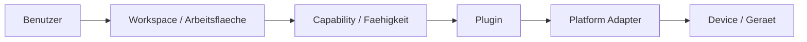

# RKWS-0470 Glossary

Dokument-ID: RKWS-GLOSSARY-001  
Version: 1.11.0
Status: Accepted  
Datum: 2026-07-02

## Zweck

Dieses Glossar definiert bevorzugte Begriffe fuer RK Workspace und ordnet deutsche und englische Begriffe ein. Es ist verbindlich fuer Dokumentation, Spezifikation, Code-Namen und spaetere Implementierung.

## Begriffe

| Bevorzugter Begriff | Deutsch | Bedeutung | Nicht bevorzugt / Hinweis |
| --- | --- | --- | --- |
| Workspace | Arbeitsflaeche | Primaere Benutzer- und Architekturabstraktion. | Nicht "Geraet" als Zielbegriff verwenden. |
| Device | Geraet | Technische Identitaet oder Host, der eine oder mehrere Workspaces bereitstellen kann. | Nur technische Ebene, nicht Bedienphilosophie. |
| Smart Device | Smart Device | Geraet mit eigenem Agent oder App, z. B. Laptop, Phone, Tablet. | Kein Dongle erforderlich. |
| Display Node | Display-Knoten | Arbeitsflaeche, die durch Display oder Dongle repraesentiert wird. | Nicht zwingend eigener Rechner. |
| Headless Node | Headless-Knoten | Workspace ohne direktes Display. | Ziel oder Kontext, aber keine sichtbare Flaeche. |
| KVM Node | KVM-Knoten | Workspace an einem KVM-Arbeitsplatz. | Aktiver Host kann wechseln. |
| Dongle | Dongle | Optionale Hardware, die eine Arbeitsflaeche repraesentiert. | Nicht automatisch der Zielrechner. |
| TransferObject | Transferobjekt | Neutrales Objektmodell mit Metadaten, PayloadReference, Checksum und Status. | Nicht mit Payload gleichsetzen. |
| Digital Thing | Digitales Ding / digitaler Gegenstand | Benutzerbezogener Begriff fuer digitale Information mit Bedeutung, Ort, Besitzer und Geschichte. | In UX-Kontexten bevorzugt gegenueber Datei oder Transferobjekt. |
| Digital Hand | Digitale Hand | UX-Metapher fuer den Moment, in dem ein Ding vom Benutzer gegriffen und getragen wird. | Nicht mit Mauszeiger, Cursor oder OS-Drag gleichsetzen. |
| Digital Tray | Digitales Tablett | Handy oder Tablet als Traeger eines digitalen Dings im realen Raum. | Nicht als Upload-App oder mobile Dateiliste verstehen. |
| Ablage | Ablage | Ort im Raum, auf dem ein digitales Ding abgelegt werden kann. | Nicht als Geraet, Host oder technisches Ziel beschreiben. |
| Ablage Compass | Ablage-Kompass | Ruhige Orientierung, welche Ablagen im Raum erreichbar sind. | Nicht als Bildschirmrand-Logik oder Device-Liste darstellen. |
| Ablage Bubble | Ablage-Bubble | Weiche, raeumliche Moeglichkeit, auf der ein digitales Ding abgelegt werden kann. | Keine Schaltflaeche, keine Box, kein technisches Ziel. |
| Ablage Lens | Ablage-Linse | Oeffnende innere Ablageflaeche, die bei aktiver Naehe sichtbar wird und zeigt, dass hier abgelegt werden kann. | Nicht als technische Zielmarkierung, Button oder Drop-Zone darstellen. |
| OpeningAblage | Oeffnende Ablage | Carry-Zustand, in dem eine Ablage auf Naehe antwortet, lesbar wird und `Hier ablegen` zeigt. | Nicht als abgeschlossene Platzierung oder Transportstatus verstehen. |
| Microtext | Mikrotext | Sehr kleine, transparente oder unscharfe Beschriftung, die Naehe andeutet, aber noch nicht voll lesbar ist. | Nicht als normale UI-Beschriftung behandeln. |
| Distance Readability | Distanz-Lesbarkeit | Prinzip, dass Ablagen erst bei ausreichender Naehe klar lesbar werden. | Nicht alle Ziele sofort voll beschriften. |
| Soft Snap | Weiches Einrasten | Subtiles Annaehern und Orientieren an einer Ablage ohne harte Sprungbewegung. | Kein aggressiver Magnetismus und kein hartes Snapping. |
| Free Placement | Freies Ablegen | Loslassen im freien Raum legt das Ding dort ab, statt es automatisch zurueckspringen zu lassen. | Kein Fehlerfall und kein automatischer Ruecksprung. |
| Spatial Room Session | Spatial Room Session / Raum-Session | Gemeinsamer Raumzustand, den alle Ablagen sehen. | Nicht als Sender-Empfaenger-Verbindung verstehen. |
| Spatial Room State | SpatialRoomState / Raumzustand | Modell fuer RoomId, Ablagen, Things, ActiveCarry und UpdatedAt. | Keine technische Transport-Session. |
| Surface | Surface / Oberflaeche | Sichtbare Ansicht einer Ablage, z. B. Handy oder Monitor. | Keine App-Rolle, kein Client, kein Device. |
| Remote Preview | Remote Preview / Ankommendes Ding | Zielablage sieht ein Ding bereits kommen, bevor es dort abgelegt wird. | Nicht als empfangene Datei oder abgeschlossener Transfer formulieren. |
| Spatial Handover | Raeumliches Weiterreichen | Dokumentierter Zukunftsschritt fuer das natuerliche Weiterreichen eines Dings durch den gemeinsamen Raum. | Noch nicht implementiert; kein Protokoll, kein Pairing, keine Payload. |
| Carry Session | Carry Session / Tragehandlung | Laufende menschliche Handlung: Quelle, tragende Ablage, Zielkandidat und Zustand. | Nicht als Datenuebertragung oder Netzwerkverbindung verstehen. |
| Digital Room | Digitaler Raum | Gemeinsamer Arbeitsraum, in dem Menschen, digitale Dinge und Arbeitsflaechen existieren. | Nicht als Netzwerk, Plattformverbund oder Geraeteliste beschreiben. |
| Workspace Room | Arbeitsraum | Benutzerperspektive auf alle aktuell verfuegbaren Arbeitsflaechen. | Endet nicht am Bildschirmrand oder Monitor. |
| Workspace Shell | Workspace Shell | Unsichtbare Produktebene, in der sich der Mensch durch den digitalen Raum bewegt. | Keine Anwendung, kein Fenster, kein Tool. |
| Workspace Session | Workspace Session | Aktueller Arbeitsraum des Benutzers mit den dazugehoerigen Workspace Objects. | Nicht als Device-, App- oder Pairing-Session verstehen. |
| Workspace Adapter | Workspace Adapter | Spaetere Uebersetzungsschicht von Anwendungen und Ablagen in Workspace Objects. | Adapter besitzen Objekte nicht. |
| Room Perception | Arbeitsraum-Wahrnehmung | Erste Wahrnehmung, dass alles ein Arbeitsraum ist, bevor einzelne Objekte oder Geraete bewertet werden. | Nicht als mehrere Fenster, Betriebssysteme oder Computer darstellen. |
| Work Relevance | Arbeitsrelevanz | Wahrnehmung, dass ein digitales Ding zur aktuellen Aufgabe gehoert und jetzt mitgenommen werden kann. | Nicht als Dateiauswahl, Fensteraktivierung oder App-Bedienung darstellen. |
| Take Intent | Nehmen-Wollen | Mentale Bereitschaft, ein Objekt als Teil der Arbeit zu nehmen statt nur darauf zu klicken. | Entsteht vor Greifen, Tragen und Ablegen. |
| Digital Response | Digitale Antwort | Glaubwuerdiges Verhalten eines digitalen Dings, das Kontrolle bestaetigt. | Nicht als dekorative Animation, Glow oder Wackeln verstehen. |
| Control Confirmation | Kontrollbestaetigung | Wahrnehmung, dass ein Objekt auf die Handlung des Benutzers antwortet und dadurch kontrollierbar wirkt. | Nicht mit perfektem Cursor-Folgen oder Gehorsam gleichsetzen. |
| Transition | Uebergang | Sichtbarer und logischer Weg eines digitalen Dings durch den Arbeitsraum. | In UX-Kontexten bevorzugt gegenueber Transfer, Sprung oder Dateiuebertragung. |
| Carry | Tragen | Zielgefuehl nach dem Greifen: ein digitales Ding bleibt in der digitalen Hand und bewegt sich mit dem Benutzer durch den Arbeitsraum. | Nicht als Cursor-Anhang oder klassisches Drag-and-Drop beschreiben. |
| Digital Inertia | Digitale Traegheit | Psychologisch spuerbarer, minimal verzoegerter Bewegungsanteil beim Tragen. | Niemals schwammig, langsam, unpraezise oder frustrierend. |
| Human Experience Specification | Human Experience Specification | Normatives Fuehrungsdokument fuer eine bewusste Wahrnehmung vor einer konkreten Interaktion. | Keine GUI, keine Technik, keine Animation. |
| Human Experience | Menschliche Erfahrung / HX | Vorrangige menschliche Wahrnehmung, der Architektur, ADR, UX, GUI und Code dienen. | Wenn Technik und HX widersprechen, gewinnt HX. |
| Emotion Specification | Emotion Specification | Fuehrendes UX-Dokument fuer ein Zielgefuehl, aus dem Experimente entstehen. | Keine finale Implementierung und keine Architekturentscheidung. |
| Optical Haptics | Optische Haptik | Sichtbare Reaktion, die das Gehirn als Widerstand, Griff oder Kontakt interpretiert. | Kein Blinken, kein dekorativer Effekt, kein zufaelliges Wackeln. |
| Capability | Faehigkeit | Effektive Eigenschaft eines Workspace oder Plugins. | Entscheidungen niemals nur ueber Geraetetyp treffen. |
| Plugin | Plugin | Erweiterungsbaustein fuer Plattform-, Kommunikations-, Hardware- oder Spezialfunktionen. | Core kennt nur Verträge, nicht Implementierungen. |
| Core | Core | Plattformneutraler Kern fuer Modelle, Regeln und Semantik. | Keine OS-, Netzwerk- oder Hardwarelogik. |
| Agent | Agent | Spaetere Plattformanwendung auf Desktop-/Laptop-Systemen. | Wird ueber Plugins/Adapter angebunden. |
| Platform Adapter | Plattformadapter | Schicht fuer OS-spezifische APIs unterhalb von Plugins. | Kein direkter Core-Zugriff. |
| Gesture | Geste | Benutzerinteraktion, die in neutrale Direction Intents uebersetzt wird. | Plattformgesten sind Implementierungsdetails. |
| Context | Kontext | Spaeterer Arbeits- oder App-Zustand jenseits einzelner Dateien. | Noch kein V0.1-Feature. |
| Payload | Nutzdaten | Der tatsaechliche Inhalt eines Transfers. | Wird durch TransferObject beschrieben. |
| PayloadReference | Payload-Referenz | Verweis auf Inline-Text, Pfad, Cache, URL oder Content-Adresse. | Kein Vertrauensnachweis. |
| TrustState | Vertrauenszustand | Sicherheitszustand einer Arbeitsflaeche. | Transfers nur bei `Paired` oder `Trusted`. |
| Architecture Baseline | Architektur-Baseline | Freigegebene technische Grundlage vor MA003. | Nicht ohne Review veraendern. |

## Konsistenzregeln

- In Benutzerkontexten wird `Arbeitsflaeche` oder `Workspace` verwendet.
- In Sicherheits- und Hardwarekontexten darf `Device` verwendet werden.
- `Dongle` wird als optionale Hardware fuer Node-Workspaces beschrieben.
- `Agent` bezeichnet spaetere Plattformsoftware, aber keine Core-Komponente.
- `Capability` ist die Entscheidungsgrundlage fuer Verhalten.

## Querverweise

- `Docs/Nordstern.md`
- `Spec/HumanExperienceSpecification_HX000.md`
- `Spec/HumanExperienceSpecification_HX001.md`
- `Spec/HumanExperienceSpecification_HX001A.md`
- `Docs/WorkspaceShell.md`
- `Docs/WorkspaceLayer.md`
- `Docs/WorkspaceAdapterModel.md`
- `Spec/EmotionSpecification_ES001.md`
- `Spec/EmotionSpecification_ES002.md`
- `Spec/ProductPhilosophy.md`
- `Spec/WorkspaceModel.md`
- `Spec/DisplayNodeModel.md`
- `Spec/CapabilityModel.md`
- `Spec/PluginArchitecture.md`

## Aenderungsverlauf

| Version | Datum | Aenderung |
| --- | --- | --- |
| 1.11.0 | 2026-07-03 | Begriffe fuer Ablage-Linse, OpeningAblage und Spatial Handover ergaenzt. |
| 1.10.0 | 2026-07-03 | MA006.04 Begriffe fuer Spatial Room Session, Raumzustand, Surface, Remote Preview und Carry Session ergaenzt. |
| 1.9.0 | 2026-07-03 | MA006.03-A Begriffe fuer Ablage-Bubbles, Mikrotext, Distanz-Lesbarkeit, weiches Einrasten und freies Ablegen ergaenzt. |
| 1.8.0 | 2026-07-03 | MA006.03 Begriffe fuer digitales Tablett, Ablage und Ablage-Kompass ergaenzt. |
| 1.7.0 | 2026-07-03 | MA006.00 Begriffe fuer Workspace Shell, Workspace Session und Workspace Adapter ergaenzt. |
| 1.6.0 | 2026-07-03 | HX-001A-Begriffe fuer digitale Antwort und Kontrollbestaetigung ergaenzt. |
| 1.5.0 | 2026-07-03 | HX-000-Begriffe fuer Arbeitsraum-Wahrnehmung und Human Experience ergaenzt. |
| 1.4.0 | 2026-07-03 | HX-001-Begriffe fuer Arbeitsrelevanz und Nehmen-Wollen ergaenzt. |
| 1.3.0 | 2026-07-03 | Tragen und digitale Traegheit fuer ES-002 ergaenzt. |
| 1.2.0 | 2026-07-03 | Emotion Specification und optische Haptik ergaenzt. |
| 1.1.0 | 2026-07-03 | Nordstern-Begriffe fuer digitales Ding, digitale Hand, digitalen Raum und Uebergang ergaenzt. |
| 1.0.0 | 2026-07-02 | Glossar fuer RKWS-0470 angelegt. |
