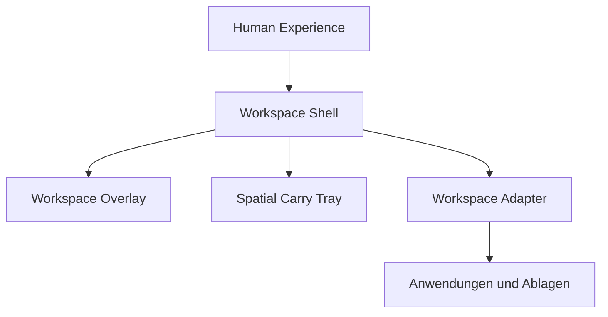

# Workspace Layer

Dokument-ID: RKWS-WORKSPACE-LAYER
Version: 1.3.0
Status: Accepted
Datum: 2026-07-03

## Zweck

Ab MA006.00 besteht RK Workspace aus drei Ebenen.

## Ebene 1: Human Experience

Die oberste Ebene ist der Mensch.

Human Experience entscheidet, ob eine Funktion existieren darf. Technik dient nur dazu, diese Wahrnehmung entstehen zu lassen.

Aktuelle fuehrende HX:

- HX-000
- HX-001
- HX-001A
- HX-002

## Ebene 2: Workspace Shell

Workspace Shell ist die unsichtbare Systemebene.

Sie verbindet:

- Benutzer
- digitalen Raum
- Anwendungen
- Ablagen

Workspace Shell ist keine App. Sie wird spaeter nicht bewusst gestartet und nicht als Fenster bedient.

Ab MA006.01 existiert dafuer ein eigener Runtime Host:

```text
src/Shell/RKWorkspace.Shell.Host
```

Dieser Host ist der vorbereitete Produktpfad. Er zeigt kein Hauptfenster, besitzt noch keine OS-Hooks und dient nur dazu, die Shell als staendige unsichtbare Ebene startbar, stoppbar und diagnostizierbar zu machen.

Ab MA006.02 besitzt dieser Produktpfad den ersten sichtbaren Overlay-Prototyp:

```text
src/Shell/RKWorkspace.Shell.Overlay.Windows
```

Das Overlay ist keine App-Ebene. Es ist eine transparente Workspace-Ebene ueber dem echten Desktop. Es zeigt nur ein Demo-Ding und linke/rechte Ablagen als Orte im Raum.

Ab MA006.03 wird das Desktop-Overlay als technisches Experiment eingeordnet. Der neue Human-Experience-Testpfad ist das Spatial Carry Tray:

```text
src/Shell/RKWorkspace.Shell.SpatialTray
```

Hier wird Handy oder Tablet als digitales Tablett getestet. Die Shell denkt Desktop und Monitor als Ablagen im Raum, nicht als Geraete.

## Ebene 3: Workspace Adapter

Workspace Adapter verbinden bestehende Anwendungen und Umgebungen mit dem Workspace-Raum.

Beispiele:

- Explorer
- Browser
- PDF
- Word
- Outlook
- WinCC
- PCS7

Adapter sind nicht das Produkt. Sie sind Uebersetzer.

## Richtung

Die Architektur folgt dieser Richtung:



Technische Entscheidungen duerfen diese Richtung nicht umkehren.

## Warum mit Ebene 3 beginnen

MA006 beginnt bewusst mit der Adapter-Perspektive, obwohl Adapter nicht das Ziel sind.

Grund:

Adapter machen spaeter sichtbar, welche digitalen Dinge aus realen Anwendungen in Workspace Sessions uebersetzt werden koennen.

Das Ziel bleibt trotzdem Workspace Shell.

## Nicht-Ziele

Dieses Dokument definiert keine konkrete Integration fuer Explorer, Browser, PDF, Word, Outlook, WinCC oder PCS7.

Es definiert nur die Layer-Regel.

## Aenderungsverlauf

| Version | Datum | Aenderung |
| --- | --- | --- |
| 1.3.0 | 2026-07-03 | MA006.03 Spatial Carry Tray als neuen Shell-Wahrnehmungspfad ergaenzt. |
| 1.2.0 | 2026-07-03 | MA006.02 Workspace Overlay Prototype als erste sichtbare Shell-Ebene ergaenzt. |
| 1.1.0 | 2026-07-03 | MA006.01 Shell Runtime Host als vorbereiteten Produktpfad ergaenzt. |
| 1.0.0 | 2026-07-03 | MA006.00 dreistufige Workspace-Layer-Architektur dokumentiert. |
