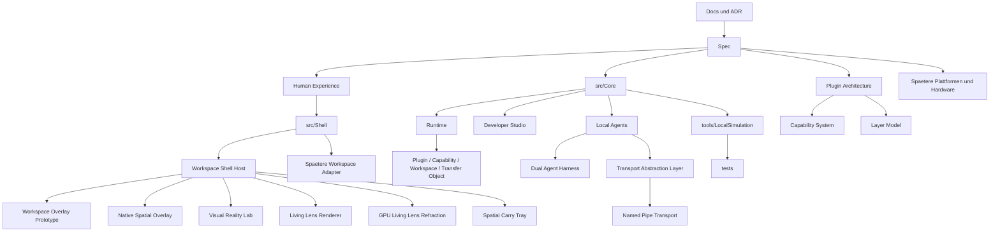

# RK Workspace

Dokument-ID: RKWS-README-001  
Version: 2.42.0
Status: Accepted  
Datum: 2026-07-04

RK Workspace (RKWS) ist ein eigenstaendiges Software- und Hardwareprodukt fuer raeumlich gedachte digitale Arbeitsflaechen. Das Projekt ist kein Bestandteil von RKOS und wird mit eigener Roadmap, eigener Dokumentation, eigenen Releases und eigener Architektur gefuehrt.

Ab MA006.00 ist das eigentliche Produkt die Workspace Shell. Workspace Shell ist keine Anwendung. Workspace Shell ist der digitale Raum, in dem sich der Mensch bewegt.

HX-000 steht in `Spec/HumanExperienceSpecification_HX000.md` und ist die oberste Wahrnehmungsregel des Projektes: RK Workspace beginnt in der Wahrnehmung des Menschen. Wenn Code, Architektur, ADRs, UX, GUI oder Nordstern einer Human Experience widersprechen, gewinnt die Human Experience.

Der Nordstern des Projektes steht in `Docs/Nordstern.md`. Er folgt HX-000 und beschreibt die Richtung nach dem ersten Arbeitsraum-Gefuehl: Der Benutzer nimmt digitale Dinge in die Hand, traegt sie durch seinen Arbeitsraum und legt sie dort ab, wo er weiterarbeiten moechte.

Die zentrale Produktidee ist einfach: Der Benutzer soll nicht "Datei an Geraet senden" denken, sondern "dieses Objekt nach rechts verschieben". RK Workspace modelliert deshalb Arbeitsflaechen statt Geraete. Ein Windows-Laptop, ein MacBook, ein iPad, ein Linux-Rechner, ein Monitor mit Dongle, ein KVM-Arbeitsplatz oder ein Industrie-Leitstand koennen alle Arbeitsflaechen sein.

## Status

Die Architecture Baseline v1.0 ist veroeffentlicht. Die produktive Core-Entwicklung laeuft in MA003. Der aktuelle Stand enthaelt die freigegebene Architekturgrundlage und die ersten plattformneutralen Core-Bausteine:

- Human Experience Specification HX-000 definiert die oberste Wahrnehmung: `Ich betrete meinen Arbeitsraum`.
- Der Nordstern ist als Projektorientierung dokumentiert und folgt HX-000 als verbindlichem Kompass fuer Architektur, UX und Implementierung.
- Human Experience Specification HX-001 definiert die erste bewusste Wahrnehmung vor dem Greifen: `Das gehoert gerade zu meiner Arbeit`.
- Human Experience Specification HX-001A definiert die digitale Antwort: `Das Objekt antwortet mir`.
- Emotion Specification ES-001 definiert das erste fuehrende UX-Gefuehl: `Ich habe etwas in meiner Hand`.
- Emotion Specification ES-002 definiert das zweite fuehrende UX-Gefuehl: `Ich trage etwas`.
- Produktvision und Architektur sind dokumentiert.
- Spec-Dokumente fuer Objektmodell, Arbeitsflaechenmodell, Kommunikation, Plugins, Capabilities, UX, Hardware, Firmware und Tests sind angelegt.
- ADRs und Decision-Log sind eingerichtet.
- CI/CD-Grundstruktur und GitHub-Templates sind vorbereitet.
- Der plattformneutrale Core enthaelt erste Modelle und Richtungslogik.
- Der Plugin Manager ist als erste produktive Core-Komponente angelegt.
- Der Capability Manager ist als zweite produktive Core-Komponente angelegt.
- Die Workspace Registry ist als dritte produktive Core-Komponente angelegt.
- Der Transfer Object Manager ist als vierte produktive Core-Komponente angelegt.
- Die Transfer Engine Runtime ist als fuenfte produktive Core-Komponente angelegt.
- Der Core Runtime Orchestrator ist als zentrale Lebenszyklussteuerung angelegt.
- Das Developer Workspace Studio ist als erste sichtbare Core-Testoberflaeche angelegt.
- Die Workspace Agent Runtime ist als erster echter RK Workspace Konsolenprozess angelegt.
- Die Dual Local Agent Simulation startet zwei unabhaengige LocalOnly-Agenten und simuliert einen logischen Transfer ueber einen Harness.
- Der Local IPC Two Process Test startet zwei echte Agent-Prozesse und verbindet sie lokal ueber die Transport Abstraction Layer.
- Named Pipes sind ab MA004.04 nur noch eine Transport-Implementierung hinter neutralen Transport-Schnittstellen.
- Das Developer Workspace Studio enthaelt einen interaktiven Workspace-Prototyp: Textobjekt greifen, nach rechts ziehen und ueber die Transfer Engine abschliessen.
- Das Developer Workspace Studio kann zwei echte Arbeitsflaechen oeffnen und Dinge ueber denselben Core-Kontext nehmen, tragen und ablegen.
- Der Multi-Window-Prototyp zeigt aktives Greif-Feedback, Durchgangshinweise, Randvorschlaege und klares Erfolgs-/Fehlerfeedback.
- Der Workspace Experience Sprint verbessert die Multi-Window-UX mit Monitor-Optik, Objektkarten, Arbeitsflaechenvorschau, Ruecktransfer und lokaler UX-Diagnose.
- Der Workspace Illusion Sprint verbessert Greifzustand, Rand-Hot-Zones, Edge-Lock, Ghost-Uebergang und sichtbare `WorkspaceSessionCandidate`-Zustaende.
- Das Workspace Experience Lab erlaubt Live-Vergleich von Greifen, Tragen, Durchgang, Kontinuitaet, Ablegen und Aufmerksamkeit mit lokaler Bewertung.
- UX Evolution Lab Sprint 1 ersetzt feste A/B-Varianten durch Generationen, lokale Statistik und automatische Folgegenerationen nach Gefuehlsbewertung.
- Digital Physics DP-001 fuehrt Pick, Carry, Place als UX-Regel ein: Dinge werden genommen, getragen und abgelegt; das Lab enthaelt dafuer eine eigene Trage-Physik.
- MA005.04 First Contact reduziert das Studio auf einen Erstkontakt-Test: ein Ding, zwei Arbeitsflaechen, kurze Hinweise und lokale Messwerte fuer Greifen, Ablegen, Fehlversuche, Abbrueche und unnoetige Klicks.
- HX-LAB-001 erweitert das Studio zum Human Experience Validation Lab: aktive HX, Experimente, Owner-Bewertung, Timeline, Dashboard und lokales Beobachtungsprotokoll.
- HX-P001 erweitert das Studio um den Human Experience Playground: fuenf isolierte Hypothesen fuer den ersten Magic Moment.
- MA006.00 fuehrt die Workspace Shell Foundation ein: eine unsichtbare Shell-Ebene, Workspace Sessions, Carry States, Overlay-Architektur und Adaptermodell.
- MA006.01 macht Workspace Shell erstmals als eigenen Runtime-Host startbar: kein Hauptfenster, keine OS-Hooks, aber Produktmodus `Shell`, aktive Workspace Session, CarryState `Empty` und vorbereitetes inaktives Overlay.
- MA006.02 fuehrt den ersten Workspace Overlay Prototype ein: eine transparente Windows-Ebene ueber dem echten Desktop, ein digitales Ding, linke/rechte Ablagen, digitale Antwort und sicherer `Esc`-Exit.
- MA006.03 fuehrt den Spatial Carry Tray Prototype ein: Handy oder Tablet als digitales Tablett, Desktop und Monitor als Ablagen im Raum, lokaler Web-Prototyp ohne Discovery, Pairing, Cloud oder echte Payload.
- MA006.03-A verfeinert den Spatial Carry Tray mit digitaler Hand, optischer Haptik, freiem Ablegen, explizitem Zuruecklegen, reduzierter Bewegung und raeumlichen Ablage-Bubbles.
- MA006.04 fuehrt die Spatial Room Session ein: alle Ablagen sehen denselben Raum, das digitale Ding existiert nur einmal, Zielablagen sehen eine Preview und jede Ablage kann das Ding wieder nehmen.
- MA006.04-A schaerft die Spatial Room Session: mindestens fuenf Ablagen sind vorbereitet, Distanz steuert Lesbarkeit, aktive Ablagen oeffnen sich als Ablage-Linse und Spatial Handover ist als naechster Wahrnehmungsschritt dokumentiert.
- MA006.05 verfeinert den Tactile Mobile Carry Slice: kurzer Widerstand, Loesen aus der Ablage, kompakte digitale Hand, Teilverdeckung, Vektor-Neigung, fast kein Wabern, Ghost auf der Zielablage und gleitendes Ablegen mit gespeicherter Zielposition.
- MA006.06 fuehrt Spatial Portal Carry ein: Ablage-Bubbles werden zu ruhigen Portalen, das Ding springt nicht, sondern geht mit Source-/Target-Progress durch einen Durchgang und erscheint als groesser werdender Ghost auf der Zielablage.
- MA006.07 verwirft die MA006.06-Radar-/Statusdarstellung als Produktpfad und setzt die Surface zurueck: keine Karte, keine Statusseite, keine permanente Bubble-Anzeige, sondern Ablageflaeche, Ding, digitale Hand und periphere Moeglichkeiten erst beim Tragen.
- MA006.08 fuehrt den Native Spatial Overlay Slice ein: kein Browser, kein WebView, echter Desktop bleibt sichtbar, transparentes randloses Windows-Overlay, Demo-Ding, digitale Hand, periphere Bubble-Linsen, Mini-Ablage und eigener Smoke-Test.
- MA006.09 fuehrt das Visual Reality Lab ein: natives Overlay ohne Web, fuenf Living-Lens-Hypothesen, langsames Erscheinen, subtile Linsen-Lebendigkeit, Mini-Ablage, Glide und Ziel-Ghost.
- Der erste Visual-Reality-Spike hat den technischen Smoke-Test bestanden, wurde vom Owner visuell aber verworfen: Der aktuelle WinForms/GDI+-Ansatz ist nur noch technischer Test, nicht Zieloptik.
- Das Owner-Referenzboard fuer Visual Reality ist unter `Docs/Assets/VisualReality/` gesichert und setzt die naechste Zielrichtung auf Glaslinse, Gravitationsbrunnen und ruhiges Portal auf dem echten Desktop.
- Der Visual-Reality-Slice baut diese Richtung erstmals sichtbar: `1` Glasbrunnen-Portal, `2` Glasmaterial, `3` Raumbrunnen, `4` ruhiges Portal, `5` minimaler Raumriss.
- MA006.10R setzt den Living-Lens-Renderer sichtbar zurueck: eigener Windows-Slice, Real Bubble Lens, Glass Lens, Water Surface Lens, Wormhole Lens, Gravity Lens, Lens Absorption, Target Emergence und Visual-Target-Export.
- MA006.11 fuehrt den GPU Living Lens Refraction Prototype ein: separater WPF-/DirectX-komponierter Windows-Slice, Desktop-Sampling unter der Linse, Rand-Durchgang, kontrolliertes Loslassen, Pull-out und Smoke-Test ohne Browser/WebView.
- Der GPU Living Lens Prototype simuliert jetzt den Portal-Handover: Ablegen im Tunnel startet einen 10-Sekunden-Countdown, erneutes Nehmen setzt den Countdown zurueck, danach schliesst der Tunnel und das Ding gilt lokal als auf der Gegenseite abgelegt.
- Die Tunnelgrafik wurde sichtbar veredelt: mehr neutrale Tiefenringe, ein ruhiger innerer Schlund, gebrochene Desktop-Schichten und Spiegelkanten ohne lila/cyan Hintergrund.
- Die Premium-Portal-Iteration ersetzt falsche Eigenrotation des digitalen Dings durch `PortalEdgeApexSqueeze`: die tunnelnahe Kante laeuft symmetrisch zu einer Spitze zusammen, die Neigung wird am Tunnel gedaempft und im Tunnel liegt nur ein kleines ruhiges Papierstueck.
- Ein separates Integration-Test-Projekt prueft die Core-Komponenten gemeinsam ueber Runtime Engine und Transfer Engine.
- Ein Core Demo Runner zeigt den aktuellen End-to-End-Core-Ablauf sichtbar ueber Runtime Engine und Transfer Engine in der Konsole.
- Eine lokale Simulation erzeugt zwei Arbeitsflaechen und plant einen Texttransfer von A nach B mit vollstaendigem Log.
- Unit-Tests und Integration-Tests pruefen Core-Regeln, Simulation, Plugin Manager, Capability Manager, Workspace Registry, Transfer Object Manager, Transfer Engine und Runtime Engine.

## Einstieg fuer Entwickler

Neue Entwickler beginnen mit diesen Dokumenten:

1. `Spec/HumanExperienceSpecification_HX000.md`
2. `Docs/Nordstern.md`
3. `Spec/HumanExperienceSpecification_HX001.md`
4. `Spec/HumanExperienceSpecification_HX001A.md`
5. `Spec/EmotionSpecification_ES001.md`
6. `Spec/EmotionSpecification_ES002.md`
7. `Docs/HumanExperience/README.md`
8. `Docs/00_ProductVision.md`
9. `Docs/Glossary.md`
10. `Docs/Architecture/ArchitectureBaseline_v1.0.md`
11. `Spec/README.md`
12. `Docs/ADR/README.md`
13. `Docs/Architecture/OpenIssuesBeforeMA003.md`

Die Spezifikationen liegen in `Spec/`. Human-Experience-Validierung liegt in `Docs/HumanExperience/`. Die ADRs liegen in `Docs/ADR/`. Die Architektur- und Freigabeberichte liegen in `Docs/Architecture/`.

## V1 Ziel

V1 soll beweisen, dass RK Workspace als Arbeitsflaechen-Erweiterung tragfaehig ist. Der erste Prototyp muss zwei Arbeitsflaechen lokal modellieren, koppeln, in einer manuellen Raumkarte anordnen, ein neutrales Transferobjekt erzeugen und einen Richtungstransfer planen koennen. Texttransfer ist der erste konkrete Nachweis. Dateien, PDFs, Bilder, Links, Ordner und Clipboard werden im Modell vorbereitet, aber noch nicht als echte plattformweite Agentenfunktion umgesetzt.

## Nicht-Ziele fuer diesen Stand

Dieser Stand baut keine vollstaendigen Plattformanwendungen, keine globale Gestenerkennung, keine plattformuebergreifende Maussteuerung, keine Bildschirmuebertragung, kein PCB-Layout und keine Serienhardware. Bluetooth wird nicht als Datenkanal vorgesehen. UWB wird als spaetere Positionshilfe behandelt, nicht als Transport fuer Payloads.

## Projektstruktur



```text
Docs/                 Produkt-, Architektur-, ADR-, HX- und Entscheidungsdokumente
Docs/HumanExperience/ Human-Experience-Validierung, Timeline und Lab-Regeln
Spec/                 Spezifikationen fuer Modelle, UX, Kommunikation und Tests
src/Shell/RKWorkspace.Shell/ Unsichtbare Workspace Shell Foundation ohne OS-, Netzwerk- oder Transportintegration
src/Shell/RKWorkspace.Shell.Host/ Shell Runtime Host ohne Hauptfenster, OS-Hooks oder Produktoberflaeche
src/Shell/RKWorkspace.Shell.Overlay.Windows/ Windows-Prototyp fuer transparente Shell-Ebene ueber dem Desktop
src/Shell/RKWorkspace.Shell.NativeOverlay.Windows/ Nativer Windows Spatial-Overlay-Slice ohne Browser/WebView
src/Shell/RKWorkspace.Shell.VisualReality.Windows/ Nativer Windows Visual-Reality-Slice fuer lebendige Ablage-Linsen
src/Shell/RKWorkspace.Shell.LivingLens.Windows/ Isolierter Windows Living-Lens-Slice fuer echtes Material, Lens Absorption und Visual Target Export
src/Shell/RKWorkspace.Shell.LivingLens.Gpu.Windows/ GPU-komponierter Living-Lens-Slice mit Desktop-Sampling und Refraction-Map-Vorbereitung
src/Shell/RKWorkspace.Shell.SpatialTray/ Lokaler Web-Prototyp fuer Spatial Room Session und gleichberechtigte Ablagen
src/Core/             Plattformneutraler Core
src/Core/Plugins/     Plattformneutraler Plugin Manager und Plugin-Vertraege
src/Core/Capabilities/ Plattformneutraler Capability Manager und Capability-Vertraege
src/Core/Workspaces/  Plattformneutrale Workspace Registry und Workspace-Vertraege
src/Core/TransferObjects/ Plattformneutraler Transfer Object Manager und Objekt-Vertraege
src/Core/Transfers/   Plattformneutrale Transfer Engine Runtime und Transfer-Vertraege
src/Core/Runtime/     Plattformneutraler Core Runtime Orchestrator
src/Communication/RKWorkspace.Transport/ Neutrale Transport-Schnittstellen und Transport-Nachrichten
src/Communication/RKWorkspace.Transport.NamedPipes/ Lokale Named-Pipe-Transportimplementierung
src/Communication/RKWorkspace.LocalIpc/ Kompatibilitaetsschicht fuer lokale IPC auf Basis der TAL
src/Demo/RKWorkspace.Core.Demo/ Plattformneutraler Core Demo Runner ohne GUI und Netzwerk
src/Tools/RKWorkspace.DeveloperStudio/ Developer-Diagnoseoberflaeche mit interaktivem Workspace-Prototyp
src/Agents/RKWorkspace.Agent/ LocalOnly Workspace Agent Runtime als Konsolenprozess
tools/DualAgentHarness/ Dual Local Agent Simulation ohne Netzwerk und IPC
tools/LocalIpcHarness/ Zwei-Prozess-Harness fuer lokale Named-Pipe-IPC
src/Windows/          Reserviert fuer spaeteren Windows-Agent
src/macOS/            Reserviert fuer spaeteren macOS-Agent
src/Linux/            Reserviert fuer spaeteren Linux-Agent
src/iOS/              Reserviert fuer spaetere iOS-App
src/Android/          Reserviert fuer spaetere Android-App
firmware/             Firmware-Vorbereitung fuer spaetere Dongles
hardware/             Hardware-Anforderungen und Board-Notizen
PCB/                  Reserviert fuer spaeteres PCB-Layout
Mechanical/           Reserviert fuer spaetere Mechanik
tests/                Unit-, Integrations-, Protokoll- und Hardwaretests
tests/Integration/RKWorkspace.Core.IntegrationTests/ Erster Core-Integrationstest ohne Netzwerk
tools/                Lokale Simulation und Hilfsskripte
.github/              CI, Issue-Templates und PR-Template
```

Die aelteren Agent/App-Verzeichnisse `src/Agent.Windows`, `src/Agent.macOS`, `src/Agent.Linux`, `src/App.iOS` und `src/App.Android` bleiben als Kompatibilitaetsreservierung fuer die erste Projektstruktur erhalten. Die neue kanonische Plattformstruktur ist `src/Windows`, `src/macOS`, `src/Linux`, `src/iOS` und `src/Android`.

## Ausfuehren

```powershell
dotnet build .\src\Core\RKWorkspace.Core.csproj
dotnet run --project .\tests\Unit\RKWorkspace.Core.Tests\RKWorkspace.Core.Tests.csproj
dotnet run --project .\tools\LocalSimulation\RKWorkspace.LocalSimulation.csproj
.\tools\run-demo.ps1
.\tools\run-studio.ps1
.\tools\run-agent.ps1 -Once
.\tools\run-dual-agent.ps1
.\tools\run-local-ipc.ps1
.\tools\run-shell.ps1 -Once
.\tools\run-shell.ps1 -OverlaySmokeTest
.\tools\run-spatial-tray.ps1 -SmokeTest
.\tools\run-native-overlay.ps1 -SmokeTest
.\tools\run-living-lens.ps1 -SmokeTest
.\tools\run-living-lens.ps1 -ExportFrames
.\tools\run-gpu-lens.ps1 -SmokeTest
```

Oder gesammelt:

```powershell
.\tools\run-tests.ps1
```

## Arbeitsregel

Die Entwicklungsreihenfolge ist Vision, Requirements, Architektur, Spezifikation, Simulation, Core, Plattformdienste, Hardware, Firmware, Tests und Produktion. Kein Schritt wird uebersprungen. Architektur, Dokumentation und Tests besitzen denselben Stellenwert wie Quellcode.

HX-000 steht ueber lokalen technischen Entscheidungen. Vor jeder neuen Implementierung ist zu pruefen, welche Human Experience durch diese Funktion unterstuetzt wird. Wenn keine HX unterstuetzt wird, wird nicht implementiert.

Ab HX-LAB-001 gilt zusaetzlich: Jede sichtbare UX-Komponente muss genau einer HX zugeordnet sein. Das Developer Studio fuehrt dafuer ein lokales Human Experience Lab mit Experimenten, Owner-Bewertung, Timeline, Dashboard und Beobachtungsprotokoll.

Der Nordstern folgt HX-000. Jede neue Funktion muss beantworten, was der Mensch in diesem Moment fuehlen soll. Wenn diese Frage nicht beantwortet werden kann, ist die Funktion noch nicht bereit.

Human Experience Specifications konkretisieren die bewusste Wahrnehmung vor einer Interaktion. HX-001 gilt fuer alle kuenftigen UX-Experimente: Ein Objekt muss zuerst als Teil der aktuellen Arbeit erscheinen. HX-001A gilt danach: Das Objekt muss auf die Handlung des Menschen antworten, damit Kontrolle und Besitz entstehen koennen.

Emotion Specifications konkretisieren diese Frage fuer einzelne Zielgefuehle. Sie erzeugen Experimente, aber keine unmittelbaren finalen Produktentscheidungen.

Vor Master-Arbeitsauftrag 003 duerfen keine Plattformagenten, keine GUI, keine Firmware, keine Hardwarelayouts, keine Netzwerkimplementierung und keine Betriebssystemintegration gebaut werden.

## Naechster Entwicklungsschritt

MA003 entwickelt den plattformneutralen Core und erste produktive Komponenten auf Grundlage der freigegebenen Architecture Baseline v1.0. MA003.01 liefert den Plugin Manager. MA003.02 liefert den Capability Manager. MA003.03 liefert die Workspace Registry mit logischer Zielauswahl V1. MA003.04 liefert den Transfer Object Manager. MA003.05 liefert den ersten vollstaendigen Core Integration Test ohne Netzwerk und ohne Betriebssystemabhaengigkeit. MA003.06 liefert den Core Demo Runner als sichtbaren Konsolenablauf. MA003.07 liefert die Transfer Engine Runtime und den Core Runtime Orchestrator. MA003.08 liefert das Developer Workspace Studio. MA004.01 liefert die Workspace Agent Runtime. MA004.02 liefert die Dual Local Agent Simulation. MA004.03 liefert den Local IPC Two Process Test. MA004.04 liefert die Transport Abstraction Layer. MA004.X liefert den Interactive Workspace Prototype im Developer Studio. MA005.00 liefert den Multi Window Workspace Prototype mit zwei echten Workspace-Fenstern. MA005.01 liefert Drag-Feedback und Randziel-Logik. MA005.02 liefert den Workspace Experience Sprint fuer ein natuerlicheres Arbeitsflaechen-Gefuehl. MA005.03 liefert den Workspace Illusion Sprint fuer Greifen, Randuebertritt und durchgehenden Arbeitsraum. UX-LAB-001 liefert ein internes Workspace Experience Lab fuer Live-Variantenvergleich und lokale Bewertung. UX Evolution Lab Sprint 1 erzeugt viele Generationen, bewertet sie ueber drei Gefuehlsbuttons und fuehrt lokal Statistik, damit der Owner die natuerlichste Kombination entscheiden kann. DP-001 Digital Physics macht Pick, Carry, Place zur verbindlichen UX-Regel und ergaenzt Trage-Generationen mit Feder, Traegheit und ruhigerem Hintergrund. MA005.04 First Contact prueft, ob eine neue Person ohne Erklaerung innerhalb von 30 Sekunden ein Ding nehmen, tragen und ablegen kann. HX-LAB-001 macht aus dem UX-Labor ein Human Experience Validation Lab, damit jede neue Interaktion zuerst einer bestaetigbaren Wahrnehmung folgt. HX-P001 liefert den Human Experience Playground mit fuenf isolierten Hypothesen fuer den ersten Magic Moment. MA006.00 fuehrt Workspace Shell als eigentliche Produktebene ein. MA006.01 macht diese Shell erstmals als eigenen Runtime-Host startbar. MA006.02 fuehrt den ersten transparenten Workspace Overlay Prototype ueber dem Desktop ein. MA006.03 fuehrt den Spatial Carry Tray Prototype ein. MA006.03-A verfeinert diesen Prototyp mit digitaler Hand, optischer Haptik, Ablage-Bubbles und freiem Ablegen. MA006.04 fuehrt die Spatial Room Session mit gemeinsamen Raumzustand, Remote Preview und gleichberechtigten Ablagen ein. MA006.08 fuehrt den nativen Spatial Overlay Slice ueber dem echten Windows-Desktop ein. MA006.09 fuehrt das Visual Reality Lab fuer lebendige Ablage-Linsen ein; der erste WinForms/GDI+-Spike ist nach Owner-Test aber nur noch technischer Smoke und nicht die Zieloptik.

Der Core Demo Runner ist kein Produktagent, keine GUI, kein Netzwerkdienst und kein Plattformadapter. Er startet die plattformneutrale Runtime Engine und fuehrt danach nur den aktuellen Core-Ablauf sichtbar ueber die Transfer Engine aus.

Das Developer Workspace Studio ist ebenfalls kein Produktagent und keine Endanwender-GUI. Es ist ein separates Developer-Tool fuer Diagnose, Tests, Demonstration und Core-Visualisierung.

Der Workspace Shell Runtime Host ist ab MA006.01 der vorbereitete Produktpfad. Er startet die Shell ohne Hauptfenster, meldet `ProductMode: Shell`, haelt eine aktive Workspace Session bereit und laesst das Overlay inaktiv, bis spaetere Human-Experience-Ereignisse es sichtbar machen. Er besitzt noch keine OS-Hooks, keine transparente Overlay-Schicht, keine Adapter, keine Discovery und keine Netzwerkfunktion.

Der Workspace Overlay Prototype ist ab MA006.02 der erste sichtbare Produkttest ausserhalb des Developer Studios. Er startet ueber `.\tools\run-shell.ps1 -OverlayDemo`, liegt transparent ueber dem echten Desktop, zeigt ein digitales Ding und linke/rechte Ablagen als Orte im Raum. Der automatische Check laeuft ueber `.\tools\run-shell.ps1 -OverlaySmokeTest`.

Der Native Spatial Overlay Slice ist ab MA006.08 der neue primaere Gefuehlspfad. Er startet ueber `.\tools\run-native-overlay.ps1`, nutzt ein randloses, transparentes, topmost Windows-Overlay und zeigt keinen Browser und kein WebView. Die Testgeste `Ctrl+Alt+Space` erzeugt das Demo-Ding `Rechnung.pdf`; Bubbles erscheinen erst beim Halten. Der automatische Check laeuft ueber `.\tools\run-native-overlay.ps1 -SmokeTest`.

Das Visual Reality Lab ist ab MA006.09 der native Wahrnehmungstest fuer lebendige Ablage-Linsen. Es startet ueber `.\tools\run-visual-reality.ps1`, zeigt keinen Browser, kein WebView und keine Weboberflaeche, sondern ein transparentes Overlay ueber dem echten Desktop. Fuenf Linsen-Hypothesen koennen im laufenden Test mit `1` bis `5` umgeschaltet werden. Der automatische Check laeuft ueber `.\tools\run-visual-reality.ps1 -SmokeTest`. Der erste konkrete C#-/WinForms-/GDI+-Spike wurde vom Owner visuell nicht akzeptiert und bleibt deshalb nur ein technischer Smoke-Test. Der naechste Schritt ist nicht weitere Politur, sondern Visual-Reality-Blueprint, Storyboard, Mockup oder Renderer-Entscheidung. Das neue Owner-Referenzboard verankert dafuer die Richtung Glaslinse plus Gravitationsbrunnen plus ruhiges Portal; der echte Desktop bleibt der sichtbare Raum. Der aktuelle Slice setzt diese Richtung erstmals als Glasbrunnen-Portal um und prueft `ReferenceDirection: OK`.

Der Living Lens Renderer Reset ist ab MA006.10R der neue isolierte visuelle Material-Spike. Er startet ueber `.\tools\run-living-lens.ps1`, prueft `.\tools\run-living-lens.ps1 -SmokeTest` und exportiert Zielbilder ueber `.\tools\run-living-lens.ps1 -ExportFrames` nach `Docs/VisualTargets/MA00610R/`. Er enthaelt Real Bubble Lens, Glass Lens, Water Surface Lens, Wormhole Lens, Gravity Lens, Lens Absorption, Target Emergence und Timing-Varianten 600/1200/1800 ms. Die sichtbare App startet bewusst mit Variante 2 `Glass Lens`. Die sichtbare Overlay-Flaeche nutzt jetzt Per-Pixel-Alpha statt Magenta-/Color-Key-Transparenz, damit der echte Desktop unter der Linse sichtbar bleibt. Naehe oeffnet die Linse, Wegbewegen beruhigt sie wieder; das Ding wird erst beim Loslassen absorbiert. Nach Owner-Video-Feedback klebt die primaere Linse am rechten Bildschirmrand, rendert ueber getaktetes Frame-Pacing statt pro Mausereignis, verzichtet auf den weissen Innenrahmen, erhoeht Glasbrillanz und Schattenwirkung und erlaubt ein erneutes Herausziehen aus der Linse. WinForms/GDI+ bleibt fuer diesen Spike erlaubt, ist aber laut `Docs/RenderingDecision_LivingLens.md` nicht der finale Renderer fuer echte Desktop-Brechung und finale Materialphysik.

Der GPU Living Lens Refraction Prototype ist ab MA006.11 der naechste Renderer-Slice. Er startet ueber `.\tools\run-gpu-lens.ps1` und prueft `.\tools\run-gpu-lens.ps1 -SmokeTest`. Der Slice nutzt ein transparentes WPF-Overlay mit DirectX-komponierter Darstellung, tastet den realen Desktop unter der Randlinse ab und zeichnet daraus eine transparente, gebrochene Linsenflaeche ohne lila/cyan Hintergrund und ohne Browser/WebView. Die Randlinse bleibt am rechten Rand verankert, ist aber zu etwa 85 bis 90 Prozent sichtbar. Sie erscheint direkt beim Greifen, nicht permanent. Das Ding ist fuer den Physiktest bewusst ein klares zweidimensionales Rechteck ohne abgerundete Kanten. Beim Halten reagiert es nur sanft mit vektorieller Trapez-Neigung; am Tunnel zieht dagegen `PortalPull` die linse-nahe Kante lokal Richtung Tiefe. Die Premium-Iteration fuehrt `PortalEdgeApexSqueeze` ein: nicht das ganze Papier rotiert, sondern die tunnelnahe Kante laeuft symmetrisch zu einer Spitze zusammen. `TiltDampingNearTunnel` beruhigt die normale Papierneigung direkt vor der Linse, damit keine Verdrehung entsteht. Der Trageschatten ist weich geschichtet statt als harte schwarze Platte gezeichnet und wird bei der Aufnahme als `ShadowTunnelSuction` mit in Richtung Tunnel verzerrt. Im Tunnel liegt das Ding als kleines ruhiges Papierstueck, nicht als verdrilltes Restobjekt. Beim Ablegen auf der Arbeitsflaeche wird das Ding wieder flach und verliert den Trageschatten. Die Tunnelgrafik nutzt mehr gebrochene Desktop-Schichten, neutrale Tiefenringe, einen dunkleren inneren Schlund, ruhige Spiegelkanten, zusaetzliche Refraction-Ribbons und eine feinere Aperture-Schichtung, damit der Durchgang raeumlicher wirkt, ohne zum bunten Effekt zu werden. Fuer den aktuellen Owner-Test existiert zusaetzlich ein Acht-Tunnel-Feld: vier Tunnel in den Ecken und vier Tunnel in den Seitenmitten, waehrend das digitale Ding in der Mitte startet. Der sichtbare schwarze Schlund ist jetzt das einzige Sogziel: das Rechteck und sein Schatten werden auf diesen Punkt gezogen, die Spitze wird dort gekappt und der aktive Tunnel wird stabil gehalten, damit kein unruhiges Ausloten entsteht. Der Portal-Handover ist bewusst zeitlich: Nach Drop im Tunnel bleibt das Ding 10 Sekunden zuruecknehmbar; jedes erneute Nehmen startet diese Frist neu. Erst wenn der Mensch es in dieser Zeit nicht mehr beruehrt, schliesst der Tunnel und das Ding gilt lokal als auf der Gegenseite abgelegt. Der Stand vor dem Shader-Sprung ist mit `gpu-living-lens-depth-freeze-v1` gesichert; der HLSL-Vertrag liegt im Projekt als Vorbereitung fuer den Direct2D-/Win2D-Produktpfad und enthaelt inzwischen `portalPull`, `edgeContact`, `edgeSqueeze`, `apexSqueeze`, `handoverProgress`, `tunnelClosing`, `shadowTunnelSuction`, `premiumRefraction` und `tunnelAperture`. Diese Stufe ist ein ehrlicher GPU-Kompositions- und Refraction-Map-Prototyp; der finale Premium-Look braucht danach die Aktivierung des nativen HLSL-/Direct2D-/Win2D-Renderers.

Der Spatial Carry Tray Prototype ist ab MA006.03 der neue Wahrnehmungstest fuer das Raumgefuehl. Er startet ueber `.\tools\run-spatial-tray.ps1`, zeigt eine URL fuer Tablet oder Handy und testet das mentale Modell: digitales Ding auf einem mobilen Tablett tragen und auf einer Ablage im Raum ablegen. MA006.03-A ergaenzt die digitale Hand: ein Teil des Dings wird optisch umfasst, Wabern bleibt minimal, Loslassen legt im freien Raum oder auf einer nahen Ablage ab, und nur explizites Abbrechen kehrt zur Quelle zurueck. Ablage-Bubbles werden durch Naehe groesser und lesbar; `Hier ablegen` erscheint erst bei aktiver Naehe. MA006.04 erweitert daraus eine Spatial Room Session: `/surface/tablet`, `/surface/handy` und `/surface/monitor` sehen denselben Raumzustand, das Ding existiert nur einmal und liegt initial auf dem Tablet, Zielablagen sehen `Rechnung.pdf kommt an`, und das Ding kann von jeder Ablage wieder genommen werden. Die verfeinerte Fassung bereitet mindestens fuenf Ablagen vor, fuehrt `OpeningAblage` ein und laesst aktive Ablagen als Ablage-Linse oeffnen. MA006.05 konzentriert danach den einen Ablauf: nehmen, in digitaler Hand halten, Ablage oeffnet sich, Ding gleitet hinein und liegt auf der Zielablage an gespeicherter Position. MA006.06 macht diese Oeffnung erstmals zu einem Spatial Portal Carry: die Zielablage sitzt am Rand des wahrgenommenen Raums, oeffnet sich als Portal, das Ding verschwindet teilweise auf der Quelle, erscheint teilweise im Ziel, bleibt bis `ReadyToPlace` nur Preview und wird erst beim Ablegen final dort platziert. MA006.07 verwirft die sichtbare Radar-/Statusseiten-Darstellung: Empty zeigt keine Karte und keine Bubbles mehr, Bubbles erscheinen erst bei aktiver Tragehandlung peripher am Rand, und die Surface ist als Vollflaeche mit PWA-/Standalone-Vorbereitung angelegt. Der automatische Check laeuft ueber `.\tools\run-spatial-tray.ps1 -SmokeTest`.

Der Interactive Workspace Prototype im Studio testet erstmals das Bediengefuehl: Ein sichtbares Textobjekt wird von Workspace A nach Workspace B gezogen. Beim Ablegen nutzt das Studio die vorhandene Transfer Engine; es gibt weiterhin keine Netzwerkfunktion, keine Discovery, keine Hardware, keine Firmware und keine Cloud.

Der Multi Window Workspace Prototype erweitert diesen Bedienversuch auf zwei echte Betriebssystemfenster. Window A und Window B teilen sich denselben Core-Kontext, zeigen eigene Transferobjekte, History, Diagnostics und Logs und fuehren Drag-and-Drop ueber `TransferEngine.ExecuteLogicalTransfer()` aus. MA005.01 ergaenzt Drag-Hervorhebung, Statushinweise, Zieltext `Hier ablegen`, Success-/Fehlerfeedback und eine gekapselte Fensterrand-Logik, die rechts Workspace B und links Workspace A vorschlaegt. MA005.02 verbessert das Arbeitsflaechen-Gefuehl mit Monitor-Kopf, echten Objektkarten fuer Text, PDF, Bild und Link, Workspace Preview am Rand, sichtbarer Zielanimation, Ruecktransfer B nach A, UX-Diagnosewerten und vorbereitetem `WorkspaceSessionCandidate`. MA005.03 reagiert auf Owner-Feedback, dass sich der Prototyp noch zu sehr wie eine App mit zwei Kaestchen anfuehlt: Greifzustand, pulsierende Rand-Hot-Zones, Edge-Lock, Ghost-Objekt im Rand und Candidate-Zustaende sollen einen durchgehenden Arbeitsraum andeuten. UX-LAB-001 macht diese Darstellung variierbar: Greifen, Rand, Uebergang, Ablegen, Preview, Animation und Geschwindigkeit koennen live verglichen und lokal bewertet werden. UX Evolution Lab Sprint 1 erweitert das Lab auf Generationen: 24 Greif-, 24 Rand-, 24 Uebergangs-, 20 Ablege- und 8 Vorschauvarianten, drei Gefuehlsbuttons und lokale Statistik. DP-001 verschiebt den sichtbaren Fokus auf digitale Physik: Dinge werden genommen, getragen und abgelegt; der Rand ist ein Durchgang. MA005.04 ergaenzt einen reduzierten First-Contact-Test: ein Ding, zwei Arbeitsflaechen, keine Optionen, kurze Hinweise und lokale Messwerte fuer die erste Begegnung. HX-LAB-001 erweitert die dritte Studio-Registerkarte zum Human Experience Lab mit aktiver HX, Experiment-Historie, Beobachtungsprotokoll, Timeline und Dashboard. HX-P001 ergaenzt den Human Experience Playground fuer fuenf isolierte Magic-Moment-Hypothesen ohne Kombination und ohne Scoring. MA006.00 fuehrt Workspace Shell als unsichtbare Produktebene ein. MA006.01 startet sie erstmals als Runtime Host. MA006.02 ergaenzt eine transparente Desktop-Ebene fuer den ersten Produkttest. MA006.03 verlagert den Traeger des digitalen Dings auf Handy oder Tablet. MA006.03-A praezisiert: Ablagen offenbaren sich durch Naehe, ein Teil des Dings verschwindet optisch in der digitalen Hand, und freies Ablegen ist kein Fehler. MA006.04 macht Handy, Monitor, Tablet, Desktop und Beamer zu gleichberechtigten Ablagen desselben Raums. Sie bleibt lokal und architektonisch: kein IPC, kein Netzwerk-Discovery, kein Pairing, keine Cloud, keine Persistenz ausser Lab-Bewertungen, Lab-Statistik, Human-Experience-Beobachtungen und Playground-Wahrnehmungen, keine echte Monitorerkennung und keine Plattformadapter im Core.

Die Workspace Agent Runtime ist noch kein Betriebssystemdienst. Sie ist ein LocalOnly-Konsolenprozess ohne Netzwerk, Discovery, GUI, Persistenz, Firmware, Hardware oder Cloud.

Die Dual Local Agent Simulation ist noch keine Prozesskommunikation. Zwei AgentRuntime-Instanzen laufen parallel im selben Harness, behalten getrennte Runtime- und Manager-Instanzen und simulieren den Transfer logisch ohne Netzwerk, Discovery oder IPC.

Der Local IPC Two Process Test ist die erste echte Prozesskommunikation. Seit MA004.04 laeuft er ueber die Transport Abstraction Layer. Die aktuelle Implementierung verwendet Named Pipes lokal auf demselben Rechner, aber Agent und Harness kommunizieren ueber `ITransport`, `ITransportClient`, `ITransportServer` und `TransportMessage`. Es gibt weiterhin keine TCP-/UDP-Ports, keine Discovery, keine Dienste und keine Netzwerkkommunikation ueber Rechnergrenzen.

Nach dem Multi Window Workspace Prototype wird zuerst die Bedienung ueber echte Fenster gemeinsam geprueft. Danach wird entschieden, ob echte Monitor-/Rand-Erkennung, Local Discovery oder echter Netzwerktransfer begonnen wird. Discovery kommt weiterhin nach der TAL, damit Agenten spaeter einen Transport auswaehlen koennen, ohne an Named Pipes, TCP, WebSocket, USB, BLE oder Cloud Relay gekoppelt zu sein.

Nach MA006.09 hat der erste Owner-Test entschieden: Die aktuelle C#-Darstellung erzeugt keinen glaubwuerdigen Raum. Deshalb wird nicht an derselben Animation gefeilt, sondern ein neuer visueller Ansatz oder Renderer geprueft.

## Querverweise

- `Spec/HumanExperienceSpecification_HX000.md`
- `Docs/Nordstern.md`
- `Docs/WorkspaceShell.md`
- `Docs/WorkspaceLayer.md`
- `Docs/WorkspaceAdapterModel.md`
- `Docs/WorkspaceOverlayPrototype.md`
- `Docs/NativeSpatialOverlay.md`
- `Docs/VisualRealityBlueprint.md`
- `Docs/VisualRealityLab.md`
- `Docs/RenderingDecision_LivingLens.md`
- `Docs/LensAbsorption.md`
- `Docs/Development/MA006_10_LivingLens_Rejection.md`
- `Docs/VisualTargets/MA00610R/README.md`
- `Docs/SpatialCarryTray.md`
- `Docs/SpatialRoomSession.md`
- `Spec/HumanExperienceSpecification_HX001.md`
- `Spec/HumanExperienceSpecification_HX001A.md`
- `Spec/EmotionSpecification_ES001.md`
- `Spec/EmotionSpecification_ES002.md`
- `Docs/HumanExperience/README.md`
- `Docs/Architecture/ArchitectureBaseline_v1.0.md`
- `Docs/Architecture/ArchitectureFreeze.md`
- `Docs/Architecture/ArchitectureBaseline.md`
- `Docs/Architecture/GitInitialCommitReadiness.md`
- `Docs/Architecture/GitReleaseReadiness.md`
- `Docs/Architecture/ArchitectureReview.md`
- `Docs/Architecture/OpenIssuesBeforeMA003.md`
- `Docs/Glossary.md`
- `Spec/PluginArchitecture.md`
- `Spec/CapabilityModel.md`
- `Spec/LayerModel.md`
- `Spec/RuntimeArchitecture.md`
- `Spec/VersionV0.1.md`
- `Docs/Development/DeveloperWorkspaceStudio.md`
- `Docs/Development/InteractiveWorkspacePrototype.md`
- `Docs/Development/MultiWindowWorkspacePrototype.md`
- `Docs/Development/WorkspaceExperienceSprint.md`
- `Docs/Development/WorkspaceIllusionSprint.md`
- `Docs/Development/WorkspaceExperienceLab.md`
- `Docs/Development/HumanExperienceLab.md`
- `Docs/Development/HumanExperiencePlayground.md`
- `Docs/Development/MA006_06_UX_Rejection.md`
- `Docs/Development/SurfaceOverlayReset.md`
- `Docs/Development/UXEvolutionLabSprint1.md`
- `Docs/Development/DigitalPhysicsSprint.md`
- `Docs/Development/FirstContact.md`
- `Docs/Development/WorkspaceAgentRuntime.md`
- `Docs/Development/DualAgentSimulation.md`
- `Docs/Development/LocalIpcTwoProcessTest.md`
- `Docs/Development/TransportAbstractionLayer.md`
- `Docs/Development/MA006_11_GpuLivingLensRefraction.md`
- `Docs/Development/MA003_Progress.md`
- `Docs/ADR/README.md`

## Aenderungsverlauf

| Version | Datum | Aenderung |
| --- | --- | --- |
| 2.44.0 | 2026-07-04 | GPU Living Lens schwarzer Tunnel-Schlund als einziges Sogziel mit Apex-Kappung und stabilem Tunnel-Lock dokumentiert. |
| 2.43.0 | 2026-07-04 | GPU Living Lens Acht-Tunnel-Testfeld mit Vektor-Sogmitte fuer Ecken und Seitenmitten dokumentiert. |
| 2.42.0 | 2026-07-04 | GPU Living Lens No-Twist-Funnel mit PortalEdgeApexSqueeze, TiltDampingNearTunnel, CalmRestingObjectInTunnel und PremiumTunnelAperture dokumentiert. |
| 2.41.0 | 2026-07-04 | GPU Living Lens Premium-Portal mit PortalEdgeSqueeze, ShadowTunnelSuction, NoPaperAxisSpin und PremiumTunnelRefraction dokumentiert. |
| 2.40.0 | 2026-07-04 | GPU Living Lens Tunnelgrafik mit mehr gebrochenen Desktop-Schichten, neutralen Tiefenringen, innerem Schlund und Spiegelkanten veredelt. |
| 2.39.0 | 2026-07-04 | GPU Living Lens Portal-Handover mit 10-Sekunden-Ruecknahmefenster, Timer-Reset bei erneutem Nehmen und automatischem Tunnel-Schliessen dokumentiert. |
| 2.38.0 | 2026-07-04 | GPU Living Lens Carry beruhigt, Schatten weich geschichtet, PortalPull an linse-naher Kante und HLSL-edgeContact dokumentiert. |
| 2.37.0 | 2026-07-04 | GPU Living Lens Digital Thing fuer Physiktest auf 2D-Rechteck, sensiblere Trapez-Neigung und rechteckigen Schatten umgestellt. |
| 2.36.0 | 2026-07-04 | GPU Living Lens Shader-Sprung mit Backup-Tag, HLSL-Vertrag und ShadowSuction dokumentiert. |
| 2.35.0 | 2026-07-04 | GPU Living Lens um 85-90 Prozent sichtbare Randlinse, Pick-Emergence, Perspektiv-Trapez, CarryShadowOnly und Tunnel-Tiefe verfeinert. |
| 2.34.0 | 2026-07-04 | MA006.11 GPU Living Lens Refraction Prototype mit WPF-/DirectX-Komposition, Desktop-Sampling, Rand-Durchgang und eigenem Smoke-Test dokumentiert. |
| 2.33.0 | 2026-07-04 | Living Lens nach Owner-Video-Feedback mit Randlinse, Pull-out, Frame-Pacing, mehr Brillanz und ohne weissen Innenrahmen verfeinert. |
| 2.32.0 | 2026-07-04 | Living Lens Overlay auf Per-Pixel-Alpha umgestellt, Color-Key-Artefakte entfernt und kontrolliertes Loslassen/Relax dokumentiert. |
| 2.31.0 | 2026-07-04 | MA006.10R Living Lens Renderer Reset mit eigenem Windows-Slice, run-living-lens, Lens Absorption und Visual Target Export dokumentiert. |
| 2.30.0 | 2026-07-04 | Visual-Reality-Slice in Richtung Glasbrunnen-Portal implementiert und ReferenceDirection-Smoke dokumentiert. |
| 2.29.0 | 2026-07-04 | Owner-Referenzboard fuer Visual Reality gesichert und neue Zielrichtung Glaslinse, Gravitationsbrunnen und ruhiges Portal auf dem echten Desktop dokumentiert. |
| 2.28.0 | 2026-07-04 | Owner-Bewertung des ersten Visual-Reality-Spikes als visuellen Fehlschlag dokumentiert und naechsten Schritt auf Blueprint, Storyboard, Mockup oder Renderer-Entscheidung gesetzt. |
| 2.27.0 | 2026-07-04 | MA006.09 Visual Reality Lab mit fuenf Living-Lens-Hypothesen, Visual-Reality-Blueprint und neuem Smoke-Test dokumentiert. |
| 2.26.0 | 2026-07-03 | MA006.08 Native Spatial Overlay Slice mit transparentem Desktop-Overlay ohne Browser/WebView dokumentiert. |
| 2.25.0 | 2026-07-03 | MA006.07 Surface Overlay Reset mit verworfener Radar-/Statusdarstellung, Empty-ohne-Bubbles, peripheren Bubbles und PWA-Vorbereitung dokumentiert. |
| 2.24.0 | 2026-07-03 | MA006.06 Spatial Portal Carry mit Portalphasen, Source-/Target-Progress, Ghost vor Place und No-Jump-Regel dokumentiert. |
| 2.23.0 | 2026-07-03 | MA006.05 Tactile Mobile Carry Slice mit digitaler Hand, Vektor-Neigung, Ghost, Glide und Zielposition dokumentiert. |
| 2.22.0 | 2026-07-03 | MA006.04 Spatial Room Session um Ablage-Linse, OpeningAblage, Distanz-Lesbarkeit und dokumentiertes Spatial Handover ergaenzt. |
| 2.21.0 | 2026-07-03 | MA006.04 Spatial Room Session mit gemeinsamem Raumzustand und gleichberechtigten Ablagen dokumentiert. |
| 2.20.0 | 2026-07-03 | MA006.03-A digitale Hand, optische Haptik, Ablage-Bubbles und freies Ablegen dokumentiert. |
| 2.19.0 | 2026-07-03 | MA006.03 Spatial Carry Tray Prototype dokumentiert. |
| 2.18.0 | 2026-07-03 | MA006.02 Workspace Overlay Prototype mit transparentem Desktop-Overlay dokumentiert. |
| 2.17.0 | 2026-07-03 | MA006.01 Workspace Shell Runtime Host und run-shell Smoke-Test dokumentiert. |
| 2.16.0 | 2026-07-03 | MA006.00 Workspace Shell Foundation als eigentliche Produktebene dokumentiert. |
| 2.15.0 | 2026-07-03 | HX-P001 Human Experience Playground mit fuenf Magic-Moment-Hypothesen dokumentiert. |
| 2.14.0 | 2026-07-03 | Human Experience Specification HX-001A als digitale Antwort des Objekts verlinkt. |
| 2.13.0 | 2026-07-03 | HX-LAB-001 Human Experience Validation Lab dokumentiert. |
| 2.12.0 | 2026-07-03 | Human Experience Specification HX-000 als oberste Wahrnehmungsregel verlinkt. |
| 2.11.0 | 2026-07-03 | Human Experience Specification HX-001 als Wahrnehmung vor dem Greifen verlinkt. |
| 2.10.0 | 2026-07-03 | Emotion Specification ES-002 als zweites fuehrendes UX-Dokument verlinkt. |
| 2.9.0 | 2026-07-03 | Emotion Specification ES-001 als fuehrendes UX-Dokument verlinkt. |
| 2.8.0 | 2026-07-03 | Nordstern als oberste Projektorientierung verlinkt. |
| 2.7.0 | 2026-07-03 | MA005.04 First Contact mit Erstkontakt-Test und lokalen Messwerten dokumentiert. |
| 2.6.0 | 2026-07-03 | DP-001 Digital Physics mit Pick, Carry, Place dokumentiert. |
| 2.5.0 | 2026-07-02 | UX Evolution Lab Sprint 1 mit Generationen, Statistik und Folgegenerationen dokumentiert. |
| 2.4.0 | 2026-07-02 | UX-LAB-001 Workspace Experience Lab dokumentiert. |
| 2.3.0 | 2026-07-02 | MA005.03 Workspace Illusion Sprint dokumentiert. |
| 2.2.0 | 2026-07-02 | MA005.02 Workspace Experience Sprint dokumentiert. |
| 2.1.0 | 2026-07-02 | MA005.01 UX-Feinschliff fuer Multi-Window-Drag-Feedback dokumentiert. |
| 2.0.0 | 2026-07-02 | MA005.00 Multi Window Workspace Prototype dokumentiert. |
| 1.9.0 | 2026-07-02 | Interactive Workspace Prototype im Developer Studio dokumentiert. |
| 1.8.0 | 2026-07-02 | MA004.04 Transport Abstraction Layer dokumentiert. |
| 1.7.0 | 2026-07-02 | MA004.03 Local IPC Two Process Test dokumentiert. |
| 1.6.0 | 2026-07-02 | MA004.02 Dual Local Agent Simulation und Harness dokumentiert. |
| 1.5.0 | 2026-07-02 | MA004.01 Workspace Agent Runtime und Startscript dokumentiert. |
| 1.4.0 | 2026-07-02 | Developer Workspace Studio und Startscript dokumentiert. |
| 1.3.0 | 2026-07-02 | Core Runtime Orchestrator und Runtime-Dokumentation ergaenzt. |
| 1.2.0 | 2026-07-02 | MA003.07 Transfer Engine Runtime dokumentiert. |
| 1.1.0 | 2026-07-02 | MA003.06 Core Demo Runner und Startscript dokumentiert. |
| 1.0.0 | 2026-07-02 | MA003.05 Core Integration Tests fuer alle vier produktiven Core-Komponenten ergaenzt. |
| 0.9.0 | 2026-07-02 | MA003.04 Transfer Object Manager als vierte produktive Core-Komponente ergaenzt. |
| 0.8.0 | 2026-07-02 | MA003.03 Workspace Registry als dritte produktive Core-Komponente ergaenzt. |
| 0.7.0 | 2026-07-02 | MA003.02 Capability Manager als zweite produktive Core-Komponente ergaenzt. |
| 0.6.0 | 2026-07-02 | MA003.01 Plugin Manager als erste produktive Core-Komponente ergaenzt. |
| 0.5.0 | 2026-07-02 | Developer-Onboarding, Baseline-v1.0 und Git-Readiness-Verweise fuer RKWS-0530 ergaenzt. |
| 0.4.0 | 2026-07-02 | Architecture Baseline Completion 002A verlinkt. |
| 0.3.0 | 2026-07-02 | Dokumentstandard und Architektur-Freeze-Verweise ergaenzt. |
| 0.2.0 | 2026-07-02 | Master-Arbeitsauftrag 001 Struktur ergaenzt. |
| 0.1.0 | 2026-07-02 | README angelegt. |
