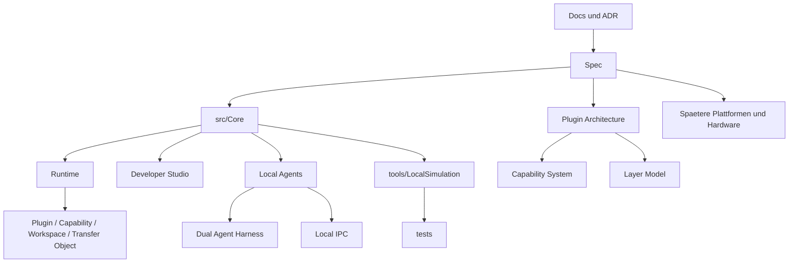

# RK Workspace

Dokument-ID: RKWS-README-001  
Version: 1.7.0
Status: Accepted  
Datum: 2026-07-02

RK Workspace (RKWS) ist ein eigenstaendiges Software- und Hardwareprodukt fuer raeumlich gedachte digitale Arbeitsflaechen. Das Projekt ist kein Bestandteil von RKOS und wird mit eigener Roadmap, eigener Dokumentation, eigenen Releases und eigener Architektur gefuehrt.

Die zentrale Produktidee ist einfach: Der Benutzer soll nicht "Datei an Geraet senden" denken, sondern "dieses Objekt nach rechts verschieben". RK Workspace modelliert deshalb Arbeitsflaechen statt Geraete. Ein Windows-Laptop, ein MacBook, ein iPad, ein Linux-Rechner, ein Monitor mit Dongle, ein KVM-Arbeitsplatz oder ein Industrie-Leitstand koennen alle Arbeitsflaechen sein.

## Status

Die Architecture Baseline v1.0 ist veroeffentlicht. Die produktive Core-Entwicklung laeuft in MA003. Der aktuelle Stand enthaelt die freigegebene Architekturgrundlage und die ersten plattformneutralen Core-Bausteine:

- Produktvision und Architektur sind dokumentiert.
- Spec-Dokumente fuer Objektmodell, Arbeitsflaechenmodell, Kommunikation, Plugins, Capabilities, UX, Hardware, Firmware und Tests sind angelegt.
- ADRs und Decision-Log sind eingerichtet.
- CI/CD-Grundstruktur und GitHub-Templates sind vorbereitet.
- Der plattformneutrale Core enthaelt erste Modelle und Richtungslogik.
- Der Plugin Manager ist als erste produktive Core-Komponente angelegt.
- Der Capability Manager ist als zweite produktive Core-Komponente angelegt.
- Die Workspace Registry ist als dritte produktive Core-Komponente angelegt.
- Der Transfer Object Manager ist als vierte produktive Core-Komponente angelegt.
- Die Transfer Engine Runtime ist als fuenfte produktive Core-Komponente angelegt.
- Der Core Runtime Orchestrator ist als zentrale Lebenszyklussteuerung angelegt.
- Das Developer Workspace Studio ist als erste sichtbare Core-Testoberflaeche angelegt.
- Die Workspace Agent Runtime ist als erster echter RK Workspace Konsolenprozess angelegt.
- Die Dual Local Agent Simulation startet zwei unabhaengige LocalOnly-Agenten und simuliert einen logischen Transfer ueber einen Harness.
- Der Local IPC Two Process Test startet zwei echte Agent-Prozesse und verbindet sie lokal ueber Named Pipes.
- Ein separates Integration-Test-Projekt prueft die Core-Komponenten gemeinsam ueber Runtime Engine und Transfer Engine.
- Ein Core Demo Runner zeigt den aktuellen End-to-End-Core-Ablauf sichtbar ueber Runtime Engine und Transfer Engine in der Konsole.
- Eine lokale Simulation erzeugt zwei Arbeitsflaechen und plant einen Texttransfer von A nach B mit vollstaendigem Log.
- Unit-Tests und Integration-Tests pruefen Core-Regeln, Simulation, Plugin Manager, Capability Manager, Workspace Registry, Transfer Object Manager, Transfer Engine und Runtime Engine.

## Einstieg fuer Entwickler

Neue Entwickler beginnen mit diesen Dokumenten:

1. `Docs/00_ProductVision.md`
2. `Docs/Glossary.md`
3. `Docs/Architecture/ArchitectureBaseline_v1.0.md`
4. `Spec/README.md`
5. `Docs/ADR/README.md`
6. `Docs/Architecture/OpenIssuesBeforeMA003.md`

Die Spezifikationen liegen in `Spec/`. Die ADRs liegen in `Docs/ADR/`. Die Architektur- und Freigabeberichte liegen in `Docs/Architecture/`.

## V1 Ziel

V1 soll beweisen, dass RK Workspace als Arbeitsflaechen-Erweiterung tragfaehig ist. Der erste Prototyp muss zwei Arbeitsflaechen lokal modellieren, koppeln, in einer manuellen Raumkarte anordnen, ein neutrales Transferobjekt erzeugen und einen Richtungstransfer planen koennen. Texttransfer ist der erste konkrete Nachweis. Dateien, PDFs, Bilder, Links, Ordner und Clipboard werden im Modell vorbereitet, aber noch nicht als echte plattformweite Agentenfunktion umgesetzt.

## Nicht-Ziele fuer diesen Stand

Dieser Stand baut keine vollstaendigen Plattformanwendungen, keine globale Gestenerkennung, keine plattformuebergreifende Maussteuerung, keine Bildschirmuebertragung, kein PCB-Layout und keine Serienhardware. Bluetooth wird nicht als Datenkanal vorgesehen. UWB wird als spaetere Positionshilfe behandelt, nicht als Transport fuer Payloads.

## Projektstruktur



```text
Docs/                 Produkt-, Architektur-, ADR- und Entscheidungsdokumente
Spec/                 Spezifikationen fuer Modelle, UX, Kommunikation und Tests
src/Core/             Plattformneutraler Core
src/Core/Plugins/     Plattformneutraler Plugin Manager und Plugin-Vertraege
src/Core/Capabilities/ Plattformneutraler Capability Manager und Capability-Vertraege
src/Core/Workspaces/  Plattformneutrale Workspace Registry und Workspace-Vertraege
src/Core/TransferObjects/ Plattformneutraler Transfer Object Manager und Objekt-Vertraege
src/Core/Transfers/   Plattformneutrale Transfer Engine Runtime und Transfer-Vertraege
src/Core/Runtime/     Plattformneutraler Core Runtime Orchestrator
src/Communication/RKWorkspace.LocalIpc/ Lokale Named-Pipe-IPC fuer Zwei-Prozess-Tests
src/Demo/RKWorkspace.Core.Demo/ Plattformneutraler Core Demo Runner ohne GUI und Netzwerk
src/Tools/RKWorkspace.DeveloperStudio/ Developer-Diagnoseoberflaeche fuer Core-Visualisierung
src/Agents/RKWorkspace.Agent/ LocalOnly Workspace Agent Runtime als Konsolenprozess
tools/DualAgentHarness/ Dual Local Agent Simulation ohne Netzwerk und IPC
tools/LocalIpcHarness/ Zwei-Prozess-Harness fuer lokale Named-Pipe-IPC
src/Windows/          Reserviert fuer spaeteren Windows-Agent
src/macOS/            Reserviert fuer spaeteren macOS-Agent
src/Linux/            Reserviert fuer spaeteren Linux-Agent
src/iOS/              Reserviert fuer spaetere iOS-App
src/Android/          Reserviert fuer spaetere Android-App
firmware/             Firmware-Vorbereitung fuer spaetere Dongles
hardware/             Hardware-Anforderungen und Board-Notizen
PCB/                  Reserviert fuer spaeteres PCB-Layout
Mechanical/           Reserviert fuer spaetere Mechanik
tests/                Unit-, Integrations-, Protokoll- und Hardwaretests
tests/Integration/RKWorkspace.Core.IntegrationTests/ Erster Core-Integrationstest ohne Netzwerk
tools/                Lokale Simulation und Hilfsskripte
.github/              CI, Issue-Templates und PR-Template
```

Die aelteren Agent/App-Verzeichnisse `src/Agent.Windows`, `src/Agent.macOS`, `src/Agent.Linux`, `src/App.iOS` und `src/App.Android` bleiben als Kompatibilitaetsreservierung fuer die erste Projektstruktur erhalten. Die neue kanonische Plattformstruktur ist `src/Windows`, `src/macOS`, `src/Linux`, `src/iOS` und `src/Android`.

## Ausfuehren

```powershell
dotnet build .\src\Core\RKWorkspace.Core.csproj
dotnet run --project .\tests\Unit\RKWorkspace.Core.Tests\RKWorkspace.Core.Tests.csproj
dotnet run --project .\tools\LocalSimulation\RKWorkspace.LocalSimulation.csproj
.\tools\run-demo.ps1
.\tools\run-studio.ps1
.\tools\run-agent.ps1 -Once
.\tools\run-dual-agent.ps1
.\tools\run-local-ipc.ps1
```

Oder gesammelt:

```powershell
.\tools\run-tests.ps1
```

## Arbeitsregel

Die Entwicklungsreihenfolge ist Vision, Requirements, Architektur, Spezifikation, Simulation, Core, Plattformdienste, Hardware, Firmware, Tests und Produktion. Kein Schritt wird uebersprungen. Architektur, Dokumentation und Tests besitzen denselben Stellenwert wie Quellcode.

Vor Master-Arbeitsauftrag 003 duerfen keine Plattformagenten, keine GUI, keine Firmware, keine Hardwarelayouts, keine Netzwerkimplementierung und keine Betriebssystemintegration gebaut werden.

## Naechster Entwicklungsschritt

MA003 entwickelt den plattformneutralen Core und erste produktive Komponenten auf Grundlage der freigegebenen Architecture Baseline v1.0. MA003.01 liefert den Plugin Manager. MA003.02 liefert den Capability Manager. MA003.03 liefert die Workspace Registry mit logischer Zielauswahl V1. MA003.04 liefert den Transfer Object Manager. MA003.05 liefert den ersten vollstaendigen Core Integration Test ohne Netzwerk und ohne Betriebssystemabhaengigkeit. MA003.06 liefert den Core Demo Runner als sichtbaren Konsolenablauf. MA003.07 liefert die Transfer Engine Runtime und den Core Runtime Orchestrator. MA003.08 liefert das Developer Workspace Studio. MA004.01 liefert die Workspace Agent Runtime. MA004.02 liefert die Dual Local Agent Simulation. MA004.03 liefert den Local IPC Two Process Test.

Der Core Demo Runner ist kein Produktagent, keine GUI, kein Netzwerkdienst und kein Plattformadapter. Er startet die plattformneutrale Runtime Engine und fuehrt danach nur den aktuellen Core-Ablauf sichtbar ueber die Transfer Engine aus.

Das Developer Workspace Studio ist ebenfalls kein Produktagent und keine Endanwender-GUI. Es ist ein separates Developer-Tool fuer Diagnose, Tests, Demonstration und Core-Visualisierung.

Die Workspace Agent Runtime ist noch kein Betriebssystemdienst. Sie ist ein LocalOnly-Konsolenprozess ohne Netzwerk, Discovery, GUI, Persistenz, Firmware, Hardware oder Cloud.

Die Dual Local Agent Simulation ist noch keine Prozesskommunikation. Zwei AgentRuntime-Instanzen laufen parallel im selben Harness, behalten getrennte Runtime- und Manager-Instanzen und simulieren den Transfer logisch ohne Netzwerk, Discovery oder IPC.

Der Local IPC Two Process Test ist die erste echte Prozesskommunikation. Er verwendet Named Pipes lokal auf demselben Rechner, keine TCP-/UDP-Ports, keine Discovery, keine Dienste und keine Netzwerkkommunikation ueber Rechnergrenzen.

## Querverweise

- `Docs/Architecture/ArchitectureBaseline_v1.0.md`
- `Docs/Architecture/ArchitectureFreeze.md`
- `Docs/Architecture/ArchitectureBaseline.md`
- `Docs/Architecture/GitInitialCommitReadiness.md`
- `Docs/Architecture/GitReleaseReadiness.md`
- `Docs/Architecture/ArchitectureReview.md`
- `Docs/Architecture/OpenIssuesBeforeMA003.md`
- `Docs/Glossary.md`
- `Spec/PluginArchitecture.md`
- `Spec/CapabilityModel.md`
- `Spec/LayerModel.md`
- `Spec/RuntimeArchitecture.md`
- `Spec/VersionV0.1.md`
- `Docs/Development/DeveloperWorkspaceStudio.md`
- `Docs/Development/WorkspaceAgentRuntime.md`
- `Docs/Development/DualAgentSimulation.md`
- `Docs/Development/LocalIpcTwoProcessTest.md`
- `Docs/Development/MA003_Progress.md`
- `Docs/ADR/README.md`

## Aenderungsverlauf

| Version | Datum | Aenderung |
| --- | --- | --- |
| 1.7.0 | 2026-07-02 | MA004.03 Local IPC Two Process Test dokumentiert. |
| 1.6.0 | 2026-07-02 | MA004.02 Dual Local Agent Simulation und Harness dokumentiert. |
| 1.5.0 | 2026-07-02 | MA004.01 Workspace Agent Runtime und Startscript dokumentiert. |
| 1.4.0 | 2026-07-02 | Developer Workspace Studio und Startscript dokumentiert. |
| 1.3.0 | 2026-07-02 | Core Runtime Orchestrator und Runtime-Dokumentation ergaenzt. |
| 1.2.0 | 2026-07-02 | MA003.07 Transfer Engine Runtime dokumentiert. |
| 1.1.0 | 2026-07-02 | MA003.06 Core Demo Runner und Startscript dokumentiert. |
| 1.0.0 | 2026-07-02 | MA003.05 Core Integration Tests fuer alle vier produktiven Core-Komponenten ergaenzt. |
| 0.9.0 | 2026-07-02 | MA003.04 Transfer Object Manager als vierte produktive Core-Komponente ergaenzt. |
| 0.8.0 | 2026-07-02 | MA003.03 Workspace Registry als dritte produktive Core-Komponente ergaenzt. |
| 0.7.0 | 2026-07-02 | MA003.02 Capability Manager als zweite produktive Core-Komponente ergaenzt. |
| 0.6.0 | 2026-07-02 | MA003.01 Plugin Manager als erste produktive Core-Komponente ergaenzt. |
| 0.5.0 | 2026-07-02 | Developer-Onboarding, Baseline-v1.0 und Git-Readiness-Verweise fuer RKWS-0530 ergaenzt. |
| 0.4.0 | 2026-07-02 | Architecture Baseline Completion 002A verlinkt. |
| 0.3.0 | 2026-07-02 | Dokumentstandard und Architektur-Freeze-Verweise ergaenzt. |
| 0.2.0 | 2026-07-02 | Master-Arbeitsauftrag 001 Struktur ergaenzt. |
| 0.1.0 | 2026-07-02 | README angelegt. |
