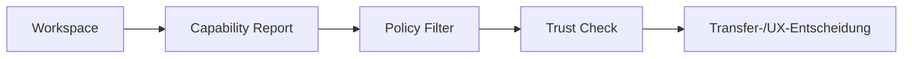

# RKWS-0370 Capability Model

Dokument-ID: RKWS-SPEC-CAPABILITY-001  
Version: 1.0.0  
Status: Accepted  
Datum: 2026-07-02

## Zweck

RK Workspace arbeitet niemals primaer anhand des Geraetetyps, sondern anhand vorhandener Capabilities. Geraeteklassen duerfen Defaults liefern, aber jede Entscheidung muss ueber konkret gemeldete, validierte und ggf. durch Policy eingeschraenkte Faehigkeiten laufen.

## Capability-Status

| Status | Bedeutung |
| --- | --- |
| Present | Capability ist vorhanden und freigegeben. |
| Optional | Capability kann vorhanden sein, muss aber erkannt oder konfiguriert werden. |
| Missing | Capability fehlt oder ist nicht erlaubt. |
| Restricted | Capability existiert, ist aber durch OS, Policy oder Trust begrenzt. |
| Unknown | Capability wurde noch nicht validiert. |

## Capabilities

| Capability | Beschreibung | Voraussetzungen | Einschraenkungen | Erweiterbarkeit |
| --- | --- | --- | --- | --- |
| Touch | Direkte Fingereingabe auf Display. | Touchscreen, OS-Events. | App-Sandbox, Gestenkonflikte. | Multi-touch, Pencil, Druck. |
| Touchpad | Indirekte mehrfingrige Eingabe. | Trackpad, Gesture Plugin. | OS-reservierte Gesten. | Konfigurierbare Gesten. |
| Mouse | Zeiger und Klicks. | Pointer API. | Langklick-Konflikte. | Modifier, Edge-Zones. |
| Keyboard | Tastatur und Modifier. | Key events. | Fokus und Accessibility. | Shortcuts, Admin-Modus. |
| BLE | Bluetooth Low Energy. | BLE-Hardware, Permissions. | Discovery-only, keine Payloads. | Pairing-Hints, Presence. |
| WLAN | Wireless Netzwerk. | WLAN-Adapter, Netzwerkzugang. | Firewall, Roaming. | Transport oder Discovery. |
| LAN | Kabelnetzwerk. | Ethernet/Adapter. | Nicht auf allen Devices. | Industrie/KVM stabil. |
| USB | USB-Anbindung. | Port und Treiber. | OS-Rechte, Legacy-Stecker. | Debug, Provisioning. |
| USB-C | USB-C Versorgung/Service. | USB-C Port/Controller. | PD-Komplexitaet. | Power, Service, Display alt mode nur spaeter. |
| UWB | Praezise Distanz/Position. | UWB-Hardware, Kalibrierung. | Position-only, Umgebungseinfluss. | Auto-Raumkarte. |
| Display | Sichtbare Arbeitsflaeche. | Display oder Display Node. | Headless fehlt Anzeige. | Overlay, Target Highlight. |
| Multiple Displays | Mehrere Flaechen pro Device. | OS Display API. | Mapping-Komplexitaet. | Pro-Display Workspace. |
| Clipboard | Lesen/Schreiben von Clipboard. | OS-Clipboard-Rechte. | Datenschutz, Sandbox. | Rich content, History. |
| Drag & Drop | Objektbewegung aus UI. | OS/UI-Unterstuetzung. | App-Grenzen. | Cross-app Bridge. |
| Context Transfer | Kontext statt einzelner Datei. | Context Plugin, App-Integration. | App-spezifisch, Privacy. | Session, Workspace Snapshot. |
| Firmware Update | Firmware aktualisieren. | Firmware Plugin, Update Plugin. | Signaturpflicht, Recovery. | OTA, USB Recovery. |
| Hardware Node | Physische Node-Repr. | Dongle/Board. | Produktion, Security. | Sensoren, Buttons. |
| Display Node | Node repraesentiert Display. | Hardware oder Service. | Keine volle OS-Kontrolle. | KVM/Leitstand. |
| Haptic Feedback | Spuerbares Feedback. | Haptik-Hardware/API. | Plattformabhaengig. | Intensitaet, Muster. |
| Animation | Visuelles Objektfeedback. | UI/Overlay. | Performance, Accessibility. | Motion-reduced Mode. |
| Overlay | Rand- oder Zielanzeige ueber UI. | Display Plugin. | OS-Rechte, Fullscreen. | Multi-display overlays. |
| Notification | Systemhinweise. | OS Notification API. | Fokusmodus, Rechte. | Actionable Notifications. |
| Logging | Strukturierte Diagnose. | Logging Plugin. | Datenschutz, Retention. | Remote Diagnostics spaeter. |
| Encryption | Verschluesselung. | Security Plugin, Crypto API. | Key Storage, Exportregeln. | Hardware-backed keys. |
| Pairing | Vertrauensaufbau. | Identity, User confirmation. | Headless-Bestaetigung. | QR, Code, NFC spaeter. |
| Offline Mode | Betrieb ohne Cloud. | Lokale Discovery/Trust. | Neue Trusts eingeschraenkt. | Mesh/Direct Modes. |
| Cloud Mode | Optionaler Cloud-Fallback. | Account/Policy. | Kein V0.1-Zwang. | Federation, Relay. |

## Entscheidungsregel

Ein Feature darf nur aktiviert werden, wenn Capability vorhanden, Policy erlaubt, Trust ausreichend und die relevante Plugin-Abhaengigkeit aktiv ist.

## Querverweise

- `Spec/WorkspaceCapabilityMatrix.md`
- `Spec/PluginArchitecture.md`
- `Spec/ProductPhilosophy.md`
- `Spec/SecurityModel.md`

## Aenderungsverlauf

| Version | Datum | Aenderung |
| --- | --- | --- |
| 1.0.0 | 2026-07-02 | Capability-Modell fuer RKWS-0370 definiert. |
