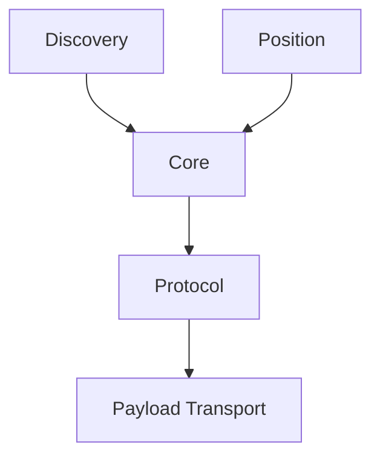

# RKWS Communication Specification

Dokument-ID: RKWS-SPEC-COMM-001  
Version: 0.3.0
Status: Accepted  
Datum: 2026-07-02

## Zweck

Dieses Dokument beschreibt die Kommunikationsprinzipien. Das normative Nachrichtenmodell steht in `Spec/Protocol.md`.

## Separation

Discovery, Position und Payload-Transport sind getrennt. BLE kann Discovery unterstuetzen. UWB kann Position unterstuetzen. Nutzdaten laufen ueber LAN, WLAN oder spaeter optional ueber Cloud-Fallback.

## Diagramm

## Protocol Phases

1. Discovery
2. Announcement
3. Heartbeat
4. Capability Exchange
5. Pairing
6. Authentication
7. Encryption
8. Workspace Advertisement
9. Target Selection
10. Transfer Request
11. Transfer Accept or Reject
12. Transfer Progress
13. Transfer Finished or Failed
14. Version Negotiation
15. Error Handling and Retry

## Implementation Status

Der produktive Payload-Transport ist noch nicht implementiert. Seit MA004.03 existiert jedoch lokale Agent-zu-Agent-Prozesskommunikation auf demselben Rechner. Seit MA004.04 laeuft diese lokale IPC ueber die Transport Abstraction Layer:

- `RKWorkspace.Transport` definiert neutrale Transport-Vertraege.
- `RKWorkspace.Transport.NamedPipes` ist die aktuelle lokale Implementierung.
- `RKWorkspace.LocalIpc` bleibt als Kompatibilitaetsschicht erhalten.

Es gibt weiterhin keine Netzwerkkommunikation, kein TCP, kein UDP, keine Discovery, kein Pairing, keine Remote-Kommunikation und keinen echten Payload-Transfer ueber Rechnergrenzen.

## Querverweise

- `Spec/Protocol.md`
- `Spec/SecurityModel.md`
- `Docs/ADR/ADR-0004-separate-discovery-and-data-transfer.md`
- `Docs/Development/TransportAbstractionLayer.md`

## Aenderungsverlauf

| Version | Datum | Aenderung |
| --- | --- | --- |
| 0.3.0 | 2026-07-02 | MA004.04 lokale IPC ueber TAL als Implementierungsstand dokumentiert. |
| 0.2.0 | 2026-07-02 | Auf RKWS-0240 und `Spec/Protocol.md` erweitert. |
| 0.1.0 | 2026-07-02 | Erste Kommunikationsspezifikation angelegt. |
