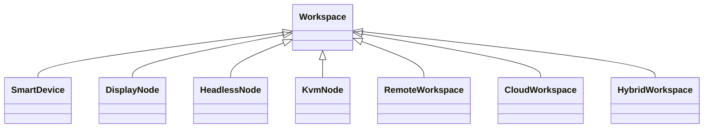

# RKWS-0260 Display Node Model Specification

Dokument-ID: RKWS-SPEC-NODE-001  
Version: 1.1.0
Status: Accepted  
Datum: 2026-07-02

## Zweck

Dieses Dokument definiert die Klassen von Arbeitsflaechen, ihre Eigenschaften, Faehigkeiten, Einschraenkungen, Sicherheitsmodelle, Discovery, Pairing und Beispiele.

## Klassenuebersicht

## Smart Device

Eigenschaften: eigener Agent oder App, lokale UI, lokaler Speicher, OS-Integration.  
Faehigkeiten: Discovery, Pairing, Texttransfer, spaeter Datei und Clipboard.  
Einschraenkungen: OS-Berechtigungen, Gesture-Konflikte, App-Sandbox.  
Sicherheit: lokaler Secure Store, Pairing-Fingerprint, widerrufbarer Trust.  
Discovery: LAN/mDNS, optional BLE.  
Pairing: Benutzerbestaetigung auf beiden Seiten.  
Beispiele: Windows-Laptop, MacBook, Linux-Laptop, iPhone, iPad, Android-Tablet.

## Display Node

Eigenschaften: repraesentiert eine sichtbare Flaeche, haeufig per Dongle.  
Faehigkeiten: Identitaet, Discovery, Position, Zielanzeige.  
Einschraenkungen: keine volle OS-Integration.  
Sicherheit: Dongle-Identitaet, physische Zuordnung, Pairing.  
Discovery: BLE/WLAN/LAN je Hardware.  
Pairing: physischer Button oder Code moeglich.  
Beispiele: Monitor ohne OS, Leitstand-Display.

## Headless Node

Eigenschaften: Arbeitskontext ohne direkt sichtbaren Bildschirm.  
Faehigkeiten: Ziel fuer Payloads oder Kontextablage.  
Einschraenkungen: keine direkte visuelle Zielrueckmeldung.  
Sicherheit: strenge Policy, explizites Pairing.  
Discovery: Netzwerkbasiert.  
Pairing: administrative Bestaetigung.  
Beispiele: Server im Schrank, Build-Maschine.

## KVM Node

Eigenschaften: Arbeitsflaeche mit wechselndem aktiven Rechner.  
Faehigkeiten: Repraesentation des Bedienplatzes, Zielauswahl, ggf. Umschaltstatus.  
Einschraenkungen: aktiver Host kann wechseln.  
Sicherheit: Workspace-Trust und Host-Trust muessen getrennt bleiben.  
Discovery: Dongle oder lokaler Service.  
Pairing: Arbeitsplatzbezogen.  
Beispiele: KVM-Arbeitsplatz, Laborplatz.

## Remote Workspace

Eigenschaften: Arbeitsflaeche ist lokal sichtbar, aber remote gehostet.  
Faehigkeiten: Text und Datei nach Policy.  
Einschraenkungen: Latenz, Netzwerkabhaengigkeit.  
Sicherheit: starke Authentifizierung, Session-Policy.  
Discovery: konfiguriert oder Netzwerk.  
Pairing: account- oder device-gestuetzt.  
Beispiele: Remote Desktop, VDI.

## Cloud Workspace

Eigenschaften: nicht lokal, aber als Zielkontext nutzbar.  
Faehigkeiten: spaeterer Fallback oder Ablageziel.  
Einschraenkungen: Cloud-Zwang ist kein V0.1-Ziel.  
Sicherheit: Account, Token, Policy.  
Discovery: nicht automatisch lokal.  
Pairing: Account-Autorisierung.  
Beispiele: spaeterer Cloud-Fallback.

## Hybrid Workspace

Eigenschaften: Kombination aus lokalem Agent, Dongle und Remote/Cloud-Komponenten.  
Faehigkeiten: erweitert, aber policy-lastig.  
Einschraenkungen: hohe Komplexitaet.  
Sicherheit: mehrere Trust-Domaenen.  
Discovery: gemischt.  
Pairing: mehrstufig.  
Beispiele: Industrie-Leitstand mit lokalem Dongle und zentralem System.

## Registry-Anbindung MA003.03

Die Workspace Registry behandelt Smart Devices, Display Nodes, Headless Nodes, KVM Nodes, Remote Workspaces, Cloud Workspaces und Hybrid Workspaces als `WorkspaceType`. Diese Typen beschreiben die Arbeitsflaeche, entscheiden aber nicht allein ueber Verhalten.

Display Nodes und andere Nodes werden ueber `WorkspaceDescriptor` und `CapabilitySet` beschrieben. Zielauswahl V1 nutzt Position, Capabilities, Trust, Priority und LastSeen. UWB-basierte Positionierung, Hardware-Sensorik, Firmware, Netzwerk-Discovery und Plattformadapter bleiben spaetere Schichten.

## Querverweise

- `Spec/WorkspaceModel.md`
- `Spec/HardwareArchitectureV0.md`
- `Docs/ADR/ADR-0007-smart-devices-and-display-nodes.md`

## Aenderungsverlauf

| Version | Datum | Aenderung |
| --- | --- | --- |
| 1.1.0 | 2026-07-02 | MA003.03 Workspace Registry Anbindung fuer Node-Klassen dokumentiert. |
| 1.0.0 | 2026-07-02 | Display-Node-Modell fuer RKWS-0260 definiert. |
