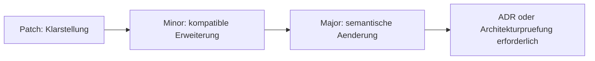

# RKWS-0310 Documentation Quality Specification

Dokument-ID: RKWS-SPEC-DOCS-001  
Version: 1.0.0  
Status: Accepted  
Datum: 2026-07-02

## Zweck

Dieses Dokument definiert die Dokumentationsqualitaet fuer Architektur-, Spezifikations- und Entscheidungsdokumente. Navigations-READMEs duerfen kuerzer sein, muessen aber auf die normativen Dokumente verweisen.

## Pflichtfelder

Jedes normative Dokument muss enthalten:

- eindeutigen Dokumenttitel mit RKWS-Nummer oder Dokument-ID
- `Dokument-ID`
- `Version`
- `Status`
- `Datum`
- mindestens ein Diagramm, wenn das Dokument Architektur, Prozess, Zustand oder Struktur beschreibt
- Querverweise
- Aenderungsverlauf

## Statuswerte

| Status | Bedeutung |
| --- | --- |
| Draft | In Arbeit, nicht verbindlich. |
| Proposed | Zur Pruefung bereit. |
| Accepted | Architekturverbindlich. |
| Superseded | Durch anderes Dokument ersetzt. |
| Archived | Historisch, nicht mehr aktiv. |

## Versionsregel

Patch-Versionen duerfen Tippfehler und Klarstellungen enthalten. Minor-Versionen duerfen kompatible Erweiterungen enthalten. Major-Versionen aendern Semantik und erfordern Architekturpruefung.

## Querverweise

- `Docs/Architecture/ArchitectureFreeze.md`
- `Docs/Architecture/ArchitectureReview.md`
- `Docs/ADR/README.md`

## Aenderungsverlauf

| Version | Datum | Aenderung |
| --- | --- | --- |
| 1.0.0 | 2026-07-02 | Dokumentqualitaetsstandard fuer RKWS-0310 definiert. |
