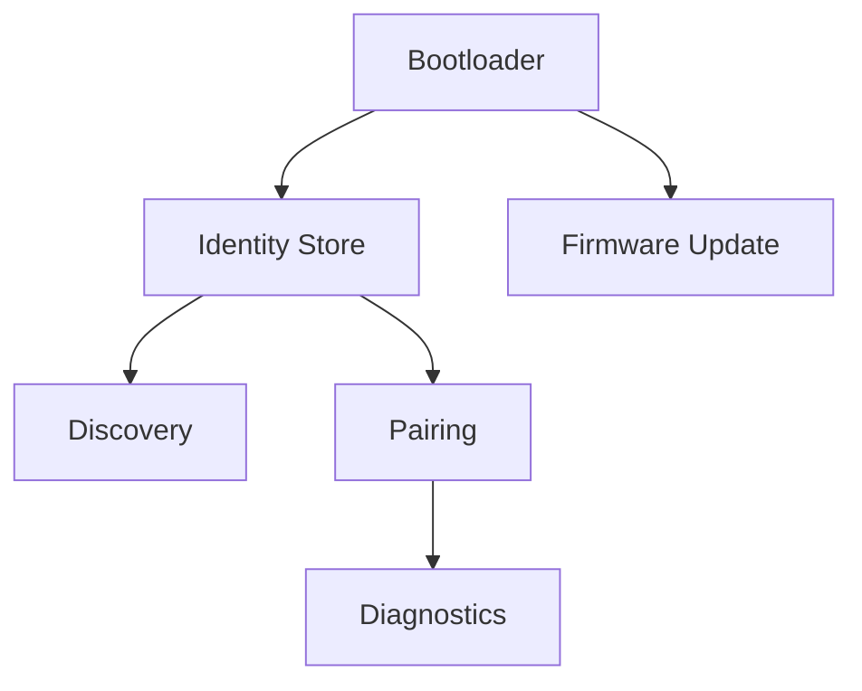

# RKWS Firmware Specification

Dokument-ID: RKWS-SPEC-FIRMWARE-001  
Version: 0.2.0  
Status: Accepted  
Datum: 2026-07-02

## Scope

Firmware wird fuer den spaeteren RK Workspace Dongle benoetigt. Sie ist in V1 nicht implementiert.

## Required Modules

Die Firmware soll spaeter Boot/Self-Test, Identity Store, Discovery, Pairing, optionale UWB-Position, Diagnose-Logging und Firmware-Update unterstuetzen.

## Payload Boundary

Die Firmware soll keine grossen Payloads ueber BLE oder UWB uebertragen. Payload-Transport bleibt Netzwerkaufgabe.

## Diagramm

## Querverweise

- `Docs/09_FirmwareArchitecture.md`
- `Spec/HardwareArchitectureV0.md`
- `Spec/SecurityModel.md`

## Aenderungsverlauf

| Version | Datum | Aenderung |
| --- | --- | --- |
| 0.2.0 | 2026-07-02 | Dokumentstandard und Firmwarediagramm ergaenzt. |
| 0.1.0 | 2026-07-02 | Firmware-Spezifikation angelegt. |
