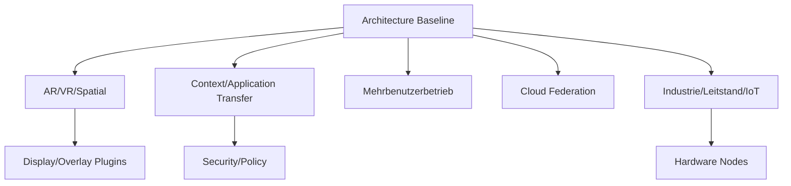

# RKWS-0410 Future Extensions

Dokument-ID: RKWS-SPEC-FUTURE-001  
Version: 1.0.0  
Status: Accepted  
Datum: 2026-07-02

## Zweck

Dieses Dokument beschreibt langfristige Erweiterungsrichtungen. Es definiert keine Implementierung und keinen kurzfristigen Scope. Alle Erweiterungen muessen spaeter durch ADRs, Spezifikationen und Tests konkretisiert werden.

## Erweiterungsfelder

| Erweiterung | Architekturidee | Voraussetzungen | Hauptrisiken |
| --- | --- | --- | --- |
| AR | Arbeitsflaechen koennen im Raum sichtbar markiert werden. | Spatial UI, Positionsmodell, Overlay. | Datenschutz, Kalibrierung. |
| VR | Virtuelle Arbeitsraeume mit mehreren Arbeitsflaechen. | Virtuelle Workspace-Registry. | UX-Komplexitaet. |
| Vision Pro | Spatial Workspace Nodes als Premium-Flaechen. | Platform Adapter, Gesture Plugin. | Plattformbindung. |
| KI-Unterstuetzung | Zielvorschlaege, Kontextklassifizierung, Diagnose. | Context Plugin, Privacy Policy. | Fehlentscheidungen, Datenabfluss. |
| Kontextuebertragung | Mehr als Dateien: Arbeitszustand, Auswahl, App-Kontext. | Context Plugin, Security, App Adapter. | App-spezifisch, schwer portabel. |
| Anwendungsuebertragung | Spaeterer Transfer von Anwendungszustand. | App-spezifische Contracts. | Lizenz, Sicherheit, Plattformgrenzen. |
| Virtuelle Arbeitsflaechen | Workspaces ohne physisches Display. | Workspace Registry, Cloud/Remote. | Zielverstaendlichkeit. |
| Mehrbenutzerbetrieb | Gemeinsame oder uebergabefaehige Arbeitsflaechen. | Identity, Policy, Audit. | Rechte, Konflikte. |
| Cloud Federation | RKWS-Instanzen ueber Domains hinweg. | Federation Protocol, Trust. | Komplexe Security. |
| Industrieintegration | Leitstand, KVM, LAN-only, Audit. | Hardware Nodes, Policy, Logs. | Betriebssicherheit. |
| Leitstand | Mehrere Displays, Rollen, robuste Diagnose. | Display Node, KVM Node. | Falsche Zielwahl. |
| IoT | Kleine Nodes als Kontext- oder Statuspunkte. | Hardware Plugin, Capability Model. | Security, Skalierung. |
| Smart Displays | Displays mit eigener App oder Dongle. | Display Plugin, Hardware Plugin. | Plattformfragmentierung. |

## Zukunftsdiagramm

## Leitplanken

Keine Erweiterung darf die Arbeitsflaeche als Primaerabstraktion ersetzen. Keine Erweiterung darf Cloud-Zwang einfuehren. Keine Erweiterung darf den Core mit Plattformlogik belasten. Jede Erweiterung muss Capabilities, Plugin-Abhaengigkeiten, Security und Teststrategie aktualisieren.

## Querverweise

- `Spec/PluginArchitecture.md`
- `Spec/CapabilityModel.md`
- `Spec/ProductPhilosophy.md`
- `Docs/Architecture/ArchitectureBaseline.md`

## Aenderungsverlauf

| Version | Datum | Aenderung |
| --- | --- | --- |
| 1.0.0 | 2026-07-02 | Future Extensions fuer RKWS-0410 definiert. |
