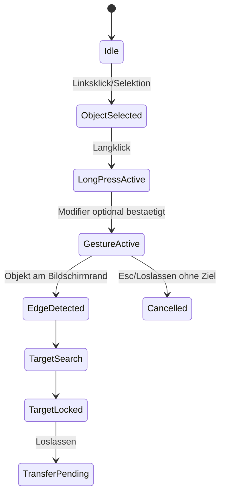
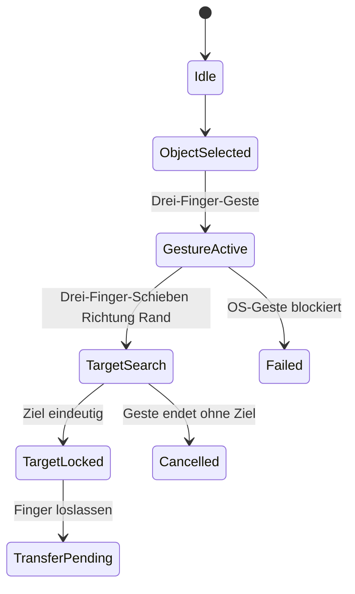
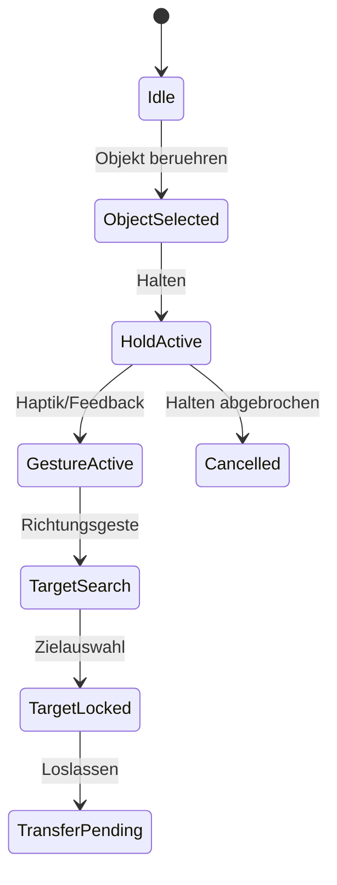

# RKWS-0250 Gesture Model Specification

Dokument-ID: RKWS-SPEC-GESTURE-001  
Version: 1.0.0  
Status: Accepted  
Datum: 2026-07-02

## Zweck

Das Gestenmodell beschreibt Desktop-, Touchpad- und Touch-Interaktionen als Zustandsdiagramme. Es definiert keine OS-Hooks und keine Implementierung.

## Desktop

Desktop-Systeme ohne Touchpad nutzen Langklick, optionale Modifier-Tasten, Bildschirmrand, Zielanzeige, Animation und Fehlbedienungsschutz.

## Touchpad

Touchpad-Systeme nutzen Drei-Finger-Geste und Drei-Finger-Schieben. Konflikte mit Betriebssystem-Gesten muessen pro Plattform geprueft werden. Alternativen sind Modifier plus Drag, Kontextmenue oder Setup-seitig konfigurierbare Geste.

## Touch

Touch-Systeme nutzen Halten, Richtungsgeste, Haptik, visuelles Feedback und Zielauswahl.

## Fehlbedienungsschutz

Desktop darf Modifier-Tasten verlangen. Touchpad darf Geste nur nach expliziter Aktivierung starten. Touch darf Haptik oder visuelle Aktivierung voraussetzen. Jede Plattform muss einen klaren Abbruchpfad haben.

## Querverweise

- `Spec/StateMachine.md`
- `Spec/UX.md`
- `Docs/ADR/ADR-0006-gestures-as-primary-interaction.md`

## Aenderungsverlauf

| Version | Datum | Aenderung |
| --- | --- | --- |
| 1.0.0 | 2026-07-02 | Gestenmodell fuer RKWS-0250 definiert. |
