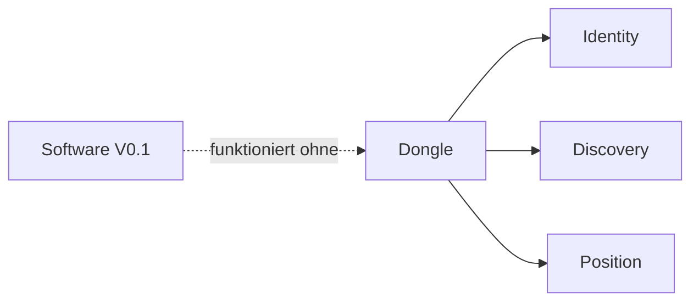

# RKWS Hardware Specification

Dokument-ID: RKWS-SPEC-HARDWARE-001  
Version: 0.2.0  
Status: Accepted  
Datum: 2026-07-02

## Scope

Hardware ist optional und darf die erste Softwareversion nicht blockieren. Der spaetere Dongle repraesentiert Arbeitsflaechen, die keinen eigenen Agenten tragen oder nicht direkt einem Betriebssystem zugeordnet sind.

## Dongle Requirements

Der Dongle soll sichere Identitaet, Discovery, Pairing, verschluesselte Kommunikation, optionale UWB-Positionierung, USB-C-Versorgung und Firmware-Updatefaehigkeit unterstuetzen.

## Non-Requirements For V1

V1 enthaelt kein PCB-Layout, keine Serienhardware und keine finalen Boardentscheidungen.

## Diagramm

## Querverweise

- `Spec/HardwareArchitectureV0.md`
- `Spec/HardwareSourcing.md`
- `Docs/03_HardwareArchitecture.md`

## Aenderungsverlauf

| Version | Datum | Aenderung |
| --- | --- | --- |
| 0.2.0 | 2026-07-02 | Dokumentstandard und Verweise auf Hardware V0 ergaenzt. |
| 0.1.0 | 2026-07-02 | Hardware-Spezifikation angelegt. |
